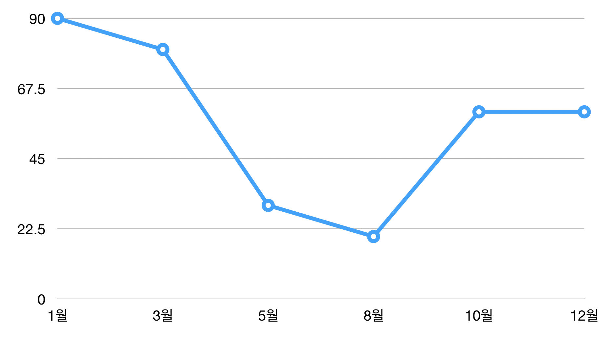
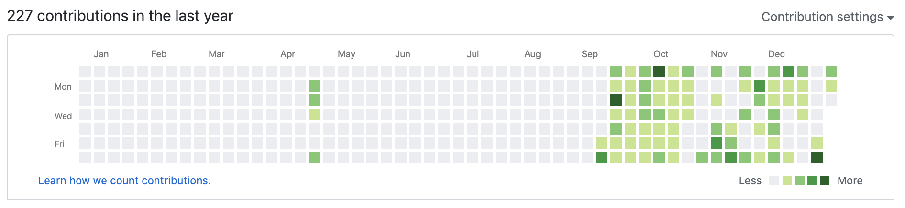

## 들어가며

**회고(回顧)** 라는 단어가 예전에는 뭔가 대단하고 거창하고 멋있어 보였다.

그래서 그런지

> <i>'회고는 대단한 개발자들이 하는거야..'</i> :thinking:

라고 생각했었다.

사실, 회사에 들어오기 전에 갖고 있던 생각이 1년 정도 해보니까 많이 바뀌었다.

### :heavy_check_mark: 입사 전 내가 가지고 있던 생각들..

- <i>"회사에 들어가면 많이 배우고 성장할 수 있을거야!" (선배들이 많이 가르쳐 주겠지?)</i>
- <i>"회사에서는 내가 경험해보지 못한 기술들을 쓰고 있겠지?" (새로운 것을 많이 접할 수 있겠다!)</i>
- <i>"회사에서 선배들이 하는 것이 정석이다!" (내가 정하고 하는 것은 이상해!)</i>
- <i>"개발 많이 할 수 있어서 좋겠다!" (개발자라면 개발에 살고 죽어야지.. 그럼..!)</i>

몇 개 더 있는데, 누군가 언제든지 이 글을 볼 수 있기 때문에 적당히 ~~수위 조절~~ 했다. :neutral_face:

### :heavy_check_mark: 변화한 점..

어쨌든, 위에 적은 것 말고도 가장 많이 바뀐 것은 나의 **'소극적인 태도'**이다.

1년간 회사 생활하면서 나의 성장에 아무도 신경을 써주지 않고, 또한 내가 블로그를 하든 공부를 하든 무엇을 하든 뭐라 하지 않는다는 것을 알았고, 결국 내 **스스로** 해야만 한다는 것이다.

그렇기 때문에 지난 한 해를 되돌아보며 글을 적는다.

## 지난 한 해동안 어떤 일이..?

### :banana: KT 입사

정확히 회사에 들어온 날짜는 2018.10.28일이다. SW직무는 공채보다 약 2달 먼저 들어온 케이스다. 들어와서 갑자기 뭐 클라우드 운영을 한다느니 개발을 못할 수도 있다느니 혼란이 있었던 시기였다.

#### :strawberry: 첫 프로젝트

어찌저찌 소프트웨어개발단에 왔고, 7~8주 정도의 프로젝트를 했었다. 여러 주제가 있었는데, 그 중 `ELK 기반의 통합 로그 웹 뷰어`를 만드는 주제로 화면을 만드는 프론트엔드 역할을 맡았었다.

회사에 들어오기 전에는 주로 `JAVA`를 사용했고, 취업을 위해서 혼자서 기본적인 `Computer Science` 공부와 함께 기초적인 `HTML`, `CSS`, `Javascript`를 공부했었다.

개발 경험이 정말 많이 부족했고, 그나마 해봤던 게 Web이라서 이것을 해보고 싶다고 말씀드려서 팀이 꾸려졌지만, 과연 잘 할 수 있을까 걱정을 많이 했었다.

그냥 어찌저찌 처음 해보는 웹 프레임워크 `Vue.js` 찾아가면서 공부했고, 개발도 그럭저럭 마무리했었다. 마지막 발표 때는 설마설마하던 `데모의 법칙`을 경험하긴 했지만, 그래도 뭔가 실력있는 동료들과 같이 토론하면서 전반적인 프로젝트 과정을 경험할 수 있는 기회였기 때문에 뜻깊었다.

#### :strawberry: 연수원

그러고 연수원에 들어갔다. 다른 직무 동기들도 많이 만나고, 여러 활동도 하고, 올림픽 현장도 보고 농구까지.. 밥은 얼마나 잘 나오던지.. 살도 많이 찌고 즐거웠던 경험이었다.

### :banana: 팀 배치 그리고 조직 개편

#### :strawberry: 팀 배치

연수과정이 다 끝나고 나니까 추석, 그리고 2월에 배치받은 팀으로 가게 되었다. (~~하지만 딱히 하는 일은 없었다..~~)

아, 내가 가게 된 팀은 **KT Map Javascript** 파트였다.

뭐.. Doc 문서 스타일 수정이나 데모 페이지 검증 등 간단한 것을 하기는 했지만, 딱히 뭘 해야 할지, 뭘 하게 될지도 아무도 알려주지 않았고, 그냥 아무것도 하지 않았었다. (<i>지금이라면 이 시간을 미친듯이 활용했을텐데 아쉽다..</i>)

#### :strawberry: 조직 개편

그러고 나서 5월 쯤 **조직 개편**으로 팀이 바뀌었다.

**GIS Onenavi 서버개발 팀의 경로탐색을 다루는 RP(Route Planning) 파트**로 가게 되었다.

그 곳에서 Javascript로 만들어진 경로탐색 분석 툴을 유지보수(`React`로 전환)하는 업무를 맡게 되었다.

### :banana: 2019 KT Software Developer Conference..

조직개편이 된 지 얼마 지나지 않아, 나에게 또 다른 업무가 주어졌다. KT 소프트웨어 개발자 컨퍼런스의 스탭으로 행사를 기획하고 준비하는 업무를 하게 되었다.

개발과는 전혀 관련이 없는 업무였다. 자연스럽게 기존에 하고 있던 개발 업무는 stop할 수 밖에 없었다.

아무도 인정해주지 않지만 누군가는 해야하는 하지만 나 자신조차도 받아들이기 힘든 시기였다.

팀 배치 때부터 이 때까지 회의감이 들기도 하고 여러 감정이 교차했었던 것 같다.

### :banana: 다시 GIS Onenavi RP(Route Planning) 파트로의 복귀

어느덧 9월이 되서 다시 원래 업무로 복귀하였다.

많은 것이 바뀌어 있었다. 다른 동기들의 실력, 팀의 개발 히스토리, 애자일 문화 등등..

다른 것을 하고 왔지만 그건 온전히 내 사정일 뿐이었다. 어쨌든 팀의 일원이라면 팀과 관련된 일을 할 수 있는 개발자여야만 했고, 그러기엔 그동안 너무 쌓아둔 것이 없었다.

프론트엔드 개발자로써 기존에 하던 React 개발을 완료한 것도 아니고, 그렇다고 서버 개발을 당장 할 수 있을만큼 도메인 지식이나 백엔드 지식도 너무나 부족했다. (하.. 이거 눈치도 보이고 정말ㅠㅠ :pensive:)

### :banana: 그리고 지금

어찌저찌 내 스스로 결정을 내리고 일을 하는 방식인 **애자일 문화**에도 적응을 했고, 직접 RP 개발까지는 못하지만, 어떤 식으로 VoC에 대해 분석하고 대응하는지에 대한 프로세스와 관련 도메인 지식도 쌓였다.

팀 내부적으로 중요한 일, 바쁜 일이 있었기 때문에 아직 React 개발하던 것은 진행 중이긴 하다. (물론 나 혼자 하던 것에서 팀이 같이 하는 것으로 바뀌는 중이다.)

## 무엇을 했는가?

### 1. Github

- [https://github.com/ChanGrea](https://github.com/ChanGrea)
  
  - `Algorithm(C++)`
  - `CSS`
  - `Javascript`

### 2. 블로그

- [어제보다 한 걸음 더](https://k39335.tistory.com/)
  - 예전 기술 블로그
  - `Computer Science`
- [ChanGrea.io](https://changrea.io/)
  - 9월부터 새롭게 이전한 현재의 블로그
  - `Web`, `Javascript`, `Network`, `React` ...

### 3. 컨퍼런스 및 교육

#### 컨퍼런스

- [NAVER TECH CONCERT:Frontend](http://techcon.naver.com/2019/fe/)
  - Frontend 기술 세미나
- [SAMSUNG SOSCON](https://www.soscon.net/)
  - 오픈소스 관련 컨퍼런스

#### 교육

- Docker & Kubernetes
  - 회사 내부 교육
  - 도커와 쿠버네티스 실무 교육
- Clean Code and Refactoring
  - 회사 내부 교육
  - 깔끔한 코드 작성법과 리팩토링에 대한 교육

 
프로젝트(개발)과 컨퍼런스 및 교육에 많이 참여하지 못한 부분이 아쉽다. Github 관리와 블로그 운영도 9월부터 시작했기 때문에 많이 하지는 못했다.

[jojoldu](https://jojoldu.tistory.com/)님처럼 꾸준히 매일매일 하는 것이 목표였는데, 위의 것들 외에도 해야하는 것이 많았다.(볼링, 크로스핏..) :smile:

## 느낀점 그리고 2020년 목표

정말 혼란스럽고, 당황스럽기도 했고 한편으로 회의감도 들었었던 한 해였다. ~~좀 더 일찍 정신차렸다면 이 곳에 남아있었을까..?~~(농담이다..)

정말 열심히 해야겠다는 생각 뿐이다. 주어지는 것은 물론이고, **'열심히'라는 의미는 '스스로'라는 의미다.**

서두에 언급한 것처럼 여러 일들을 겪으면서 바뀐 것은 **내가 주도적으로 해야겠다**는 마음가짐이다.

나의 2020년 목표는 예전에 [블로그를 이전하면서 처음 포스팅한 글](https://changrea.io/Etc/%EC%83%88%EB%A1%9C%EC%9A%B4-%EB%B8%94%EB%A1%9C%EA%B7%B8%EB%A1%9C-%EC%9D%B4%EC%A0%84/)에도 나와있는데, **오픈소스 프로젝트에 기여**하는 것이다.

예전에 최종면접 마지막 질문이 기억이 난다.

> :older_woman: 당신은 좋은 개발자입니까? 아니면 완벽한 개발자입니까?

당시에는 이렇게 대답했었다.

> :boy: 저는 완벽한 개발자에 가깝습니다.

그런데 지금은 생각이 바뀌었다.

**필요한 개발자** 가 되고 싶다.

어느 조직에 있든 내가 필요한.. 그런 사람이 되기 위해 내년에도 노력할 것이다.
