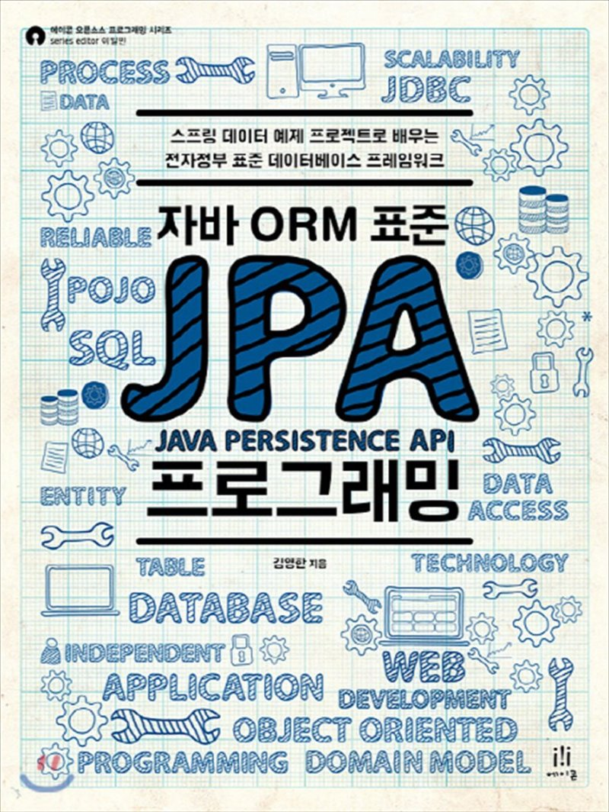

## Intro

저번 포스팅에서 [ORM(Object Relational Mapping)](https://changrea.io/Java/orm/)에 대해서 정리했었다. JPA에 대해서 다룰 일이 있어서 먼저 ORM에 대해서 정리한건데, 이어서 JPA에 대해서 정리하고자 한다.

사실 JPA의 영역은 생각보다 크다고 들었다. 단순히 포스팅 하나로 모든 내용을 다루기에 힘들 정도라고 생각한다. 국내에는 자료가 많이 부족하지만, [자바 ORM 표준 JPA 프로그래밍](http://www.yes24.com/Product/Goods/19040233) 이라는 책이 동료들 사이에서도 많이 보고 있고 유명한 것 같다.

<div style="width: 300px; margin-left: auto!important; margin-right: auto!important;">
  
</div>


이 책을 중심으로 간단하게(?) JPA에 대해서 다뤄보고자 한다.

물론 앞서 언급했듯이 모든 내용을 정리할 수는 없다. 그래도 JPA가 뭔지 실무에서는 어떻게 쓰이는지에 대해서 정리할 예정이다.

## JPA란 무엇인가?

JPA(Java Persistence API)는 **자바 진영의 [ORM(Object-Relational Mapping)](https://changrea.io/Java/orm/#-orm이란) 기술 표준**이다. JPA는 애플리케이션과 JDBC 사이에서 동작한다.

ORM 프레임워크는 객체와 테이블을 매핑해서 **패러다임의 불일치 문제를 개발자 대신 해결**해준다. 따라서 개발자는 객체와 데이터베이스의 테이블을 어떻게 매핑할지만 ORM 프레임워크에 알려주면 된다.

객체지향언어 대부분은 ORM 프레임워크가 존재하지만, Java에서 많이 쓰는 것은 `Hibernate(하이버네이트)` 이다.

### JPA 소개

#### :strawberry: 과거 EJB의 ORM과 JPA의 탄생

과거에 자바 진영에서는 **엔터프라이즈 자바 빈즈(EJB)**라는 기술 표준을 만들었다. 이 안에는 엔티티 빈이라는 **ORM** 기술도 포함되어 있었다.

하지만 너무 복잡하고, 성숙도도 떨어졌으며, 자바 엔터프라이즈(J2EE) 애플리케이션 서버에서만 동작했다.

이 때 **하이버네이트(hibernate.org)**라는 오픈소스 ORM 프레임워크가 등장했고, 이는 가볍고, 실용적이고, 서버 없이도 동작했다.

결국 **EJB3.0**에서 하이버네이트를 기반으로 새로 ORM 기술표준을 만든 것이 JPA다.

### 왜 JPA를 사용해야 하는가?

:heavy_check_mark: **생산성**

JPA를 사용하면 자바 컬렉션에 객체를 저장하듯이 JPA에게 저장할 객체를 전달하면 된다.

```java
jpa.persist(member); // 저장
Member member = jpa.find(memberId); // 조희
```

CRUD용 SQL을 개발자가 직접 작성하지 않아도 되며, DDL(Data Definition Language) 문을 자동으로 생성해주는 기능도 있다.

:heavy_check_mark: **유지보수**

기존에는 Entity에 필드 하나만 추가되더라도 Entity를 사용하는 모든 SQL과 API 코드를 전부 수정해야만 했다. (예를 들어 SQL의 컬럼 부분, API의 setXXX 부분 ...)

이 부분을 이제는 JPA가 대신 해주기 때문에 개발자는 신경 쓸 부분이 줄어든다.

:heavy_check_mark: **패러다임의 불일치 해결**

객체와 데이터베이스 테이블 간의 패러다임 불일치 즉, 객체의 상속, 연관관계, 객체 그래프 탐색, 비교하기와 같은 문제를 JPA가 해결해준다.

> :exclamation: 이 부분은 앞으로 포스팅을 해가면서 자세하게 정리할 예정이다.

:heavy_check_mark: **성능**

JPA는 애플리케이션과 데이터베이스 사이에서 다양한 성능 최적화 기회를 제공한다.

> :exclamation: 이 부분 역시 본인은 책의 뒷 부분을 미리 읽어서 봤지만, JPA는 캐시 기능을 가지고 반복되는 조회 쿼리에 대해서   데이터베이스를 통신하지 않고 결과를 리턴한다.

또한, 하이버네이트는 <u>SQL 힌트</u>를 넣을 수 있는 기능도 제공한다.

> :question: SQL 힌트
>
> 실행하려 하는 SQL 문에 사전에 정보를 주어서 SQL문 실행에 빠른 결과를 가져오라는 것

:heavy_check_mark: **데이터 접근 추상화와 벤더 독립성**

RDB는 같은 기능도 벤더마다 사용법이 다른 경우가 많다. 단적인 예로 페이징 처리는 데이터베이스마다 달라서 사용법을 각각 배워야 한다.

JPA는 애플리케이션과 데이터베이스 사이에 `Dialect`라는 **추상화된 데이터 접근 계층**을 제공해서 특정 데이터베이스 기술에 종속되지 않도록 한다.

:heavy_check_mark: **표준**

JPA는 자바 진영의 ORM 기술 표준이다. 표준을 사용하면 다른 구현 기술로 손쉽게 변경 가능하다.