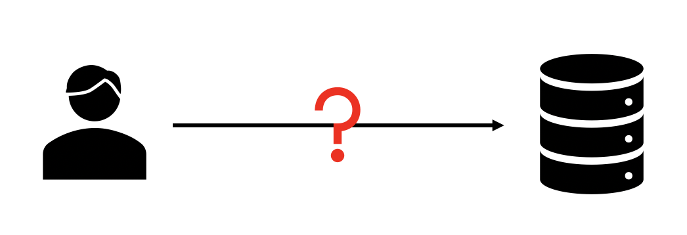
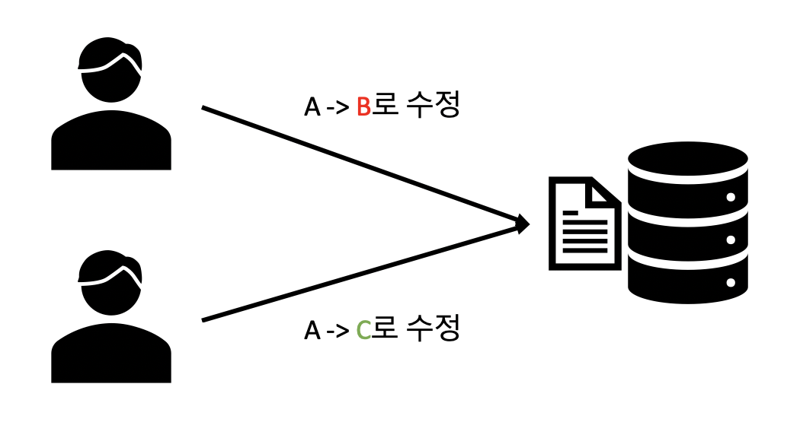
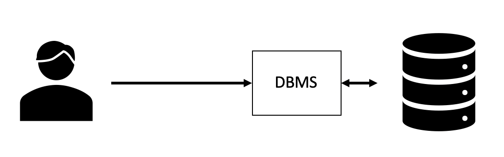
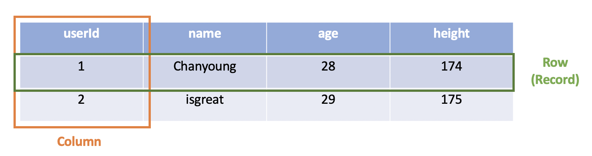

## Intro

본격적으로 백엔드(서버) 개발을 직접 해본 적은 아직가지 없다. 조금씩 공부하고 있지만 그동안 느낀 것은 백엔드는 결국 **CRUD(Create, Read, Update, Delete)**가 가장 기본이면서도 중요하다는 것이다.

우리가 뒷 단에 서버를 두는 이유는 클라이언트에서 하던 것을 서버가 빠르게 처리해주고, 기능이 추가되거나 변경되었을 때의 빠른 배포 등 여러가지가 있다.

그러기 위해서 서버는 여러 곳에서 사용하는 **데이터**를 저장하고, 필요에 따라 꺼내서 가공하고, 수정/삭제하면서 소위 데이터를 갖고 놀게 된다.

그만큼 서버 쪽 코드를 보면 **데이터 관련 코드**가 많다. 오늘은 그런 데이터베이스 관련 코드를 어떻게 관리하는지에 대한 내용인 **ORM**에 대해서 정리하고자 한다.

## 데이터베이스에 데이터를 저장하는 방법?

### :banana: 데이터베이스는 동시에 여러 요청을 받는다.



사용자가 데이터베이스에 접근하기 위해서는 어떻게 할까? 만약 위와 같이 사용자가 데이터베이스에 직접 접근하는 형태라면 어떤 문제가 있을까?

> :exclamation: 여러 사용자가 데이터베이스에 동시에 접근한다고 생각해보자.



위와 같은 명령이 동시에 일어났다면(물론 같은 시간일 수는 없다.), 저 데이터의 상태는 B일까? 아니면 C일까?

**알 수 없다**​ :disappointed:

### :banana: DBMS(DataBase Management System)

위와 같은 문제(?) 때문에 사용자는 데이터베이스에 직접 접근하는 것이 아니라 DBMS를 이용한다.

**DBMS(DataBase Management System)**은 다수의 사용자들이 데이터베이스 내의 데이터를 접근할 수 있도록 해주는 소프트웨어 도구이다.



#### :strawberry: DMBS를 쓰지 않는다면?

- 다수의 사람이 데이터를 공유하기 어렵다
  - 위와 같은 경우이다.
- 대량의 데이터를 다루기 어렵다 (txt, xls 등)
- 읽기/쓰기를 자동화하려면 프로그래밍 기술이 필요하다
- 만일의 사고에 대응하기 어렵다 (보안, 백업)

#### :strawberry: DBMS의 종류

한번 쯤은 들어보고 써봤을 것들이다. 유명한 것들만 나열하지만, 이 외에도 여러 가지가 있다.

- MySQL
- ORACLE
- Postgres

## RDB(Relational Database)

위에 나열한 것들이 대표적인 **RDB**의 DBMS들이다. (**RDBMS** 라고 한다.)

**RDB(Relational Database)**, 관계형 데이터베이스는 <u>키(Key)</u>와 <u>값(Value)</u>의 간단한 관계를 2차원 표(<u>테이블</u>) 형식으로 나타낸 데이터베이스다.

	

- 테이블의 행(`Row`)를 `Record`라고도 한다.
- 각 `Row`는 열(`Column`)에 해당하는 값들로 구성된다.
- `Table`은 여러 개의 `Record`로 구성된다.

### :banana: RDBMS(Relational Database Management System)

위에서 보았겠지만, 관계형 데이터베이스를 관리하는 소프트웨어이다.

- MySQL
- ORACLE
- Postgres

RDBMS는 Client가 요청을 보내면 처리해주는 **Client-Server 구조**이다. 그리고 Client가 요청을 보낼 때 쓰는 언어가 **SQL(Structured Query Language)**이다.

여기까지가 데이터베이스에 대한 기초적인, 이미 들어봤을 법한 내용들이었다.

## 그럼 대표적으로 Java 언어에서는?

### :banana: JDBC(Java DataBase Connectivity)

Client가 요청을 보낼 때 **SQL**을 사용한다면, **Java Program과 DBMS 간의 연결, 통신**은 어떻게 해야 할까?

앞서 정리했듯이, DBMS 종류는 여러가지가 있다. 그러면, 그 DBMS마다 각각의 API를 정의해줘야만 하는걸까?

다행히, JAVA에서는 데이터베이스와의 통신을 위한 API 인터페이스를 제공하는데, 바로 **JDBC(Java DataBase Connectivity)**다.

#### :strawberry: Example

```java
Connection conn = DriverManager.getConnection(
     "jdbc:somejdbcvendor:other data needed by some jdbc vendor",
     "myLogin",
     "myPassword" );
try {
     /* you use the connection here */
} finally {
    //It's important to close the connection when you are done with it
    try { conn.close(); } catch (Throwable e) { 
      /* Propagate the original exception instead of this one that you want just logged */ 
      logger.warn("Could not close JDBC Connection",e); 
    }
}
```

- `DriverManager.getConnection()` 메소드들 가운데 하나를 사용하여 JDBC 연결을 만든다.
- 인자로 URL과 ID, PW를 전달하게 되는데, 이제 JDBC 드라이버에만 의존하면 된다.
- URL은 "**jdbc**"로 시작하지만, 그 이후 URL은 vendor(즉 DMBS 종류)에 따라 다르다.

## ORM(Object Relational Mapping)

### :banana: 지금까지의 내용

지금까지 정리한 내용을 되짚어보면 아래와 같다.

- 사용자가 Database에 데이터를 저장하고 꺼내기 위해서는 DBMS와 통신을 한다.
- **DBMS와 통신은 C/S 구조로 SQL을 이용한다.**
- 여러 DBMS가 존재하기에 그것을 통합(?)하기 위해 대표적으로 Java 언어에서는 JDBC를 이용한다.

### :banana: 개발을 함에 있어서의 SQL의 걸림돌

#### :strawberry: SQL까지 신경써야 한다

이 중 두 번째 항목인 <u>SQL을 이용한다</u> 이 말은 즉, 우리는 Backend 언어로 개발을 하면서도 DB를 사용하기 위해서는 SQL까지 신경써야 한다는 이야기다.

매번 기능을 개발할 때마다 그 기능에 사용될 데이터를 가져와야 하고, 그에 맞는 SQL Query를 작성해야 한다. 어떻게 보면, 생산성 면에서 비효율적일 수도 있다.

#### :strawberry: SQL은 인터프리터 언어, Java는 객체지향 언어..

또한 SQL은 인터프리터 언어이다. 이것은 객체지향 프로그래밍, OOP(Object Oriented Programming)에서 작성한 코드에서 객체지향스럽게(?) DB 관련 코드를 작성할 수 없다는 뜻이다.

좀 더 쉽게 말하자면, SQL Query가 개발 코드에 들어가 있고, SQL에 종속적이게 된다. (Database의 변경이 생길 경우 개발 코드를 수정해야 한다)


이런 걸림돌을 위해 ORM이 등장하게 된다.

### :banana: ORM이란

**ORM**은 객체 지향 프로그래밍에서 객체(Object)와 관계형 데이터베이스의 데이터(Table)을 맵핑시켜주는 개념이다.

#### :strawberry: ORM 종류

- **Flask** - SQLAlchemy
- **Django** - 내장 ORM을 가진다.
- **Node.js** - Sequalize
- **Java** - Hybernate, JPA

좀 더 자세히 보자

#### :strawberry: Persistence (영속성)

데이터를 생성한 프로그램이 종료되더라도 그 데이터는 사라지지 않는 특성을 **영속성(Persistence)**라고 한다.

흔히 말하는 `MVC(Model-View-Controller)` 모델에서 **4개의 계층**으로 구성된다. (위에서부터 Top-down으로 작성)

- Presentation Layer (UI Layer)
  - 사용자에게 보여지는 화면으로 Event-Driven 방식으로 사용자의 요청을 받는다.
- Control Layer (Application Layer or Service Layer)
  - Presentation에서 받은 요청을 Business Layer에 전달하는 부분이다.
  - 비즈니스 로직과 UI(Presentation)을 분리하기 위한 계층
  - 사용자의 요청(request)에 해당하는 비즈니스 로직을 결정(controller)하고, 적절한 응답(response)을 사용자에 전달하는 역할을 한다.
- Business Layer (Domain Layer)
  - 핵심적인 로직이 구현되며, Persistence Layer에 데이터를 요청하여 받아서 로직을 수행한다.
- <span style="color: red;">Persistence Layer</span>
  - 데이터베이스에서 데이터를 빼내어(**Read**) 객체화하거나, 데이터베이스에 데이터를 저장(**Create**), 수정(**Update**), 삭제(**Delete**)하는 역할

앞서 언급한 `JDBC`로 직접 Persistence Layer를 구현할 수 있지만, **Persistence Framework**를 많이 이용하는 편이다.

#### :strawberry: Persistence Framework

JDBC 프로그래밍의 복잡함이나 번거로움 없이 간단한 작업만으로 데이터베이스와 연동되는 시스템을 빠르게 개발한다.

Persistence Framework는 **SQL Mapper**와 **ORM**으로 나뉜다.

##### :point_right: SQLMapper

- SQL :arrow_left: SQLMapper :arrow_right: Object 필드
- SQL 문장으로 직접 데이터베이스 데이터를 다룬다.
- SQL을 직접 작성해줘야 한다.
- **Mybatis**, **JdbcTemplates**(spring)

##### :point_right: ORM

- 데이터베이스 데이터 :arrow_left: ORM :arrow_right: Object 필드
- 객체를 통해 간접적으로 데이터베이스 데이터를 다룬다.
- 객체와 관계형 데이터베이스의 데이터를 자동으로 맵핑 시켜준다.
  - SQL Query가 아닌 직관적인 코드(메서드)로 데이터 조작
- **JPA**, **Hibernate**

### :banana: MyBatis vs Hibernate

#### :strawberry: MyBatis

- 반복적인 JDBC 프로그래밍을 단순화하기 위해 iBatis라는 이름으로 출발
  - 이후에 아파치 소프트웨어 재단에서 구글 코드(Google Code)로 이사하면서 MyBatis라는 이름으로 바뀜
- 개발과 유지보수가 쉽도록 소스 코드에 박혀있는 **SQL을 별도의 파일로 분리**

#### :strawberry: Hibernate

- JPA의 실제 구현체
- HQL(Hibernate Query Language)라는 객체 질의어를 제공
  - SQL을 몰라도 되기 때문에 개발자의 부담이 줄어든다.
  - 실행 시에 DBMS에 맞추어 SQL 문을 자동 생성하기 때문에 특정 DBMS에 종속되지 않는다.
- 데이터베이스의 정규화(normalized)가 잘돼 있어야 한다.
  - 테이블을 객체와 연결하기 쉽고, 객체를 통해 테이블의 데이터를 다루기가 쉽다.
- 데이터베이스의 특징에 맞추어 최적화를 할 수 없다.
  - 데이터베이스 마다 실행 성능을 높이고 데이터 처리를 쉽게 해주는 특별한 기능을 각각 가지고 있다.
  - 이런 기능을 활용할 수 있도록 전용 SQL을 제공하지만, ORM에서는 SQL을 직접 작성하지 않기 때문에 최적화가 쉽지 않다.

#### :strawberry: 왜 JPA, Hibernate를 쓰는가? MyBatis와는 뭐가 다른가? (면접 질문)

사실 최근 5년간 사용률은 **전세계적으로는 JPA > MyBatis**, **국내에서는 JPA < MyBatis** 이다. 위에서 정리했듯이, ORM(JPA), SQL Mapper(MyBatis)가 더 좋다, 나쁘다를 확언하기가 어렵다.

각각의 장,단점이 있고, JPA의 사용률이 높아지는 이유는 복잡한 데이터를 추출하는 업무보다는 비즈니스 로직에 집중하고, 수정하는 업무가 주이기 때문인 것 같다.

무작정 생산성이 빠르다, SQL을 신경쓰지 않아도 된다 등 장점이 많아서 사용한다기 보다는 "**개발하고 있는 서비스에 어떤 것이 적합한가? 왜 써야만 할까?**"와 같은 사상적인 면에서 고민하고 결정하는 것이 맞는 것 같다.

결론은 둘 다 알아두는 것이 좋다..!

## Reference

- [https://gmlwjd9405.github.io/2018/12/25/difference-jdbc-jpa-mybatis.html](https://gmlwjd9405.github.io/2018/12/25/difference-jdbc-jpa-mybatis.html)