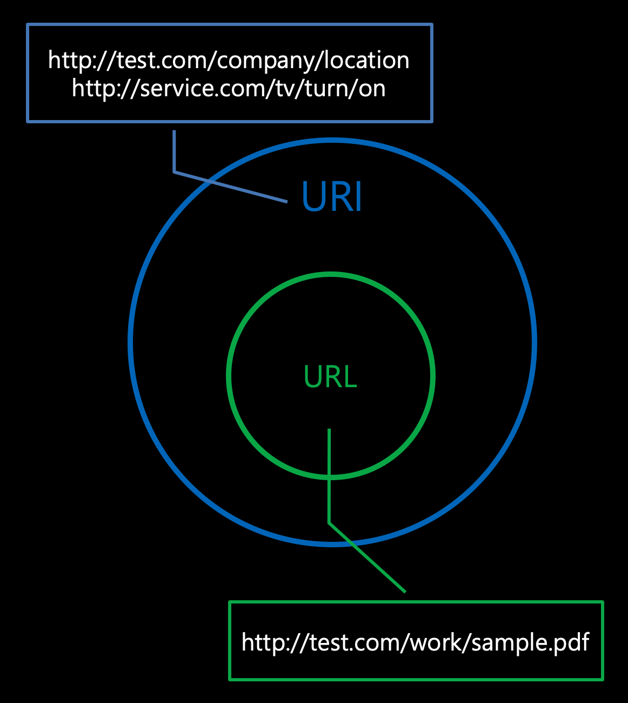
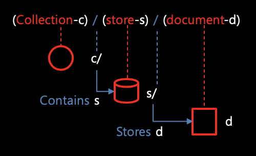
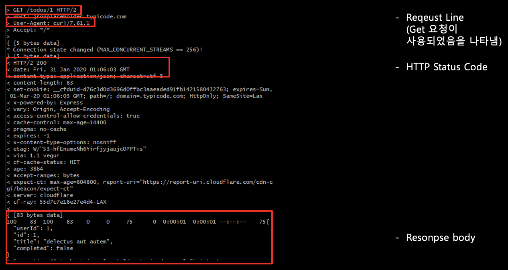
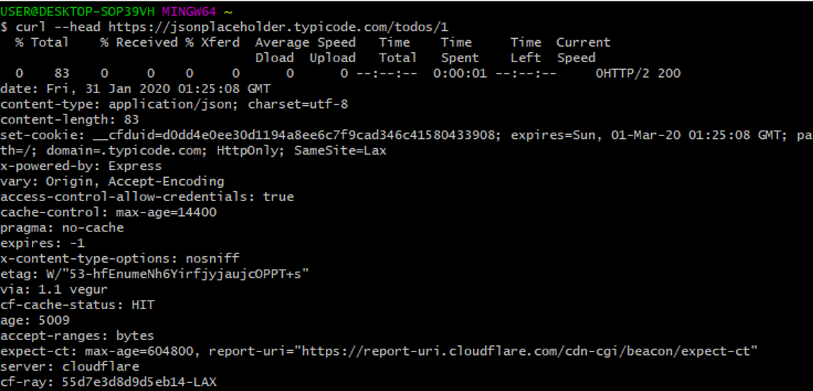

## Intro

이전 포스팅에서 **REST API**의 배경과 정의에 대해서 정리했었다.

이번 포스팅부터는 **REST API를 설게하는 원칙**에 대해서 정리하고자 한다.

사실 "설계 원칙"이라고 해서 완벽히 따라야 하는 표준은 아니다. [이 책](http://shop.oreilly.com/product/0636920021575.do)의 저자는 사실상 표준, **Defacto**라고 말하고 있기 때문이다.

많은 개발자들이 오랫동안 이런 식으로 설계하여 써왔었기 때문에 어느 정도(?) 검증된 것이라고 생각하면 된다.

이번 포스팅에서는 REST API의 **URI**와 **HTTP**에 대한 설계 원칙을 정리한다.

## URIs

### URL vs URI

먼저 URL? URI? 비슷하게 생겨서 혼용해서 쓰곤 했다.

#### URL (Uniform Resource Locator)

- 자원의 위치
- 웹 상에 서비스를 제공하는 각 서버들에 있는 **파일의 위치**를 표시하기 위한 것

#### URI (Uniform Resource Identifier)

- 통합 자원 식별자
- 인터넷에 있는 자원(Resource)을 나타내는 유일한 주소
  - 자원에 접근하기 위해 사용되는 절차
  - 어떤 자원을 가지고 있는 **특정한 컴퓨터**
  - 컴퓨터 상의 유니크한 자원의 이름(**파일명**)
- <span style="color: red;">URI 하위 개념에 URL 포함</span>

> 최근에 URL보다 URI라는 용어를 쓰는 이유는
>
> 서버 내 디렉터리 구조를 노출시키는 URL의 보안적 이슈와 관련하여, URI에 해당하는 Controller 즉 함수를 실행함으로써 결과를 받는다.



### URI Format

URI와 URL의 개념을 봤으니, 이제 URI에 대한 설계 원칙을 정리한다.

그 전에 URI의 형식은 아래와 같다.

<div style="background-color: #212121; color: #e0e0e0; padding: 1.2em; margin: 1.5em 0; overflow: auto; border-radius: 0.6em;">
URI = scheme "://" <span style="color: yellow;">authority</span> "/" <span style="color: green;">path</span> [ "?" <span style="color: red;">query</span> ] [ "#" fragment ]
</div>

#### scheme

- URI를 어떤 규칙에 따라 기술하고 자원(데이터)에 어떻게 접근하는지 지정
- http, ftp …

#### authority

- <u>서버명</u>과 <u>도메인명</u>으로 구성
- 서버명 – www …
- 도메인명 – test.co.kr
- :heavy_plus_sign: 이 영역은 userinfo@host:port 형식으로 구성된다.
  - userinfo : (option) username과 password로 구성된다. 
  - host : 보통 **ip주소**가 들어간다.
  - port : colon(:)이 붙고 그 뒤에 **포트번호**가 들어간다.

#### path

- 파일 시스템의 경로를 나타낸다.
- 특정한 resource 하나를 나타내지만은 않다. (여러 개의 reousrce가 있는 위치를 나타냄)

#### query

- <u>폴더명</u>과 <u>파일명</u>으로 구성
- 서버 내부 자원의 위치를 나타낸다.

#### Fragment

- (#)이 붙는다.
- HTML에서 id로 식별된 어떤 특정 section으로 스크롤할 때 사용

### URI Format의 설계 원칙

그럼 위 URI를 어떻게 설계해야 할까? 다시 한번 말하지만 아래 나오는 Rule들은 무조건 따라야 한다는 아니다. 어디까지나 **"Defacto"**이기 때문에 "이렇게 쓰는 것이 좋다" 정도 참고하자.

#### :green_book: Rule: 앞에 붙는 슬래쉬(/)는 계층 관계를 나타내기 위해 사용되어야 한다.

  api.canvas.restapi.org**/shapes/polygons/quadrilaterals/squares**

```
shapes
	ㄴ polygons
			ㄴ quadrilaterals
					ㄴ squares
```

#### :green_book: Rule: 뒤에 붙는 슬래쉬(/)는 URI에 포함되면 안된다.

1. api.canvas.restapi.org/shapes/
2. api.canvas.restapi.org/shapes

대부분의 웹에서는 위 두 개의 URIs를 동일하게 간주한다.

하지만 URI는 모든 문자는 식별자로 쓰인다.

그렇기 때문에 위 두 개의 URIs는 각각 다른 리소스에 접근한 것으로 간주한다.

따라서 REST API는 명확해야 한다.

> 하지만 경우에 따라서 뒤에 슬래쉬가 붙은 경우에도 301 응답코드를 리턴하면서 redirect를 제공하기도 한다.

#### :green_book: Rule: 하이픈(-)은 URI의 가독성을 향상시키기 위해 사용되어야 한다.

api.example.restapi.org/blogs/mark-masse/entries/**this-is-my-first-post**

#### :green_book: Rule: 언더바(\_)는 URI에서 사용하면 안된다.

애플리케이션의 폰트에 따라서 언더바는 문자가 깨져 보이거나 숨겨져 보이기도 한다.

따라서 이런 혼동을 피하기 위해서 언더바 대신에 **하이픈(-)**을 사용하기를 권장

#### :green_book: Rule: URI path에서 소문자 사용을 권장한다.

대문자는 때때로 문제를 야기할 수 있기 때문에 편리하게 소문자를 선호한다.

1. http:\/\/api.example.restapi.org/my-folder/my-doc
2. HTTP:\/\/API.EXAMPLE.RESTAPI.ORG/my-folder/my-doc
3.  http:\/\/api.example.restapi.org/My-Folder/my-doc

```markdown
- 1번은 괜찮음
- 2번은 1번과 같은 것으로 간주 (RFC 3986)
- 3번은 1,2번과 같지 않다!!
```

#### :green_book: Rule: URI에서 파일 확장자는 포함되어서는 안된다.

웹에서 URIs의 (.)은 파일 이름과 확장자를 분리하기 위해서 사용된다.

- REST API는 메세지의 엔티티 바디의 형식을 나타내기 위해 URIs에 커스터마이징한 파일 확장자를 포함하면 안된다.
- 대신에 body의 내용을 처리하기 위해, Content-Type 헤더를 통해 커뮤니케이션되는 media type을 이용해야 한다.

example)

- http:\/\/api.college.restapi.org/students/3249234/transcripts/2005/fall.json
  - 파일 확장자가 붙으면 안된다.
- http:\/\/api.college.restapi.org/students/3249234/transcripts/2005/fall
  - Request Header의 Accept라는 항목을 통해 client는 제공받는 형식을 지정할 수 있다.

### URI Authority의 설계 원칙

#### :green_book: Rule: API에는 일관된 서브 도메인 이름이 사용되어야 한다.

API의 최상위 레벨의 도메인 그리고 첫 번째 서브도메인의 이름은 서비스가 무엇인지 구분할 수 있는 것이어야 한다.

예를 들어 API의 풀 도메인은 서브도메인으로 "api"를 붙여야 한다.

- http:\/\/api.soccer.restapi.org

#### :green_book: Rule: 마찬가지로 개발자 포털에도 일관된 서브 도메인 이름이 사용되어야 한다.

대부분의 REST API는 관련 웹사이트를 가지고 있다.

- 개발자 포털 -> 문서, 포럼, API access key를 제공 등등

마찬가지로 "developer"라는 서브 도메인을 붙여주어야 한다.

- http:\/\/developer.soccer/restapi.org

### URI Resource Modeling

URI Path와 REST API의 리소스를 모델링하는 것은 비슷하다.

- http:\/\/api.soccer.restapi.org/leagues/seattle/teams/trebuchet
  - leagues -> seattle -> teams -> trebuchet
  - 이런식으로 REST API의 경우에도 리소스를 계층적으로 구성한다는 것이 유사

### URI Resource Archetypes

REST API는 4개의 리소스 타입을 가진다. (이건 책의 저자가 정의한 것)

1. **Document**
   - 객체 인스턴스 또는 데이터베이스의 레코드와 유사한 **단일 개념**
   - Document의 state는 어떤 값을 나타내는 Filed와 다른 Document로 연결되는 Link가 있다.

2. **Collection**
   - 서버 관리 자원(Resource)의 **디렉토리** 개념
   - <u>Resource들을 모아두는 곳</u>이라고 생각하면 된다.

3. **Store**
   - Collection과 비슷하게 <u>Resource들을 모아두는 디렉토리</u>이다.
   - Collection과 다른 점은 **Client에 의해 관리**되어진다.

4. **Controller**
   - **실행 가능한 함수**같은 개념
   - REST API 주로 이 Controller에 의존하는데, 하나의 Controller가 CRUD 중 하나에 매핑되어 작업을 수행한다.



### URI Path의 설계 원칙

#### :books: Rule: Document 이름으로 단수형 명사가 사용되어야 한다.

http:\/\/api.soccer.restapi.org/leagues/seattle/teams/trebuchet/players/claudio

#### :books: Rule: Collection 이름으로 복수형 명사가 사용되어야 한다.

http:\/\/api.soccer.restapi.org/leagues/seattle/teams/trebuchet/players

#### :books: Rule: Store 이름으로 복수형 명사가 사용되어야 한다.

http:\/\/api.music.restapi.org/artists/mikemassedotcom/playlists

#### :books: Rule: Controller 이름으로 동사 또는 동사 구문이 사용되어야 한다.

http:\/\/api.college.restapi.org/students/morgan/register

http:\/\/api.example.restapi.org/lists/4324/dedupe

#### :books: Rule: 변수형의 Path는 ID 기반의 값으로 대체되어야 한다.

http:\/\/api.soccer.restapi.org/leagues/seattle/teams/trebuchet/players/21 **→ Player ID**

http:\/\/api.soccer.restapi.org/games/3fd65a60-cb8b-11e0-9572-0800200c9a66  **→ Game ID를 UUID형식으로 나타낸 것**

#### :books: Rule: CRUD 함수 이름은 URI에서 사용되면 안된다.

> :exclamation: 여기서 CRUD 함수는 HTTP Method(GET, POST, PUT, DELETE 등)을 의미

- **DELETE** /users/1234 (**O**)
- **GET** /deleteUser?id=1234 (**X**)
- **GET** /deleteUser/1234 (**X**)
- **DELETE** /deleteUser/1234 (**X**)
- **POST** /users/1234/delete (**X**)

### URI Query의 설계 원칙

#### :books: Rule: URI의 Query 부분은 Collection이나 Store를 필터링 하기 위해 사용되어야 한다.

1. GET /users
2. GET /users?role=admin

1번의 경우는 모든 user의 정보를 받을 것이다.

2번의 경우에는 user 중 admin 역할을 가진 user의 정보를 받는다 (filtering)

#### :books: Rule: URI의 Query 부분은 Collection이나 Store의 결과를 페이징 하기 위해 사용되어야 한다.

> :exclamation: 페이징 한다는 것? 여러 개의 결과 리스트를 페이지 단위로 나눈다는 의미

- Ex) GET /users?pageSize=25&pageStartIndex=50
  - pageSize : Response에 리턴 될 데이터(element)의 양을 지정
  - pageStartIndex : Index의 0으로 시작될 부분을 지정
  - 위 예제는 user 데이터 중 50번 째부터 25개의 데이터를 받겠다는 의미

## HTTP

Request Method와 Status Code에 대한 설계에 대해서 다룬다.

### Request Method

#### :books: Rule: GET을 이용하여 자원을 얻는다.

- Jsonplaceholder라는 REST API 요청 테스트 사이트로 cURL 날린 결과 (**curl은 기본적으로 GET 요청**을 한다.)




#### :books: Rule: GET과 POST를 사용하여 다른 요청 방법을 터널링 해서는 안된다.

> :exclamation: 터널링? 다른 용도로 오,남용 한다는 의미

- 즉, GET과 POST는 Resource를 얻거나 생성하는 용도로만 사용해야 한다.

#### :books: Rule: HEAD를 이용하여 Response의 Header 정보를 얻는다.

- CURL의 “**head**” 옵션을 이용하여 header 정보를 얻을 수 있다.



#### :books: Rule: PUT을 이용하여 자원을 저장하거나 업데이트한다<br />:books: Rule: PUT을 이용하여 변하는(mutable) 자원을 업데이트한다.

- PUT Request 메시지는 저장하거나 업데이트 하고자 하는 자원을 포함해야 한다.
- GET 요청과 같은 Response body를 받을 수도 아닐 수도 있다.
  - Store 자원 같은 경우에는 변하는(mutable) 자원만 허용하는데, GET 요청은 변하지 않는(immutable) 자원을 요청하기도 하기 때문

#### :books: Rule: POST를 이용하여 Collection에 새로운 자원을 생성한다.<br />:books: Rule: POST를 이용하여 Controller를 실행한다.

- 어떤 **Controller Resource**를 대상으로 POST를 사용한다.
- 따라서 POST는 새로운 자원을 생성하는 것 외, 자원을 얻거나(get), 저장(store), 제거(delete) 하는 데 사용하지 않는다.

#### :books: Rule: DELETE를 이용하여 자원을 제거한다.

- Collection이나 Store에 있는 자원을 제거하는 데 사용한다.
- **‘soft’하게 자원을 제거**하거나 state 변경이 필요한 경우, DELETE 대신에 POST를 사용하기도 한다.

#### :books: Rule: OPTIONS를 이용하여 자원의 이용 가능한 Method의 메타데이터 정보를 얻는다.      

- Response header의 Allow 항목에 이용 가능한 Method 목록을 확인할 수 있다.

### Status Code

#### :banana: Status Code의 분류

| **Category**           | **Description**                                             |
| ---------------------- | ----------------------------------------------------------- |
| **1xx**: informational | Protocol 레벨의 정보를 제공한다.                            |
| **2xx**: Success       | Client의 요청을 성공적으로 받았다.                          |
| **3xx**: Redirection   | 요청을 완료하기 위해서 Client가  추가적인 작업을 해야 한다. |
| **4xx**: Client Error  | Client 쪽의 실수를 나타낸다.                                |
| **5xx**: Server Error  | Server 쪽에서 error를 처리해줘야 한다.                      |

#### :books: Rule: 200(“OK”)은 성공을 나타내는 데 사용된다.<br />:books: Rule: 200(“OK”)은 Error를 다루는 용도로 사용해서는 안된다.

- 200 code는 요청 후, 성공적으로 응답을 Client에 전달했다는 의미로 사용된다.
- 200 code는 반드시 Response Body를 포함하며, 204 code는 response body가 없다

#### :books: Rule: 201(“Created”)은 자원을 성공적으로 생성했음을 나타낸다.

- Collection이 생성되거나, Store가 추가되면 결과로 201 code를 보낸다.

#### :books: Rule: 202(“accepted”)는 비동기 액션의 성공적인 시작을 나타낸다.

- Client에게 요청은 유효하다고 한다.
- 하지만, 최종적으로 그 요청이 처리되기에는 어떤 문제가 있기 때문에 보내주는 code이다.
- 예를 들면, 서버가 다른 요청을 다루고 있는 중일 때, 이런 결과를 보낸다.

#### :books:Rule: 204(“No Content”)는 응답 메시지의 body가 의도적으로 비어 있다고 알릴 때 사용한다.

- 요청에 대해서 body는 없다.
- 하지만, Header 부분은 의미 있는 정보가 있을 수 있다.

#### :books:Rule: 301(“Moved Permanently”)은 자원의 위치가 이전됬음을 나타낸다.

- URI가 변경 됬을 경우 보내준다.
- Response header의 Location 부분에 변경된 URI를 명시해줘야 한다.

#### :books:Rule: 302(“Found”)는 사용하면 안된다.

- HTTP/1.0에서 사용되었던 302 code는 ”Moved Temporarily”였다.
- GET이나 HEAD 요청이 왔을 때, 자동으로 header에 있는 Location으로 GET 요청하도록 되어있다.
- 문제는 Client 입장에서 의도치 않게 요청 메소드가 바뀌는 부분이다.
- 그래서 HTTP/1.1에서는 대신에 303(“See Other”) or 307(“Temporary Redirect”)를 제공

#### :books:Rule: 303(“See Other”)은 Client에 다른 URI를 알려줘야 한다.

- 302 code와 다르게 Redirection이 발생하지 않으며, 대신 다른 URI가 Location에 지정되어 제공된다.

#### :books:Rule: 304(“Not Modified”)는 bandwidth를 유지하기 위해 사용한다.

- 204 code와 response body가 없다는 점에서 유사
- 하지만, 304 code는 이미 client가 최신 버전의 response를 가지고 있어서 body를 비워두고 보내는 것 

#### :books:Rule: 307(“Temporary Redirect”)은 Client에게 다른 URI로 요청을 다시 보내라고 할 때 사용한다.

- REST API가 Client의 요청 처리를 더 이상 진행하지 않겠다는 의미 
- 대신에 Client가 다시 다른 URI로 요청하도록, Client에 임시 URI를 보낸다.

#### :books:Rule: 400(“Bad Request”)는 요청의 실패를 알릴 때 사용한다.

- 일반적인 Client 측 error

#### :books: Rule: 401(“Unauthorized”)은 Client의 신용에 문제가 있을 때 사용한다.

- 인가(Authorization)없이, 자원에 접근하려고 할 때, 보호하기 위해 사용

#### :books:Rule: 403(“Forbidden”)은 인가된 상태임에도 불구하고 접근을 금지할 때 사용한다.

- Application 레벨에서의 권한을 요구한다.
- 예를 들어 Client가 허용된 범위 밖에서 자원에 접근하려고 할 때, 403 code를 보낸다.

#### :books:Rule: 404(“Not Found”)는 Client의 URI가 자원과 맵핑이 실패했을 때 사용한다.<br/>:books:Rule: 405(“Method Not Allowed”)는 HTTP Method를 지원하지 않을 때 사용한다.

- Resource가 허용하지 않는 HTTP Method를 사용한 경우
- Response header의 Allow 항목에 허용하는 HTTP Method를 적어줘야 한다.

#### :books:Rule: 406(“Not Acceptable”)은 요청한 media type을 처리할 수 없을 때 사용한다.

- Client가 원하는 결과 타입을 보내줄 수 없을 때 (Request header의 Accept 항목)
- 예를들어, client는 ‘application/xml’을 원했지만, API는 ’application/json’을 줄 때

#### :books:Rule: 409(“Conflict”)는 자원의 상태를 위반했을 때 사용한다.

- Client가 REST API의 자원(resource)의 상태를 불가능한 형태로 변경하려고 할 때
- 예를 들어 Store의 resource가 비어있지 않은데, 삭제를 요청할 때

#### :books:Rule: 412(“Precondition Failed”)는 조건부 operation이 필요할 경우 사용된다.

- Client가 요청 시, Request header에 추가적인 조건을 만족하는 정보를 제공할 것을 요구할 때
- 만약 그 추가적인 조건을 만족하지 못했을 경우 412 code를 보낸다.

#### :books:Rule: 415(“Unsupported Media Type”)는 요청 payload의 media type을 처리할 수 없을 때 사용한다.

- Client의 Request header의 Content-type이라는 항목에 명시되어 있는 type을 API가 처리할 수 없는 type일 경우

#### :books: Rule: 500(“Internal Server Error”)은 API가 제대로 작동 안함을 나타낸다.

- 일반적인 REST API error 결과이다.
- 대부분 웹 프레임워크들이 자동으로 예외가 발생했을 경우 보내주는 code

