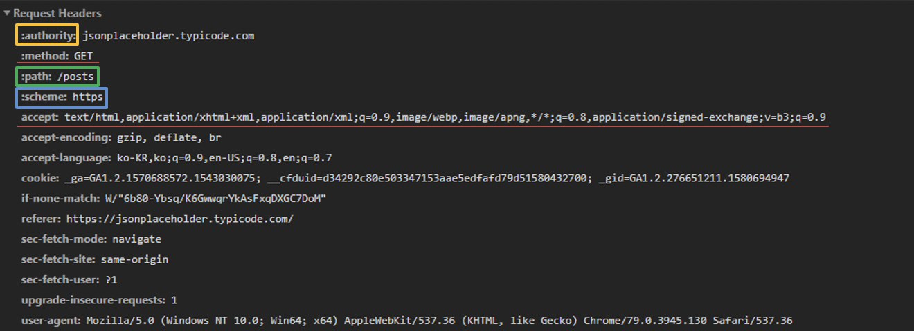
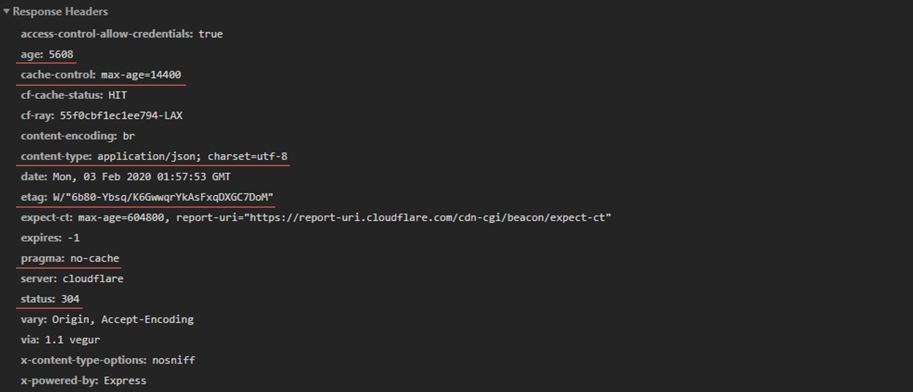

## Intro

REST API 설계원칙 중 마지막으로 **Metadata**와 **Representation**에 대한 내용에 대해 정리한다.

**Metadata**는 API 통신을 할 때의 요청 또는 응답의 정보를 말한다. 그리고 **Representation**은 API 응답을 표현하는 형태를 말한다.

## Metadata 설계

### Request Headers

- URI = scheme "://" authority "/" path ["?" query] [ "#" fragment ]
- Method: 요청 시 쓰인 함수(CRUD)
- accept: 요청 이후에 응답으로 받을 Media Type

### Response Headers

- **age** : cache-control의 max-age 시간 내에 얼마나 흘렀는지 초단위로 나타냄
- **cache-control** : ‘no-store’, ‘no-cache’, ‘max-age’ 등 여러 옵션으로 캐싱 정책을 지정
- **content-type** : Response body의 Media Type
- **etag** : Response의 특정 버전을 나타내는 일련의 문자열
- **pragma** : “no-cache”를 지정함으로써 HTTP 1.0에서 캐시를 사용하지 않게 함
- **status** : HTTP 상태 코드

### Metadata의 설계 원칙

#### HTTP Header의 역할

- 메타데이터 전달
- 요청한 Resource 관련 정보 저장
- 전달할 Representation 관련 정보 저장
- 중간 캐시 조절

#### :books: Rule: Content-Type을 사용해야 한다.

- Content-Type은 Request나 Response body에 있는 데이터 타입을 나타낸다.
- “Media Type”이라고 알려진 특별하게 정의된 문자열이 쓰인다.

#### :books: Rule: Content-Length를 사용해야 한다.

- byte 단위로 body의 크기를 나타낸다.
- 실제 body의 크기를 제공해야 하는 이유는 2가지
  - Client가 이 값을 이용해서 바이트의 크기를 올바로 읽었는지 확인
  - HEAD 요청으로 모든 데이터를 다운로드 하지 않고도 body의 크기를 확인 가능

#### :books: Rule: Last-Modified는 Response에 사용해야 한다

- 타임스탬프
- 리소스의 표현 상태 값이 바뀐 마지막 시간을 나타낸다.
- Client와 캐시 중간자는 이 값을 이용하여 Client에 저장되어 있는 리소스의 갱신을 결정

#### :books: Rule: ETag는 Response에 사용해야 한다.

- ETag 값은 Response의 특정 버전을 나타내는 일련의 문자열
- 항상 GET 요청에 대한 응답으로 보내져야 한다.
- 나중에 사용할 GET 요청에 위해서 ETag 값을 저장 할 수도 있다.

#### :books: Rule: Store는 조건부 PUT 요청을 지원해야 한다.

- Store는 PUT을 이용해서 리소스를 추가 or 업데이트 할 수 있다.
- Server에서는 Client의 의도를 모르기 때문에 ‘If-Unmodified-Since’와 ‘If-Match’를 통해 의도를 파악

#### :books: Rule: Location은 새로 생성된 리소스의 URI를 나타내는 데 사용해야 한다.

- Collection이나 Store에 성공적으로 리소스를 생성하면, 새로 생성된 리소스의 URI를 Location에 나타낸다.
- 202(“Accepted”) Response 안에 있는 Location은 비동기 Controller의 연산 상태를 Client에 알려주는 데 사용

#### :books: Rule: Cache-Control, Expires, Date Response Header는 캐시 사용을 권장하는 데 사용해야 한다.

- Client의 대기시간 감소, 신뢰성 향상, API 서버 부하 감소 장점
- Cache-Control에 초 단위의 “max-age”를 설정하여 갱신 주기를 제공
- HTTP 1.0의 캐시를 지원하려면, 추가적으로 Expires와 Date를 제공해야 함
  - Expires와 Date의 차이를 통해 갱신 주기를 알 수 있음

#### :books: Rule: Cache-Control, Expires, Pragma Response Header는 캐시 사용을 중지하는 데 사용해야 한다.

- Response를 캐시에 저장하지 않도록 하려면
  - Cache-Control 값을 “no-cache” 또는 “no-store”로 설정
- HTTP 1.0의 경우 추가적으로
  - “Pragma: no-cache”와 “Expires: 0”을 설정해야 한다.

#### :books: Rule: 캐시 기능은 사용해야 한다.

- no-cache 대신 값이 작은 max-age를 사용하면 갱신에 관계없이 짧은 시간 내 캐시에 저장된 값을 가져온다.

#### :books: Rule: 만기 된 캐싱 헤더는 200(“OK”) Response에 사용해야 한다.

- 만기 된 캐싱 헤더는 GET과 HEAD 요청에 대한 Response에만 사용해야 한다.
- POST도 캐시에 저장 가능하지만, 대부분 캐시는 POST는 캐시에 저장 불가능한 것으로 취급

#### :books: Rule: 만기 된 캐싱 헤더는 ‘3XX’ 와 ‘4XX’ Response에 선택적으로 사용될 수 있다.

- “Nagative Caching”이라고 불린다.
- Redirect 횟수와 REST API에 오류에 따른 부하를 감소시킨다.

#### :books: Rule: 커스텀 HTTP Header는 HTTP 메서드의 Action을 바꾸는 데 사용해서는 안 된다.

- 커스텀 헤더는 “정보 전달”이 목적일 때만 사용
- Client와 Server 모두 커스텀 헤더를 처리할 수 없는 경우에도, 문제가 없게 구현해야 한다.
- 커스텀 헤더에 포함된 정보가 Request나 Response를 처리하는 데 쓰인다면, body 또는 URI에 포함시키는 게 맞다.