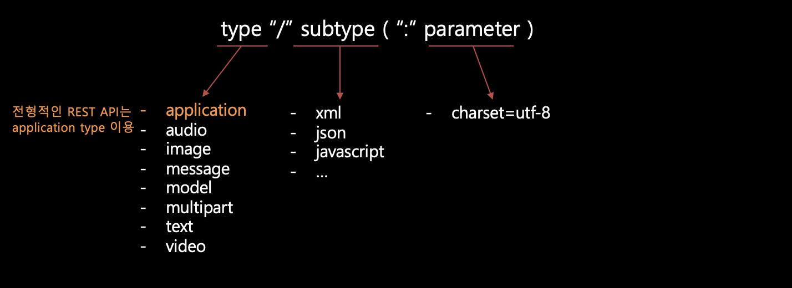

## Intro

REST API 설계원칙 중 마지막으로 **Metadata**와 **Representation**에 대한 내용에 대해 정리한다.

**Metadata**는 API 통신을 할 때의 요청 또는 응답의 정보를 말한다. 그리고 **Representation**은 API 응답을 표현하는 형태를 말한다.

## Metadata 설계

### Request Headers


- URI = scheme "://" authority "/" path ["?" query] [ "#" fragment ]
- Method: 요청 시 쓰인 함수(CRUD)
- accept: 요청 이후에 응답으로 받을 Media Type

### Response Headers


- **age** : cache-control의 max-age 시간 내에 얼마나 흘렀는지 초단위로 나타냄
- **cache-control** : ‘no-store’, ‘no-cache’, ‘max-age’ 등 여러 옵션으로 캐싱 정책을 지정
- **content-type** : Response body의 Media Type
- **etag** : Response의 특정 버전을 나타내는 일련의 문자열
- **pragma** : “no-cache”를 지정함으로써 HTTP 1.0에서 캐시를 사용하지 않게 함
- **status** : HTTP 상태 코드

### Metadata의 설계 원칙

#### HTTP Header의 역할

- 메타데이터 전달
- 요청한 Resource 관련 정보 저장
- 전달할 Representation 관련 정보 저장
- 중간 캐시 조절

#### :books: Rule: Content-Type을 사용해야 한다.

- Content-Type은 Request나 Response body에 있는 데이터 타입을 나타낸다.
- “Media Type”이라고 알려진 특별하게 정의된 문자열이 쓰인다.

#### :books: Rule: Content-Length를 사용해야 한다.

- byte 단위로 body의 크기를 나타낸다.
- 실제 body의 크기를 제공해야 하는 이유는 2가지
  - Client가 이 값을 이용해서 바이트의 크기를 올바로 읽었는지 확인
  - HEAD 요청으로 모든 데이터를 다운로드 하지 않고도 body의 크기를 확인 가능

#### :books: Rule: Last-Modified는 Response에 사용해야 한다

- 타임스탬프
- 리소스의 표현 상태 값이 바뀐 마지막 시간을 나타낸다.
- Client와 캐시 중간자는 이 값을 이용하여 Client에 저장되어 있는 리소스의 갱신을 결정

#### :books: Rule: ETag는 Response에 사용해야 한다.

- ETag 값은 Response의 특정 버전을 나타내는 일련의 문자열
- 항상 GET 요청에 대한 응답으로 보내져야 한다.
- 나중에 사용할 GET 요청에 위해서 ETag 값을 저장 할 수도 있다.

#### :books: Rule: Store는 조건부 PUT 요청을 지원해야 한다.

- Store는 PUT을 이용해서 리소스를 추가 or 업데이트 할 수 있다.
- Server에서는 Client의 의도를 모르기 때문에 ‘If-Unmodified-Since’와 ‘If-Match’를 통해 의도를 파악

#### :books: Rule: Location은 새로 생성된 리소스의 URI를 나타내는 데 사용해야 한다.

- Collection이나 Store에 성공적으로 리소스를 생성하면, 새로 생성된 리소스의 URI를 Location에 나타낸다.
- 202(“Accepted”) Response 안에 있는 Location은 비동기 Controller의 연산 상태를 Client에 알려주는 데 사용

#### :books: Rule: Cache-Control, Expires, Date Response Header는 캐시 사용을 권장하는 데 사용해야 한다.

- Client의 대기시간 감소, 신뢰성 향상, API 서버 부하 감소 장점
- Cache-Control에 초 단위의 “max-age”를 설정하여 갱신 주기를 제공
- HTTP 1.0의 캐시를 지원하려면, 추가적으로 Expires와 Date를 제공해야 함
  - Expires와 Date의 차이를 통해 갱신 주기를 알 수 있음

#### :books: Rule: Cache-Control, Expires, Pragma Response Header는 캐시 사용을 중지하는 데 사용해야 한다.

- Response를 캐시에 저장하지 않도록 하려면
  - Cache-Control 값을 “no-cache” 또는 “no-store”로 설정
- HTTP 1.0의 경우 추가적으로
  - “Pragma: no-cache”와 “Expires: 0”을 설정해야 한다.

#### :books: Rule: 캐시 기능은 사용해야 한다.

- no-cache 대신 값이 작은 max-age를 사용하면 갱신에 관계없이 짧은 시간 내 캐시에 저장된 값을 가져온다.

#### :books: Rule: 만기 된 캐싱 헤더는 200(“OK”) Response에 사용해야 한다.

- 만기 된 캐싱 헤더는 GET과 HEAD 요청에 대한 Response에만 사용해야 한다.
- POST도 캐시에 저장 가능하지만, 대부분 캐시는 POST는 캐시에 저장 불가능한 것으로 취급

#### :books: Rule: 만기 된 캐싱 헤더는 ‘3XX’ 와 ‘4XX’ Response에 선택적으로 사용될 수 있다.

- “Nagative Caching”이라고 불린다.
- Redirect 횟수와 REST API에 오류에 따른 부하를 감소시킨다.

#### :books: Rule: 커스텀 HTTP Header는 HTTP 메서드의 Action을 바꾸는 데 사용해서는 안 된다.

- 커스텀 헤더는 “정보 전달”이 목적일 때만 사용
- Client와 Server 모두 커스텀 헤더를 처리할 수 없는 경우에도, 문제가 없게 구현해야 한다.
- 커스텀 헤더에 포함된 정보가 Request나 Response를 처리하는 데 쓰인다면, body 또는 URI에 포함시키는 게 맞다.

## Media Type 설계

### Media Type

#### Media Type이란?

- Request 나 Response 의 body 안에 있는 데이터 형태를 식별하기 위한 Content-Type 헤더 값

#### Media Type 문법



#### 등록된 Media Type

- **IANA(Internet Assigned Numbers Authority)**에 등록된 Media Type
  - *등록된 Media Type을 관리하고, 각 타입의 RFC로 발표된 명세의 링크를 제공하는 기관*

| type                   | description                                                  |
| ---------------------- | ------------------------------------------------------------ |
| text/plain             | 특별한 구조나 마크업이 없는 평문 포맷                        |
| text/html              | HTML로 포맷된 콘텐츠                                         |
| image/jpeg             | JPEG(Joint Photographic Experts Group)에서 표준화한 이미지 압축 방법 |
| application/xml        | XML(Extensible Markup Language)로 구조화된 콘텐츠            |
| application/atom+xml   | feed로 알려진 구조적인 데이터를 XML 기반의 리스트로 포맷팅한 Atom을 사용하는 콘텐츠 |
| application/javascript | 자바스크립트 프로그래밍 언어로 작성된 소스 코드              |
| application/json       | 구조화된 데이터를 교환하는 프로그램에서 주로 사용되는 텍스트 기반의 JSON 포맷 |

#### 벤더 고유 Media Type

- 특정 업체에서 소유 및 관리하고 있음을 의미하는 Media Type
- 서브 타입의 접두어로 `vnd` 사용
  - application/vnd.ms-excel
  - application/vnd.lotus-notes
  - text/vnd.sun.j2me.app-descriptor

### Media Type 설계 원칙

#### :books: Rule: 애플리케이션 고유 Media Type을 사용해야 한다.

- text/plain, text/html, imgae/jpeg, application/xml, application/json …

#### :books: Rule: Resource의 표현이 여러 가지 가능할 경우 Media Type 협상을 지원해야 한다.

- Client에서 Request Header의 Accept 항목에 원하는 Media Type 추가
- ex) Accept : application/json

#### :books: Rule: Query 변수를 사용한 Media Type 선택을 지원할 수 있다.

- Query Parameter “accept”를 통해 Media Type을 선택할 수 있다.
- ex) GET /bookmarks/mikemassedotcom?accept=application/xml

## Representation 설계

### Representation 설계 원칙

#### :books: Rule: JSON 리소스 표현을 지원해야 한다.

- 특정 리소스 타입에 대한 표준 포맷(ex. jpeg는 image/jpeg)이 없을 경우, 정보를 구조화 하기 위해 JSON을 사용해야 함
- 하지만, 반드시 Content-Type 값으로 “application/json”을 사용해야 한다는 의미는 아님

#### :books: Rule: JSON은 문법에 잘 맞아야 한다.

- JSON은 Key-Value 쌍의 형태
- Key 값은 항상 큰따옴표(“) 안에 넣는다.
- JSON은 문자열과 숫자를 지원
  - 날짜와 시간은 지원하지 않기 때문에 큰따옴표로 감싸줘야 한다.
- 이름을 붙일 때, 소문자 사용하고 특수문자는 피한다.
  - property에 접근 시, 점(.)을 이용하기 때문

#### :books: Rule: XML과 다른 표현 형식은 선택적으로 지원할 수 있다.

- XML, HTML 등의 리소스를 표현하기 위해 선택적으로 대체 포맷을 사용하여 다른 언어를 지원할 수 있다.

#### :books: Rule: 추가적인 envelope은 없어야 한다.

- REST API는 HTTP가 제공한 메시지의 구성 요소를 이용해야 한다는 뜻
- 즉, 리소스의 상태를 표현하기 위해 HTTP가 제공하는 요소 외의 추가적인 것이 사용되지 않아야 한다는 뜻

### HyperMedia Representation

#### HyperMedia ?

**HATEOAS(Hypermedia As The Engine Of Application State)**라는 개념을 통해 해당 Resource에 대해 호출 가능한 API에 대한 정보를 Resource의 상태를 반영하여 표현

#### 전형적인 REST API의 응답 데이터

```json
{
  “accountId”:12345,
  “accountType”:”saving”,
  “balance”:350000”,
  “currency”:”KRW”
}
```

#### HATEAOS가 도입되어 자원에 대한 추가 정보가 제공되는 응답 데이터

```json
{
  “accountId”:12345,
  “accountType”:”saving”,
  “balance”:350000”,
  “currency”:”KRW”
  “links”: [
       {
       “rel”: “self”
       “href”: “http://localhost:8080/accounts/1”
       },
       {
       “rel”: “withdraw”,
       “href”: “http://localhost:8080/accounts/1/withdraw”
       },
       {
       “rel”:”transfer”,
         “href”:”http://localhost:8080/accounts/1/transfer”
       }
  ]
}
```

- 해당 Resource의 상태에 따라 접근 가능한 추가 API들이 "links"라는 이름으로 제공

> :exclamation: REST API는 **"stateless"**이기 때문에 위와 같이 추가적인 정보를 제공한다.

#### :books: Rule: 링크는 일관된 형태로 나타내야 한다.

```json
{
  "href" : Text <constrained by URI or URI Template syntax>,
  "rel" : Text <constrained by URI syntax>,
  "requestTypes" : Array <constrained to contain media type text elements>,
  "responseTypes" : Array <constrained to contain media type text elements>,
  "title" : Text
}
```

- href : 링크의 타켓 리소스
- rel : 링크 관계를 기술하는 Document
- requestTypes : 연결된 리소스의 허용된 Request Body의 Media Type이 나열되어 있는 배열
- responseTypes : 연결된 리소스의 사용 가능한 Response Body의 Media Type이 나열되어 있는 배열
- title : 특정 링크에 대한 문자로 된 제목

#### :books: Rule: 링크 관계를 표현할 때에는 일관된 형태를 사용해야 한다.

```json
{
  "name" : Text,
  "method" : Text <constrained to be choice of HTTP method>,
  "requestTypes" : Array <constrained to contain media type text elements>,
  "responseTypes" : Array <constrained to contain media type text elements>,
  "description" : Text,
  "title" : Text
}
```

- name : 링크 관계의 이름 (필수)
- method : 링크 관계와 관련 있는 HTTP 메서드 (없으면, GET 으로 가정)
- requestTypes : 연결된 리소스의 허용된 Request Body의 Media Type이 나열되어 있는 배열
- responseTypes : 연결된 리소스의 사용 가능한 Response Body의 Media Type이 나열되어 있는 배열
- description : 링크 관계의 설명을 plain text로 제공 (필수)
- title : 링크 관계의 제목

#### :books: Rule: 링크를 표현할 때에는 일관된 형태를 사용해야 한다.

- 리소스의 현재 상태에서 가능한 모든 링크를 포함하고 있는 ‘**links 구조**’ 사용
- Client가 새로운 링크를 쉽게 발견 가능
- 간단한 관계 이름으로 이미 알려진 링크를 쉽게 찾을 수 있다.

```json
{
  "firstName" : "Osvaldo",
  "lastName" : "Alonso",
  "links" : {
    "self" : {
      "href" : "http://api.soccer.restapi.org/players/2113",
      "rel" : "http://api.relations.wrml.org/common/self"
     },
    "parent" : {
      "href" : "http://api.soccer.restapi.org/players",
      "rel" : "http://api.relations.wrml.org/common/parent"
     },
    "team" : {
      "href" : "http://api.soccer.restapi.org/teams/seattle",
      "rel" : "http://api.relations.wrml.org/soccer/team"
     },
    "addToFavorites" : {
      "href" : "http://api.soccer.restapi.org/users/42/favorites/{name}",
      "rel" : "http://api.relations.wrml.org/common/addToFavorites"
     }
  }
}
```

#### :books: Rule: Response body 표현에는 셀프 링크를 포함해야 한다.

- Response body에 ‘**self**’라는 이름의 링크를 포함해야 한다.
- self는 ‘**href**’와 ‘**rel**’을 포함

#### :books: Rule: 진입 API URI 수를 최소화하라.

- REST API 설계 관점에서 웹을 보면, 홈페이지(API Docroot)가 있고, 그와 연관된 웹 사이트로 연결될 수 있는 네비게이션이 있다.
- 즉, Docroot에서 다른 모든 리소스를 사용할 수 있는 링크를 제공해야 한다.

#### :books: Rule: Resource의 상태에 따라 가능한 Action을 표현하기 위해서 링크를 사용해야 한다.

- REST의 HATEOAS(Hypermedia as the Engine of Application State) 제한 조건
- Client의 모든 요청에 대해 API는 상태에 민감한 링크를 포함하는 리소스 표현으로 응답해야만 한다.
- Example
  - 아래 예제는 애플리케이션의 ‘편집’ 메뉴 액션 상태를 모델링하는 HyperMedia
  - Client에서 데이터를 공유할 수 있게, Server에서 관리하는 클립보드 리소스가 있다고 가정하자.

> 초기 편집 메뉴의 상태

```json
# Fields...
"links" : {
  "self" : {
    "href" : "http://api.editor.restapi.org/docs/48679",
    "rel"  : "http://api.relations.wrml.org/common/self"
  },
  "cut"  : {
    "href" : "http://api.editor.restapi.org/docs/48679/edit/cut",
    "rel"  : "http://api.relations.wrml.org/editor/edit/cut"
  },
  "copy" : {
    "href" : "http://api.editor/restapi.org/docs/48679/edit/copy",
    "rel"  : "http://api.relations.wrml.org/editor/edit/copy"
  }
}
```

> "cut" or "copy"로 클립보드에 데이터가 저장된 상태

```json
# Fields...
"links" : {
  "self" : {
    "href" : "http://api.editor.restapi.org/docs/48679",
    "rel"  : "http://api.relations.wrml.org/common/self"
  },
  "paste" : {
    "href" : "http://api.editor.restapi.org/docs/48679/edit/paste",
    "rel"  : "http://api.relations.wrml.org/editor/edit/paste"
  }
}
```

### Error Representation

#### :books: Rule: 오류는 일관성 있게 표현한다.

- REST API의 Error Response에 포함될 수 있는 오류에 대한 설명
- 형식은 아래와 같음

```json
{
  “id” : Text,
  “description” : Text
}
```

#### :books: Rule: 오류 응답은 일관성 있게 표현한다.

- 요청 처리 시, 하나 이상의 오류가 발생하면 body 안에 오류 응답 표현을 반환
- 이 때, Status code는 ‘4XX’ or ‘5XX’ 중 하나여야 한다.

```json
{
    “elements” : [
    {
      “id” : “update Failed”,
      “description” : “failed to update /user/1234”
    }
  ]
}
```

#### :books: Rule: 일반적인 오류 상황에서는 일관성 있는 오류 타입을 사용해야 한다.

- 오류 타입은 한 번 정의되면 서비스를 제공하는 오류 스키마 문서를 통해 모든 API에 공유되어야 한다.
- Media Type 스키마 디자인에서 스키마 확장을 통해 기본 타입에 추가 항목을 넣어서 새로운 오류 타입 정의