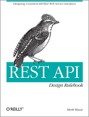

## Intro

앞으로 **REST API**에 대한 내용으로 포스팅을 하려고 한다. REST API가 무엇이고, 나오게 된 배경 그리고 더 나아가 설계원칙에 대해서 다루고자 한다.

포스팅은 아래 도서([REST API Design Rulebook](http://shop.oreilly.com/product/0636920021575.do))를 참고하여 진행한다.

    

이번 포스팅에서는 **REST API의 정의와 배경**에 대해서 정리한다.

## 용어 정리

앞으로 자주 나오게 될 용어에 대해서 간단하게 정리한다.

### URI (The <u>U</u>niform <u>R</u>esource <u>I</u>dentifier)

- 인터넷에 있는 자원을 나타내는 유일한 주소

### HTTP (The <u>H</u>yper<u>T</u>ext <u>T</u>ransfer <u>P</u>rotocol)

- HTML 문서와 같은 자원들을 가져올 수 있도록 해주는 프로토콜

### HTML (<u>H</u>yper<u>T</u>ext <u>M</u>ark-up <u>L</u>anguage)

- 웹 페이지를 만들기 위한 언어

### API (<u>A</u>pplication <u>P</u>rogramming <u>I</u>nterfaces)

- 응용 프로그램에서 사용할 수 있도록 운영체제나 프로그래밍 언어가 제공하는 기능을 제어할 수 있게 만든 인터페이스
- ex) 파일 제어, 창 제어, 문자 제어 그리고 Java 언어가 제공하는 함수 등이 모두 API라고 한다.

### REST (<u>Re</u>presentational <u>S</u>tate <u>T</u>ransfer)

- 월드 와이드 웹(**WWW**)과 같은 **소프트웨어 아키텍처**의 한 형식
- <u>자원을 정의</u>하고, <u>자원에 대한 주소를 지정</u>하는 방법 전반을 뜻한다.

## 배경

그럼 `REST`가 등장한 배경은 어떻게 될까?

### 웹 표준 정의

웹의 성장을 위해 **Fielding**과 **Tim Berners-Lee**는 여러 사람들과 일을 했다.

그 결과 HTTP의 새로운 버전인 **HTTP/1.1**과 **URI**의 문법을 공식화 하였다. (RFC 3996)

### 다양한 Client의 등장

웹의 발전과 함께 다양한 Browser가 생겨났고, Android, ios 같은 모바일은 물론 다양한 플랫폼이 등장한다.

당연히 Server는 이러한 멀티 플랫폼과 통신이 가능해야만 했다.

그 과정에서 Resource에 대해 구조를 정의하고 이용하는 방법에 대해 고민하던 찰나 REST에 대한 관심이 증가하게 된다.

### REST? 그게 뭔데?

- 2000년에 Fielding이 위 웹 표준에 따라 정의
- **_"자원을 정의하고, 자원에 대한 주소를 지정하는 방법 전반"_**에 대한 웹 구조적인 스타일

정리하자면,

`REST`는 **HTTP URI(Uniform Resource Identifier)**를 통해 자원(Resource)을 명시하고, 
**HTTP Method(POST, GET, PUT, DELETE 등)**을 통해 자원에 대한 CRUD Operation을 적용하여, 
**여러 형태의 Representation(JSON, XML, TEXT 등)**으로 응답한다.

### REST API란?

- 결국 `REST(ful) API`는 REST 기반으로 서비스 API를 구현한 것이다.
