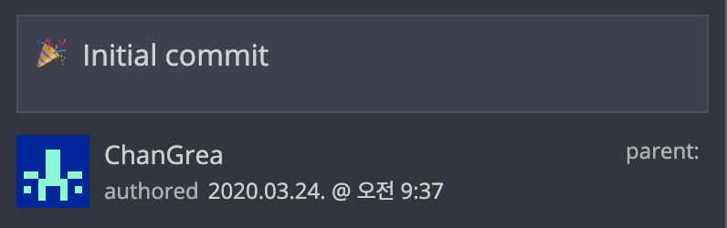

> 이제 곧 있으면, 2~3개월 동안 진행한 '**마음을 담다 -목소리 찾기-**' 프로젝트가 상용 오픈을 앞두고 있다.
>
> 물론 이 글을 쓰는 지금도 열심히 개발하고 있다. 오픈되고 나서부터 한 달 동안은 계속 잡고 있어야 할 듯하지만, 아쉬웠던 점을 위주로 회고를 하려고 한다.

## 내가 맡은 역할

 이 프로젝트에는 사업 부서를 비롯해 여러 개발자들이 붙어서 진행했다.

그 중 내가 맡은 부분은 "**관리자 페이지**" 개발이다.

Frontend 개발만 주로 해왔는데, 같은 웹 분야지만 좀 더 큰 웹 개발을 맡게 된 것이다.

- Angular.js, Gulp
- Spring Boot, Security, Batch
- JPA + Postgresql

모두 처음 접하는 것들이었다. 

## Timeline으로 지난 날을 생각해보자.

### :tada: 프로젝트의 시작

Git Repository의 Commit History를 쭉 내려보니, 처음 시작은 **2020.03.24** 이었다.

 

사실 프로젝트를 처음부터 쌩으로 개발하지는 않았다. 대부분 현업의 프로젝트가 그럴 것 같은데, **기존에 했었던 프로젝트를 가져다가 수정하는 식**으로 개발을 했다.

초기에는 프로젝트의 환경 셋팅, 프로젝트의 구조가 어떻게 되어 있는지, 어떤 기능을 썼는지, 활용할 것은 무엇인지 주로 분석하는데 시간을 많이 할애했다.

주로 시작하고 1개월 동안은 로그인 인증 부분에 집중했다. 까다로운 회사 보안 규정을 준수하면서 코딩을 해야했기 때문이다. 

번외의 이야기지만, 이 시기에 코로나19로 인해서 재택근무를 하게 되었다. 일단 약 4시간 정도의 출퇴근 시간을 세이브할 수 있어서 시간에 대한 활용도, 업무 효율의 향상의 장점이 있었다.

하지만, 혼자서 진행하고 있었기 때문에 매일 아침에 스크럼을 통해 진행상황이나 이슈를 공유한다 하더라도 더군다나 경험이 없는 주니어 개발자이기 때문에 올바른 방향을 잡고 잘 진행하고 있는지 판단하기 어려웠다.

### :construction: 프로젝트의 중반부

사실 프로젝트의 중반부라고 하기에는 애매하다. 프로젝트를 시작하고 **로그인 인증** 부분에 굉장히 신경을 많이 썼고, 중반부라고 칭하고 있는 이 시점에도 로그인 인증은 완벽하지 않았다.

어쨌든 로그인 인증은 완벽하진 않았지만, 다음 기능 개발을 하기 위해 잠시 덮어뒀고, 관리자 페이지를 만드는 주 목적이 **회원들을 등록하고 관리하기 위한 페이지**가 필요했기 때문이다.

기술 스택의 경험이 없었기 때문일까, 이런 조그마한 기능 하나를 개발하는 데에도 굉장히 많은 시간을 투자했고, 개발을 해놓고도 잘못된 데이터베이스 테이블 스키마 설계, 기능이 깔끔하게 동작하지 않는 문제 때문에 여러 번의 코드 리뷰와 리팩토링을 거쳤고, 수정에 수정을 거듭했다.

그렇게 **5월 말(상용 서비스 오픈 2주 전..)**까지 완성된 기능은 고작 로그인, 회원 관리, 앱 버전 관리 3가지 뿐이었다.

이때부터 프로젝트의 관리자였던 팀장님의 ~~압박~~이 시작되었던 것 같다.

> 3주 남았는데 다 할 수 있어? 2주 남았는데? 아직도? 할 일 엄청 많네?

### :sparkles: 프로젝트의 마무리(?)를 향해

 어쨌든 할 일은 엄청 많이 남았었다. 요즘 **1일 1깡**이 유행인데, 이 시기에 말 그대로 **1일 1기능 개발**을 했었던 것 같다. 주말에는 1일 2기능, 3기능 개발을 했었다. (관리자 계정 관리, 통계 기능, 메인 화면 구성, 접속 기록 관리, 공지 관리, FAQ 관리, 스프링 시큐리티의 인증/인가 적용 등등....)

이 때는 정말 정신 없이 밤 9시, 10시까지 야근하고 출, 퇴근하면서도 남은 일들에 대한 계획, 개발 방법, 로직만 생각했었던 것 같다. :fire::fire::fire:

무슨 일이 있어도 내가 "**기간 안에 반드시 끝낼 수 있다**"라고 내뱉었던 말을 지키려고 마인드 컨트롤도 수 없이 했었다. :muscle:

결국은 끝냈다.

설계했던 모든 기능에 대해서 개발을 완료했고, TB서버, 상용서버에 배포하여 제대로 동작하는 것 까지 확인하고 완료했다.

물론 상용 테스트를 하면서 발견되는 버그의 수정, 인수인계를 위한 문서 작성, 버전 관리 등에 대한 할 일이 남아 있다. 

## Problem

프로젝트는 잘 마무리했지만, 어떻게 보면 프로젝트의 일정 관리를 실패한 것이나 다름없다. 어떤 문제가 있었을까?

### 1. 커뮤니케이션의 실패

나의 가장 크리티컬한 단점이 아닐까 싶다. 사실 인정하고 싶지 않았고, 요즘도 많이 고민하고 있는 부분이다. 평소에 나는 말이 많은 편이 아니다. 회사에서는 일(개발)을 하고 싶지 다른 잡다한 일을 하고 싶어하지 않는 것 같다.

이 회사에 입사 면접을 볼 때, 자기소개서에 기술된 경험들을 위주로 질의응답이 오고 간다.

당연히 거기에는 '나는 일에 자신감 있고, 꼼꼼하고 적극적으로 처리하는 사람:smile:' 이런식으로 적고 면접 때도 어필하지, '소심하고 낯을 가려요, 하지만 일은 열심히 합니다' 이러면 누가 뽑아주겠는가..

:x: 평소에 일을 할 때 아래 두 가지면 충분하다고 생각했다.

1. 스크럼 때 공유하는 내 일의 진행상황, 이슈
2. 일을 처리할 수 있는 능력, 자신감

:o: 하지만 관리자 입장에서 생각해봐야 한다.

1. 얘가 무슨 일을 하고 있고 어떤 일들이 남았지?
2. 이 일을 다 할 수 있을까?

이런 요소들을 어떻게 판단할 수 있을까 생각해 봤다.

과연 조용하지만 성실하게 최선을 다해 일을 한다고 해서 윗 사람들이 "얘는 정말 성실하고 일을 잘해"라고 생각할까? 하물며, 소프트웨어를 만들때도 `로그 처리` 를 하지 않는가..

28년 동안 형성된 성격을 하루 아침에 고치기는 쉽지 않다. 하지만 지금도 노력하고 있고, 천천히 고쳐나가다 보면, 바뀐 나의 모습을 볼 수 있지 않을까?

### 2. 안일한 생각

한편 개발을 하면서 생각보다 긴 프로젝트 기간에 안일한 생각을 가지고 있었던 것 같기도 하다. 지금 생각해보면 가장 위험한 태도인 것 같다.

1번과 같은 나의 단점에 이런 생각까지 하고 있었던 것은 정말 너무 아찔하다. 

중,후반부에 팀장님, 과장님과의 수 차례의 채찍질, 면담 그리고 동료돌의 조언 덕분에 프로젝트를 마무리 할 수 있었던 것이지 만약 이런 대화가 없었다면 난 실패했을 것이다.

"난 할 수 있다" :arrow_left: 이건 그냥 자신감이 아니라 **오만함**, **자만** 이다. 나는 결코 남들보다 뛰어나지 않다. 다만 내 동료들이 가지지 못한 장점이자 무기는 "**노력**" 이다.

이렇게 노력하고 있기 때문에 난 할 수 있다. 될 것이다. 이런 안일한 생각은 버리자. 더 해야 한다. 나보다 더 노력하는 사람은 많다. 그 중에 나보다 더 뛰어난 사람도 많다.

### 3. 지나친 꼼꼼함

마지막으로 내가 가진 장점 중 하나인 꼼꼼함, 이것이 나의 발목을 잡지 않았나 싶다. 요구사항은 언제든 변경된다. 지금도 변경되고 있다.

초반에 나는 모든 경우의 수를 다 고려해서 설계를 하고 개발을 하려고 하다보니 시간이 오래 걸렸다. 하지만 그렇게 했다고 해서 완벽하지도 않았다. (**세상에 완벽한 소프트웨어는 없다.**)

프로젝트 중반에 나는 내 꼼꼼함을 버리기로 했다. 대충대충 한다는 의미가 아니다. 언제든지 변경될 수 있다는 가능성을 열어둔 것이라고 해야할까? 기능의 동작에 집중했고, 버그는 어떻게 하든 있을 수 밖에 없다고 인정했다.

물론 마감 기간이 다가오기 때문일 수도 있겠지만 개발 속도는 2,3배로 올라갔고 프로젝트를 잘 마칠 수 있었다.

## Get

프로젝트를 하면서 얻은 것은 아래와 같다.

### 1. Backend 개발 역량

Java 언어에 대한 경험은 아예 없지 않았다. 학교를 다니면서 쓰던 언어이기도 했고, 관련된 객체지향 개념에 대해서도 어느정도 알고 있었다.

하지만, Spring Framework와 ORM(JPA), MVC 개발 그리고 사소할 수도 있지만 Linux 터미널을 다루는 역량 등 모든 것이 부족했다.

작년 다른 팀에 있을 때도 서버 개발 팀이었지만, 서버 개발을 할 줄 몰랐다. 이번 프로젝트를 하면서 정말 날개를 단 것 같은 느낌이다.

별 것 아닐 수 있지만, 서버 개발을 해봤다는 경험 자체가 Frontend 개발만 했던 나에게 기술 스택 하나가 더 생긴 것이고, 대화에 낄 수 있을 정도가 되었고, 폭넓게 생각을 할 수 있게 되었다.

한마디로 한 단계, 아니 두 단계는 성장한 것 같다.

### 2. 나의 단점

위 `Problem` 에서 언급한 것들을 알았다는 것 자체가 얻은 것들인 것 같다. 나의 문제를 모르는 것은 정말 문제지만, 알았다면 이제 하나씩 고쳐나가면 된다. 난 그렇게 생각한다.

## 마무리

일기 형식으로 회고를 해봤는데, 3개월 동안 경험, 그리고 느낀점이 앞으로 나의 성장에 자양제가 되기를..!