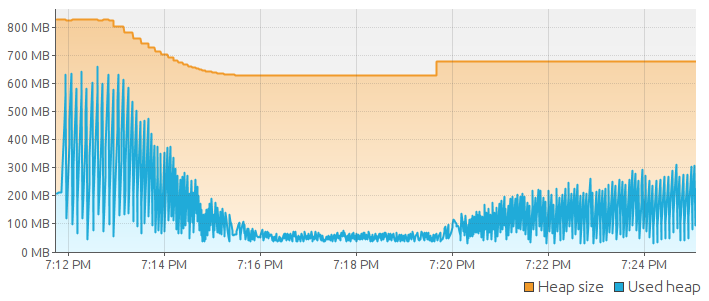
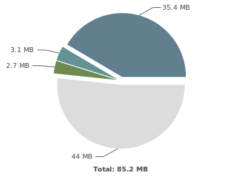
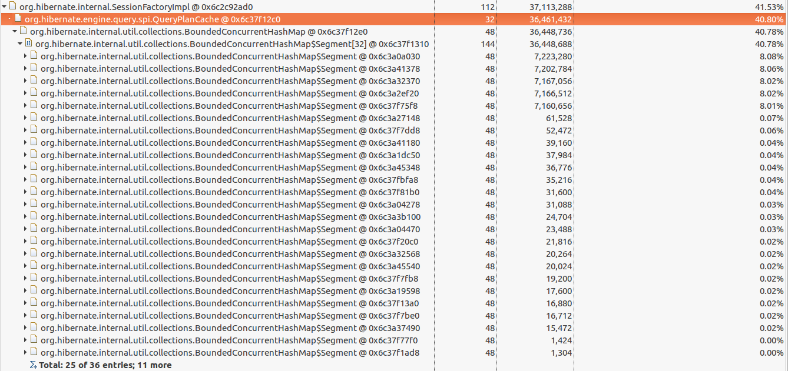

## Intro

[서비스 오픈을 앞두고 썼던 회고](https://changrea.io/etc/web-project-review/) 글이 엊그제 같은데 거의 한 달이 다 되어 간다. 진짜 서비스 오픈 날인 **2020년 7월 25일** 전까지는 상용 서버 테스트만 했었다.

단순히 BackOffice 개발이었기 때문에 성능에 대해서 크게 고려를 하지 않았다. (왜냐면 사용자가 기껏해야 5명도 안될테니까 :crying_cat_face:)

## 문제의 발생 (2020.07.30)

서비스 오픈 행사(2020.07.25)가 잘 마무리 되었고, 서비스에 이상이 없었다.

하지만 정확히 5일 후 문제가 발생했다. 당일 오전까지 잘 접속되던 BackOffice 사이트가 접속이 안되는 것이었다.

당장 BackOffice를 사용할 일이 없었기 때문에 다음 날 문제에 대해 분석하기로 했다.

> 사실 이러면 안된다. 문제가 발생하면 밤을 세우더라도 해결해야 한다.

## 문제 해결:question: (2020.07.31)

### :heavy_check_mark: 방화벽 쪽에서 걸리는 게 아닐까?

WAS가 있는 서버 말고 앞단의 DMZ 존에서 Proxy 역할을 하는 서버가 한 대 더 있었고, 이 DMZ 존에 클라우드 방화벽 작업을 문제 발생 전 날에 했었다.

그렇기 때문에 방화벽 쪽에서 막히고 있을 거라고 생각했었다. 그런데 DMZ 존 서버의 Nginx access log에 tail을 걸어놓고 요청을 보냈는데 요청은 잘 들어왔고 '**504 Gateway timeout**' 에러가 찍히고 있었다.

이는 방화벽에는 문제가 없고, **내부 WAS가 있는 서버에서 문제**가 생겼음을 알 수 있었다.

### :heavy_check_mark: WAS에서 요청은 제대로 처리되고 있는가?

서버 process 상태를 조회해봤을 때 WAS는 띄워져 있었다.

그런데 WAS의 console log를 보니 마지막으로 배치 스케줄링 작업을 한 것 빼고는 들어온 요청이 없었다.

WAS의 동작이 멈췄구나라는 것을 알았다.

### :heavy_check_mark: WAS 재기동 (문제의 해결?)

WAS를 재기동 하였다.

다시 BackOffice 사이트를 접속해보니 잘 되더라.. :pensive:

그럼 이대로 문제가 해결되었다고 볼 수 있을까?

> :x: 아니다.

그냥 서비스가 안되던 현상을 넘긴 것 뿐이다.

## 문제 분석 (2020.07.31 ~ 2020.08.05)

다시 로그를 살펴보니까 **'OutOfMemory Error: Heap Space'**라는 에러를 발견할 수 있었다.

- 자바 힙 공간에 새로운 객체를 생성할 수 없는 경우에 발생
- 하지만 반드시 Memory Leak을 의미하지는 않는다. (다양한 원인이 있다.)
- 지정한 힙 크기(혹은 기본 크기)가 애플리케이션에 충분하지 않은 경우 발생

### 문제의 정확한 원인을 찾기 위한 삽질(1) - 부하테스트

위에서 언급했듯이 OOM의 원인은 다양하다. 반드시 Memory Leak이 아닐 수도 있다. 차분하게 생각하고 접근했다면 좋았을텐데, 그러지 못하고 Local 환경에서 부하를 주면서 Heap의 상태를 모니터링했다.

사용한 도구는 아래와 같다.

- [Jmeter](https://jmeter.apache.org/)
  - 부하 테스트를 할 수 있는 도구
- [VisualVM](https://visualvm.github.io/)
  - Java Heap Memory의 상태를 모니터링 하는 도구

`Batch`, `통계` 등 Memory Leak이 날만한 api 요청을 하면서 Heap의 상태를 봤지만, GC가 발생하면서 메모리는 잘 회수되는 것 밖에는 확인이 되지 않았다.

### 문제의 정확한 원인을 찾기 위한 삽질(2) - HeapDump 분석

OOM에 대응하는 방법은 인터넷을 찾아보니 여러 곳에서 소개하고 있었다. 사실 에러를 보자마자 좀 더 찾아봤다면 쉽게 갈 수도 있었을탠데 하는 아쉬움이 든다.

**OOM의 원인**을 코드에서 찾는 것은 정말 모래사장에서 바늘을 찾는 꼴이기 때문에 **주로 HeapDump 분석**을 이용한다고 한다.

그리고 [Eclispe의 Memory Analyzer(MAT)](https://www.eclipse.org/mat/)을 사용해서 HeapDump 분석을 진행한다.

#### :heavy_check_mark: Heap Histogram

안타깝게도 문제 당일의 HeapDump는 확보하지 못했다...

위 그림은 그래도 아직 문제가 해결되지 않은 상태의 Heap의 히스토그램이다.

회색(44MB)은 Remainder라고 해서 이것저것 쓰고 있는 객체들이지만, 이상하게 그 Remainder와 비슷한 크기를 가지는 객체가 보인다. **(파란색 부분, 35.4MB)**

#### :heavy_check_mark: Dominator Tree

좀 더 자세한 사용 내역을 보기 위해 **Dominator Tree**(Heap의 GC 대상을 트리 형태로 나타낸 것)를 살펴봤다.

- **QueryPlanCache**가 <u>40.80%</u>를 차지하는 것을 볼 수 있다.
  - Query Plan Cache는 SQL Query가 처음 실행될 때, 컴파일 되고 계획을 만들어서 저장해 놓고 다음에 같은 Query가 실행될 때 컴파일 과정을 다시 거치지 않도록 저장하는 역할을 한다.

#### :question: QueryPlanCache가 왜 이렇게 많이 차지 할까? GC가 일어났는데도?

Minor GC가 주기적으로 발생하는데도 QueryPlanCache가 차지하는 메모리는 줄지 않았다.

