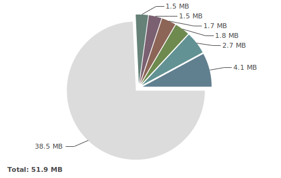

## Intro

[서비스 오픈을 앞두고 썼던 회고](https://changrea.io/etc/web-project-review/) 글이 엊그제 같은데 거의 한 달이 다 되어 간다. 진짜 서비스 오픈 날인 **2020년 7월 25일** 전까지는 상용 서버 테스트만 했었다.

단순히 BackOffice 개발이었기 때문에 성능에 대해서 크게 고려를 하지 않았다. (왜냐면 사용자가 기껏해야 5명도 안될테니까 :crying_cat_face:)


## 문제의 발생 (2020.07.30)

서비스 오픈 행사(2020.07.25)가 잘 마무리 되었고, 서비스에 이상이 없었다.

하지만 정확히 5일 후 문제가 발생했다. 당일 오전까지 잘 접속되던 BackOffice 사이트가 접속이 안되는 것이었다.

당장 BackOffice를 사용할 일이 없었기 때문에 다음 날 문제에 대해 분석하기로 했다.

> 사실 이러면 안된다. 문제가 발생하면 밤을 세우더라도 해결해야 한다.


## 문제 해결:question: (2020.07.31)

### :heavy_check_mark: 방화벽 쪽에서 걸리는 게 아닐까?

WAS가 있는 서버 말고 앞단의 DMZ 존에서 Proxy 역할을 하는 서버가 한 대 더 있었고, 이 DMZ 존에 클라우드 방화벽 작업을 문제 발생 전 날에 했었다.

그렇기 때문에 방화벽 쪽에서 막히고 있을 거라고 생각했었다. 그런데 DMZ 존 서버의 Nginx access log에 tail을 걸어놓고 요청을 보냈는데 요청은 잘 들어왔고 '**504 Gateway timeout**' 에러가 찍히고 있었다.

이는 방화벽에는 문제가 없고, **내부 WAS가 있는 서버에서 문제**가 생겼음을 알 수 있었다.


### :heavy_check_mark: WAS에서 요청은 제대로 처리되고 있는가?

서버 process 상태를 조회해봤을 때 WAS는 띄워져 있었다.

그런데 WAS의 console log를 보니 마지막으로 배치 스케줄링 작업을 한 것 빼고는 들어온 요청이 없었다.

WAS의 동작이 멈췄구나라는 것을 알았다.


### :heavy_check_mark: WAS 재기동 (문제의 해결?)

WAS를 재기동 하였다.

다시 BackOffice 사이트를 접속해보니 잘 되더라.. :pensive:

그럼 이대로 문제가 해결되었다고 볼 수 있을까?

> :x: 아니다.

그냥 서비스가 안되던 현상을 넘긴 것 뿐이다.


## 문제 분석 (2020.07.31 ~ 2020.08.05)

다시 로그를 살펴보니까 **'OutOfMemory Error: Heap Space'**라는 에러를 발견할 수 있었다.

- 자바 힙 공간에 새로운 객체를 생성할 수 없는 경우에 발생
- 하지만 반드시 Memory Leak을 의미하지는 않는다. (다양한 원인이 있다.)
- 지정한 힙 크기(혹은 기본 크기)가 애플리케이션에 충분하지 않은 경우 발생


### 문제의 정확한 원인을 찾기 위한 삽질(1) - 부하테스트

위에서 언급했듯이 OOM의 원인은 다양하다. 반드시 Memory Leak이 아닐 수도 있다. 차분하게 생각하고 접근했다면 좋았을텐데, 그러지 못하고 Local 환경에서 부하를 주면서 Heap의 상태를 모니터링했다.

사용한 도구는 아래와 같다.

- [Jmeter](https://jmeter.apache.org/)
  - 부하 테스트를 할 수 있는 도구
- [VisualVM](https://visualvm.github.io/)
  - Java Heap Memory의 상태를 모니터링 하는 도구


`Batch`, `통계` 등 Memory Leak이 날만한 api 요청을 하면서 Heap의 상태를 봤지만, GC가 발생하면서 메모리는 잘 회수되는 것 밖에는 확인이 되지 않았다.


### 문제의 정확한 원인을 찾기 위한 삽질(2) - HeapDump 분석

OOM에 대응하는 방법은 인터넷을 찾아보니 여러 곳에서 소개하고 있었다. 사실 에러를 보자마자 좀 더 찾아봤다면 쉽게 갈 수도 있었을탠데 하는 아쉬움이 든다.

**OOM의 원인**을 코드에서 찾는 것은 정말 모래사장에서 바늘을 찾는 꼴이기 때문에 **주로 HeapDump 분석**을 이용한다고 한다.

그리고 [Eclispe의 Memory Analyzer(MAT)](https://www.eclipse.org/mat/)을 사용해서 HeapDump 분석을 진행한다.


#### :heavy_check_mark: Heap Histogram


안타깝게도 문제 당일의 HeapDump는 확보하지 못했다...

위 그림은 그래도 아직 문제가 해결되지 않은 상태의 Heap의 히스토그램이다.

회색(44MB)은 Remainder라고 해서 이것저것 쓰고 있는 객체들이지만, 이상하게 그 Remainder와 비슷한 크기를 가지는 객체가 보인다. **(파란색 부분, 35.4MB)**


#### :heavy_check_mark: Dominator Tree

좀 더 자세한 사용 내역을 보기 위해 **Dominator Tree**(Heap의 GC 대상을 트리 형태로 나타낸 것)를 살펴봤다.


- **QueryPlanCache**가 <u>40.80%</u>를 차지하는 것을 볼 수 있다.
  - Query Plan Cache는 SQL Query가 처음 실행될 때, 컴파일 되고 계획을 만들어서 저장해 놓고 다음에 같은 Query가 실행될 때 컴파일 과정을 다시 거치지 않도록 저장하는 역할을 한다.


#### :question: QueryPlanCache가 왜 이렇게 많이 차지 할까? GC가 일어났는데도?

Minor GC가 주기적으로 발생하는데도 QueryPlanCache가 차지하는 메모리는 줄지 않았다.

<br>

[이 stackoverflow 글](https://stackoverflow.com/questions/31557076/spring-hibernate-query-plan-cache-memory-usage)을 보니 문제를 쉽게(?) 발견할 수 있었다.

> Using Hibernate 4.2 and MySQL in a project with an in-clause query such as: `select t from Thing t where t.id in (?)`
>
> Hibernate caches these parsed HQL queries. Specifically the Hibernate `SessionFactoryImpl` has `QueryPlanCache` with `queryPlanCache` and `parameterMetadataCache`. But this proved to be a problem when the number of parameters for the in-clause is large and varies.
>
> ... 생략

<br>

하이버네이트는  `select t from Thing t where t.id in (?)` 같은 **in-clause**가 사용된 HQL 쿼리들을  캐싱한다.

하이버네이트의 `SessionFactoryImpl`는 queryPlancache와 parameterMetadataCache로 구성된 `QueryPlanCache`를 가진다.

문제는 **in clause에 쓰이는 파라미터의 개수**다. 6000개의 파라미터가 쓰인 쿼리와 60001개의 파라미터가 쓰인 쿼리는 다른 것이기 때문에 캐시에 쌓인다.


### 문제의 정확한 원인을 찾기 위한 삽질(3)

#### :heavy_check_mark: 원인 발견

문제의 실마리를 찾았다. 다시 HeapDump 분석을 했던 MAT에서 해당 QueryPlanCache 부분의 Attribute를 자세히 봤다.

 

여러 항목 중의 하나만 확인한 결과이다.

역시나 stackoverflow 글 처럼 **in-clause** 쿼리가 발견되었고, 각 항목의 in에 쓰인 파라미터의 개수는 모두 달랐다.


#### :heavy_check_mark: 그럼 왜 OOM 이슈가 난 것일까?

in-clause의 사용 때문에 문제가 발생한 것이라면 파라미터의 개수가 계속 가변적으로 변하면서 메모리가 쌓였다는 뜻인데 일반적으로는 이해가 되지 않았다.

그래서 해당 쿼리를 사용한 코드를 좀 더 봤다.

> :exclamation: 이 쿼리는 장기 미접속 여부를 체크하기 위해 사용되던 쿼리이다.

1. 하루에 한번 씩 Batch Scheduling을 돌리는 부분
2. 일반적으로 휴면 여부를 확인하는 API

크게 위 두 군데서 사용하고 있었다.

상용 테스트를 하면서 서버를 재기동한지 얼마 되지 않았기 때문에 Batch의 경우에는 크게 영향이 없을 거라고 판단했다.

그럼 **일반적으로 휴면 여부를 확인하는 API**를 <u>다수, 그것도 파라미터의 개수가 가변적으로 변하는 경우</u>가 발생했다는 것으로 생각되었다.

<br>

**2020년 7월 25일**에 행사가 있었고 장애 발생에 대응하기 위해서 <u>BackOffice를 띄워놓고 약 3시간 가량 대기</u>했었다.

그 날 오픈 행사 참석자는 큰 서비스는 아니기 때문에 많지는 않았지만 약 100명 가까이 된 것으로 알고 있다. 아마 앱을 처음 사용하는 분도 있었지만, 가이드를 위해서 <u>앱을 접속하는 건이 평소에 테스트할 때보다 훨씬 많았을 것</u>이다.

해당 쿼리에 쓰인 in-clause에는 실시간으로 접속 기록 건이 추가되기 때문에 파라미터의 개수가 가변적으로 변한다. 또한 메인화면에서는 이 쿼리를 약 10분마다 호출해서 체크하는 로직이 있었다.

행사 당일은 메모리가 잘 버틴 것 같다. :lying_face: 하지만 행사가 끝나고 나서 사용 통계 분석을 위해서 계속 접속을 해놨었던 것 같다. 그렇게 문제가 발생한 것이다.


## 문제의 원흉 제거와 해결

>사실 해당 이슈는 JPA를 사용하고 서비스를 운영하면서 다른 곳에서도 겪게 되는 경우가 종종 있는 것 같다. [NHN Toast Meetup!](https://meetup.toast.com/posts/211) 이 곳에도 원인과 해결방법이 나와 있다.
>
>그리고 우아한 형제들 기술 블로그의 [도움이 될수도 있는 JVM memory leak 이야기](https://woowabros.github.io/tools/2019/05/24/jvm_memory_leak.html) 도 많은 도움이 되었다.

### :heavy_check_mark: In-clause 쿼리 모두 제거 그리고 로직 수정

해당 쿼리를 포함하여 다른 In-clause 쿼리가 하나 더 있었다. 우선 해당 쿼리를 모두 제거하기로 결정했고, 다른 로직으로 수정이 필요했다.

가장 베스트는 DB 테이블의 컬럼을 하나 추가하는 것이었다. 하지만 이 방법은 서비스 서버의 수정도 요구되었기 때문에 공수가 적은 다른 방법이 필요했다.

팀원들과 상의를 통해 `Join` 쿼리를 사용하는 방법으로 이야기가 나왔고, Join에 사용하는 테이블도 다른 테이블을 사용하도록 수정되었다.

또한 **약 10분 마다 API를 호출하던 로직**도 시간을 수정했다. (실시간성으로 구현을 했던 것인데, 그럴 필요가 없었다.)


### :heavy_check_mark: JVM Tuning

**문제가 발생한 날**에 우선 기본적으로 Parallel GC를 사용하는데 `G1GC` 방식으로 변경하였다. 그리고  **최대 Heap Memory도 2배**로 늘려주었다.

이후에 문제를 해결하고 나서 위 설정은 그대로 유지했다.

그리고 이후 OOM 이슈 발생을 대비하여 **HeapDump를 남기는 옵션**을 추가로 적용했다.

```
-Xms2g -Xmx4g -XX:+UseG1GC -XX:NewRatio=7 -XX:+HeapDumpOnOutOfMemoryError -XX:HeapDumpPath=/var/log 
```


### :heavy_check_mark: HeapDump 체크

이후에 2일 간격으로 HeapDump를 체크한 결과이다. 메모리 상태가 안정적으로 돌아왔음을 확인할 수 있었다.

#### 08.05 HeapDump


#### 08.07 HeapDump




## 마무리

굉장히 많이 혼났었다. 성능 테스트도 안해봤냐, 기본이 안되어 있다 등..

OOM 이슈는 원인을 바로 찾아내기가 굉장히 어렵다. 보통 개발 단계에서는 발견하기는 어렵다. (물론 고수들은 이런 경우까지 모두 고려해서 코딩한다고 한다. ~~누가 그러더라..~~)

위의 경우도 마찬가지로 개발 단계에서는 문제가 발생하지 않았으니 그냥 넘어갔겠지?

어쨌든 OOM 이슈가 발생했을 때 당황하지 말고 위에처럼 해보고,  2가지만 기억하자.

1. 성능 테스트를 하자
2. In 쿼리는 되도록 쓰지 말자 (인덱싱도 안되는 단점이 있기도 하다)

끝.