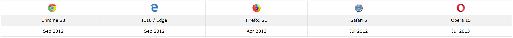

# \[Javascript\] ES5 (ECMAScript 5)

자바스크립트를 접했다면 흔히 `ES5`, `ES6`, `ECMA` 어쩌고...에 대해서 한번 쯤은 들어봤을 것이다. 이번 포스팅부터는 이것들에 대해서 정리를 하고자 한다.

## ECMAScript란 무엇인가?

자바스크립트는 1995년에 `Brendan Eich`라는 사람이 발명했다고 한다. 그리고 1997년에 ECMA 표준이 되었다고 한다. **`ECMAScript`**는 Ecma 인터내셔널의 ECMA-262 기술 규격에 정의된 **표준화된 스크립트 프로그래밍 언어**이다. 자바스크립트를 표준화하기 위해 만들어졌고 지금도 자바스크립트가 제일 잘 알려져 있지만, 액션스크립트, J스크립트 등 다른 것들도 포함된다고 한다.

## ES5 (ECMAScript 5)

그래서 계속해서 자바스크립트는 기능이 추가되고 발전해왔고, 지금도 진행중이다. 새로운 표준이 발표될 때마다 ECMAScript 1, 2, 3, 4, 5 ... 뒤에 숫자를 붙여서 명명하였다.

우리가 기존에 쓰고 있는 Javascript는 2009년에 발표된 ECMAScript 5(ES5) 라고 생각해도 될 듯 하다. 물론 ES6를 사용하고 있는 개발자도 많겠지만, 이렇게 말한 이유는 밑에서 다루겠지만, **IE9에서 'use strict'를 지원하지 않는 것** 빼고는 대부분의 브라우저 버전에서 ES5 문법을 지원하기 때문이다.

> ES5를 지원하는 브라우저 목록



`ES5의 주요 특징`은 아래와 같다.

- ['use strict'](#a-nameusestricta-use-strict)
- [String.trim()](#-stringtrim)
- [Array.isArray()](#-arrayisarray)
- [Array.forEach()](#-arrayforeach)
- [Array.map()](#-arraymap)
- [Array.filter()](#-arrayfilter)
- [Array.reduce()](#-arrayreduce)
- [Array.reduceRight()](#-arrayreduceright)
- [Array.every()](#-arrayevery)
- [Array.some()](#-arraysome)
- [Array.indexOf()](#-arrayindexof)
- [Array.lastIndexOf()](#-arraylastindexof)
- [JSON.parse()](#-jsonparse)
- [JSON.stringify()](#-jsonstringify)
- [Date.now()](#-datenow)

### <a name="usestrict"></a>:point_right: 'use strict'

- '**strict mode**'에서 javascript code를 실행한다.
- 선언하지 않은 variable, object를 사용/수정/삭제 할 수 없다.
- 함수 호이스팅도 제한된다.
- script나 function 시작 부분에 **"use strict;"** 을 선언함으로써 사용
- **IE9에서는 지원하지 않는다.**

### :point_right: String.trim()

- string의 공백 제거

  ```javascript
  var str = '       Hello World!        ';
  console.log(str.trim()); // Hello World!
  ```

### :point_right: Array.isArray()

- Object가 Array인지 검사

  ```javascript
  var fruits = ['Banana', 'Orange', 'Apple', 'Mango'];
  console.log(Array.isArray(fruits)); // true
  ```

### :point_right: Array.forEach()

- Array의 element들을 하나씩 호출

  ```javascript
  var txt = '';
  var numbers = [45, 4, 9, 16, 25];
  numbers.forEach(myFunction);

  function myFunction(value) {
  	txt = txt + value + ' ';
  }

  console.log(txt); // 45 4 9 16 25
  ```

### :point_right: Array.map()

- Array를 순회하면서 새로운 Array를 만든다.(기존에 있던 Array는 변경되지 않는다.)

  ```javascript
  var numbers1 = [45, 4, 9, 16, 25];
  var numbers2 = numbers1.map(myFunction); // [90, 8, 18, 32, 50]

  function myFunction(value, index, array) {
  	return value * 2;
  }
  ```

### :point_right: Array.filter()

- 조건에 맞는 새로운 Array를 생성

  ```javascript
  var numbers = [45, 4, 9, 16, 25];
  var over18 = numbers.filter(myFunction); // [45, 25]

  function myFunction(value, index, array) {
  	return value > 18;
  }
  ```

### :point_right: Array.reduce()

- 각 element를 순회하면서 새로운 value를 생성한다.(즉, Array를 하나의 single value로 줄인다.)

- 기존에 있던 Array는 변경되지 않는다.

  ```javascript
  var numbers1 = [45, 4, 9, 16, 25];
  var sum = numbers1.reduce(myFunction); // 99

  function myFunction(total, value, index, array) {
  	return total + value;
  }
  ```

### :point_right: Array.reduceRight()

- Array.reduce()와 같은 기능이지만, 오른쪽부터 순회한다.
- 기존에 있던 Array는 변경되지 않는다.

### :point_right: Array.every()

- 모든 Array의 Element들이 주어진 조건을 만족하는지 검사

  ```javascript
  var numbers = [45, 4, 9, 16, 25];
  var allOver18 = numbers.every(myFunction); // false

  function myFunction(value, index, array) {
  	return value > 18;
  }
  ```

### :point_right: Array.some()

- Array의 Element 중에 주어진 조건을 만족하는 Element가 있는지 검사

  ```javascript
  var numbers = [45, 4, 9, 16, 25];
  var someOver18 = numbers.some(myFunction); // true

  function myFunction(value, index, array) {
  	return value > 18;
  }
  ```

### :point_right: Array.indexOf()

- Array의 Element 중 주어진 value와 같은 element의 위치를 반환 ( 제일 첫번째 위치는 0이다. )

  ```javascript
  var fruits = ['Apple', 'Orange', 'Apple', 'Mango'];
  var a = fruits.indexOf('Apple'); // 0
  ```

### :point_right: Array.lastIndexOf()

- Array.indexOf()와 같지만, Array의 뒷 쪽부터 순회한다.

  ```javascript
  var fruits = ['Apple', 'Orange', 'Apple', 'Mango'];
  var a = fruits.lastIndexOf('Apple'); // 2
  ```

### :point_right: JSON.parse()

- 웹 서버로부터 데이터를 받았을 때 string 타입의 데이터를 javascript의 object 타입으로 바꿔준다.

- 물론 데이터는 JSON 형태이다.

  ```javascript
  var obj = JSON.parse('{"name":"John", "age":30, "city":"New York"}');
  ```

### :point_right: JSON.stringify()

- JSON 형태의 데이터를 웹 서버로 전송할 때 string 타입으로 바꿔준다.

  ```javascript
  var obj = { name: 'John', age: 30, city: 'New York' };
  var myJSON = JSON.stringify(obj);
  ```

### :point_right: Date.now()

- 시간을 millisecond 단위로 반환

  ```javascript
  console.log(Date.now() === new Date().getTime()); // true
  ```
