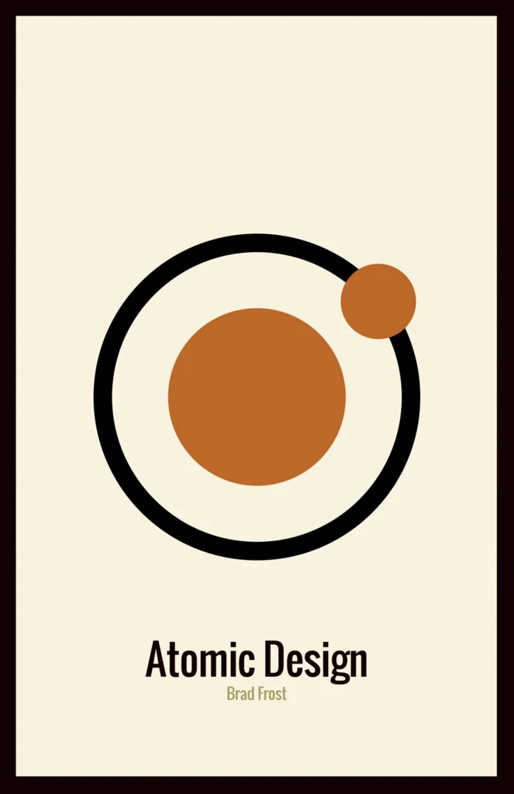
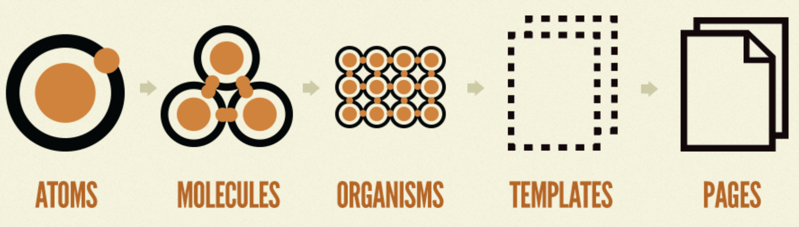
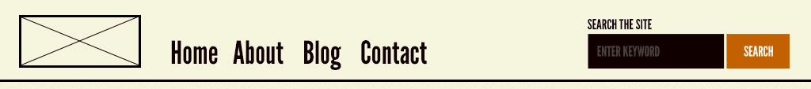

## Intro

개발을 시작할 때 하는 작업 중 항상 **프로젝트 구조**를 어떻게 정의해야 깔끔할까 고민하게 된다. 사실 React 공식문서에서도 폴더 구조에 대해서는 너무 깊게 고민하지 말라고는 한다.

하지만 꼼꼼한 성격 탓인지, 한 번 해놓고도 더럽다는 생각을 한다.

이런 고민을 해결해 줄 프로젝트 구조 설계 방법 중 **Atomic Design**에 대해 소개하고자 한다.

이 포스팅은 [https://bradfrost.com/blog/post/atomic-web-design/](https://bradfrost.com/blog/post/atomic-web-design/)을 참고하였다. (실제 출간된 책도 있다고 한다!)

[Atomic Design](https://shop.bradfrost.com/products/atomic-design-ebook) - _Brad Frost_

## 화학과 UI

Atomic Design을 생각한 저자는 **"화학"**과 UI를 연관시킬 수 있다고 말한다.

실제 예전에(한 10년 지났나..?:sweat_smile:) 화학 시간에 배웠던 기억을 되살리며, 고체, 액체, 기체는 **원자(atoms)**로 이루어져 있다. 원자가 모여서 **분자(molecules)**가 되고, 분자가 모여서 좀 더 복잡한 **유기체(organisms)**가 된다.

비슷하게 **인터페이스**는 **여러 작은 컴포넌트**들로 구성된다. 즉, 전체 인터페이스를 작은 블록 단위로 쪼갤 수 있다는 이야기다.

## Atomic Design

**Atomic Design**은 디자인 시스템을 만드는 방법론이며, **5단계 요소**로 구성된다.

1. [Atoms](./#atoms)
2. [Molecules](./#molecules)
3. [Organisms](./#organisms)
4. [Templates](./#templates)
5. [Pages](./#pages)

### Atoms

- HTML 태그 수준의 요소라고 생각하면 된다.
- ex) label, input, button ...
- 또한 Color, Font, Animation 같은 추상적이거나 눈에 보이지 않는 것들도 포함된다.

### Molecules

- 여러 개의 **Atoms**로 구성된 것
- 위에서 언급한 label, input, button 등 Atoms는 따로 사용될 때는 그리 유용하지 않다.
- Atoms를 결합해서 사용할 때 비교적 의미 있는 요소가 된다.

### Organisms

- 여러 개의 **Molecules**로 구성된 것
- ex) logo, navigation search form, social media channel이 합쳐진 구성

### Templates

- Templates 단계까지 왔다면, 어느 정도 최종 완성본에 가깝다.
- 여러 개의 **Organisms**로 구성된 것
- HTML의 Wireframe(뼈대)라고 생각하면 된다.

### Pages

- **Template**의 인스턴스
- Template의 Contents 부분이 실제 User가 볼 수 있는 것들로 채워진다.

## Reference

실제 개인적으로 프로젝트에 적용한 것도 있지만, 회사 프로젝트라 공개하기가 어렵다.

대신 Template으로 적용하기에 좋은 Reference가 있어서 남긴다.

[https://github.com/diegohaz/arc](https://github.com/diegohaz/arc)

위 Document를 참고해서 프로젝트에 적용하면 쉽게 Atomic Design을 사용할 수 있을 것이다.
