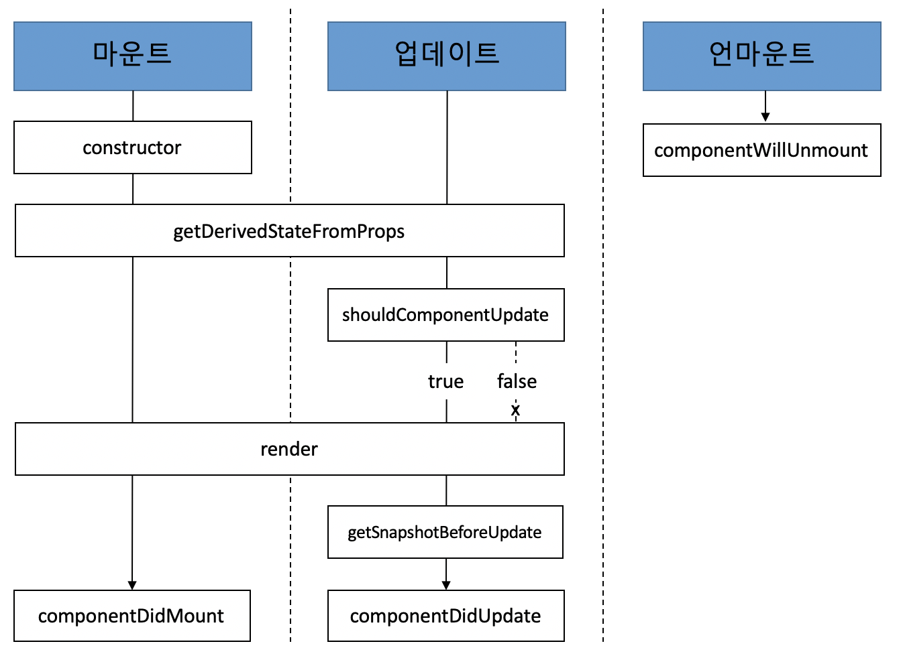

## Lifecycle Category

라이프사이클 메서드는 총 9가지이다.

`WILL`이 붙은 것은 어떤 작업을 수행하기 **전**에 실행되는 메서드고, `Did`가 붙은 것은 어떤 작업을 작동한 **후**에 실행되는 메서드다.

라이프사이클은 총 세가지, **마운트**, **업데이트**, **언마운트** 카테고리로 나눈다.

### 마운트

> 마운트(mount)
>
> - DOM이 생성되고 웹 브라우저 상에 나타나는 것

- **constructor**
  - 컴포넌트를 새로 만들 때마다 호출되는 클래스 생성자 메서드
- **getDerivedStateFromProps**
  - props에 있는 값을 state에 넣을 때 사용하는 메서드
- **render**
  - 우리가 준비한 UI를 렌더링하는 메서드
- **componentDidMount**
  - 컴포넌트가 웹 브라우저 상에 나타난 후 호출하는 메서드

### 업데이트

컴포넌트는 다음과 같은 총 네 가지 경우에 업데이트 한다.

1. props가 바뀔 때
2. state가 바뀔 때
3. 부모 컴포넌트가 리렌더링될 때
4. this, forceUpdate로 강제로 렌더링을 트리거할 때

<br />

아래는 업데이트 과정에서 쓰이는 메서드이다.

- **getDerivedStateFromProps**
  - 마운트 과정과 업데이트 과정 모두 호출된다.
  - props의 변화에 따라 state 값에도 변화를 주고 싶을 때 사용
- **shouldComponentUpdate**
  - 컴포넌트가 리렌더링을 해야 할지 말아야 할지를 결정
  - `true` 또는 `false` 반환하는데, `false`를 반환하면 작업을 중지한다(컴포넌트가 리렌더링하지 않는다)
  - 특정 함수에서 **this.forceUpdate()** 함수 호출하면 이 과정을 생략하고 바로 render 함수 호출
- **render**
  - 컴포넌트를 리렌더링
- **getSnapshotBeforeUpdate**
  - 컴포넌트 변화를 DOM에 반영하기 바로 직전에 호출
- **componentDidUpdate**
  - 컴포넌트의 업데이트 작업이 끝난 후 호출

### 언마운트

> 언마운트(unmount)
>
> - 마운트의 반대 과정, 즉 컴포넌트를 DOM에서 제거하는 것

- **componentWillUnMount**
  - 컴포넌트가 웹 브라우저 상에서 사라지기 전에 호출



## Lifecycle Method

### render()

```javascript
render() { ... }
```

- 라이프사이클 메서드 중 유일한 필수 메서드
- 이 메서드 안에서 **this.props**와 **this.state** 접근 가능

### constructor

### getDerivedstateFromProps

### componentDidMount

### shouldComponentUpdate

### getSnapshotBeforeUpdate

### componentDidUpdate

### componentWillUnmount

### componentDidCatch
