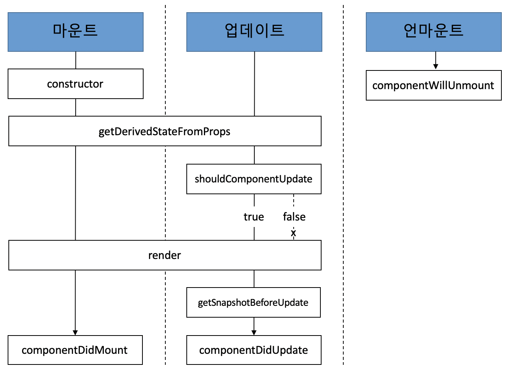

## Intro

**Hooks**가 나와서 class형 컴포넌트를 대체함에 따라 lifecycle도 잘 안보게 되었다. 하지만 Hooks를 이해하기 위해서는 먼저 Lifecycle에 대한 지식이 잡혀있어야 한다고 생각했다.

그리고 전에 봤던 lifecycle 메서드와 지금의 lifecycle 메서드, 없어지고 새로 생긴 것들이 있기에 정리하려고 한다.

## Lifecycle Category

라이프사이클 메서드는 총 9가지이다.

`WILL`이 붙은 것은 어떤 작업을 수행하기 **전**에 실행되는 메서드고, `Did`가 붙은 것은 어떤 작업을 작동한 **후**에 실행되는 메서드다.

라이프사이클은 총 세가지, **마운트**, **업데이트**, **언마운트** 카테고리로 나눈다.



### :point_right: 마운트

> 마운트(mount)
>
> - DOM이 생성되고 웹 브라우저 상에 나타나는 것

- **constructor**
  - 컴포넌트를 새로 만들 때마다 호출되는 클래스 생성자 메서드
- **getDerivedStateFromProps**
  - props에 있는 값을 state에 넣을 때 사용하는 메서드
- **render**
  - 우리가 준비한 UI를 렌더링하는 메서드
- **componentDidMount**
  - 컴포넌트가 웹 브라우저 상에 나타난 후 호출하는 메서드

### :point_right: 업데이트

컴포넌트는 다음과 같은 총 네 가지 경우에 업데이트 한다.

1. props가 바뀔 때
2. state가 바뀔 때
3. 부모 컴포넌트가 리렌더링될 때
4. this, forceUpdate로 강제로 렌더링을 트리거할 때

<br />

아래는 업데이트 과정에서 쓰이는 메서드이다.

- **getDerivedStateFromProps**
  - 마운트 과정과 업데이트 과정 모두 호출된다.
  - props의 변화에 따라 state 값에도 변화를 주고 싶을 때 사용
- **shouldComponentUpdate**
  - 컴포넌트가 리렌더링을 해야 할지 말아야 할지를 결정
  - `true` 또는 `false` 반환하는데, `false`를 반환하면 작업을 중지한다(컴포넌트가 리렌더링하지 않는다)
  - 특정 함수에서 **this.forceUpdate()** 함수 호출하면 이 과정을 생략하고 바로 render 함수 호출
- **render**
  - 컴포넌트를 리렌더링
- **getSnapshotBeforeUpdate**
  - 컴포넌트 변화를 DOM에 반영하기 바로 직전에 호출
- **componentDidUpdate**
  - 컴포넌트의 업데이트 작업이 끝난 후 호출

### :point_right: 언마운트

> 언마운트(unmount)
>
> - 마운트의 반대 과정, 즉 컴포넌트를 DOM에서 제거하는 것

- **componentWillUnMount**
  - 컴포넌트가 웹 브라우저 상에서 사라지기 전에 호출

## Lifecycle Method

### :banana: render()

```javascript
render() { ... }
```

- 라이프사이클 메서드 중 유일한 필수 메서드
- 이 메서드 안에서 **this.props**와 **this.state** 접근 가능
- :exclamation: DOM 정보를 가져오거나 state에 변화를 줄 때(setState 사용)는 **componentDidMount**에서 처리

### :banana: constructor

```javascript
constructor(props) { ... }
```

- **컴포넌트 생성자** 메서드로 컴포넌트를 만들 때 처음으로 실행
- 초기 state를 정할 수 있다.

### :banana: getDerivedstateFromProps (v16.3 이후)

- props로 받아 온 값을 state에 동기화시키는 용도
- 컴포넌트가 마운트될 때와 업데이트될 때 호출

```javascript
static getDerivedStateFromProps(nextProps, prevState) {
    if(nextProps.value !== prevState.value) {   // 조건에 따라 특정 값 동기화
        return { value: nextProps.value };
    }
    return null;    // state를 변경할 필요가 없다면 null을 반환
}
```

### :banana: componentDidMount

```javascript
componentDidMount() { ... }
```

- 컴포넌트를 만들고, 첫 렌더링을 다 마친 후 실행
- 다른 Javascript Library 또는 Framework 함수 호출
- **이벤트 등록**, **setTimeout**, **setInterval**, 네트워크 요청 같은 **비동기 작업**

### :banana: shouldComponentUpdate

```javascript
shouldComponentUpdate(nextProps, nextState) { ... }
```

- props 또는 state를 변경했을 때, **리렌더링을 시작할지 여부를 지정**
- `true` 또는 `false`를 반환해야 하는데, 이 메서드를 생성하지 않으면 기본적으로 `true` 반환
- props와 state는 **this.props**와 **this.state**로 접근
- 새로 설정될 props와 state는 **nextProps**와 **nextState**로 접근

### :banana: getSnapshotBeforeUpdate (v16.3 이후)

- render에서 만들어진 결과물이 **브라우저에 실제로 반영되기 직전**에 호출
- 이 메서드에서 **반환하는 값**은 **componentDidUpdate**에서 세 번째 파라미터인 **snapshot** 값으로 전달받을 수 있다.
- 주로 업데이트하기 직전의 값을 참고할 일이 있을 때 활용
  - ex) _스크롤바 위치 유지_

```javascript
getSnapshotBeforeUpdate(prevProps, prevState) {
    if(prevState.array !== this.state.array) {
        const { scrollTop, scrollHeight } = this.list
        return { scrollTop, scrollHeight };
    }
}
```

### :banana: componentDidUpdate

```javascript
componentDidUpdate(prevProps, prevState, snapshot) { ... }
```

- **리렌더링을 완료한 후** 실행
- 업데이트가 끝난 직후이므로, **DOM 관련 처리**해도 무방
- **prevProps** 또는 **prevState**를 사용하여 컴포넌트가 이전에 가졌던 데이터에 접근
- **getSnapshotBeforeUpdate**에서 반환된 값이 있다면 **snapshot** 값을 전달 받을 수 있다.

### :banana: componentWillUnmount

```javascript
componentWillUnmount() { ... }
```

- **DOM에서 컴포넌트를 제거**할 때 실행
- componentDidMount에서 등록한 **이벤트**, **타이머**, **직접 생성한 DOM**이 있다면 제거해야 한다.

### :banana: componentDidCatch (v16 이후)

- 컴포넌트 **렌더링 도중에 에러가 발생**했을 때, 먹통이 되지 않고 UI를 보여 줄수 있게 해준다.

```javascript
componentDidCatch(error, info) {
    this.setState({
        error: true
    });
    console.log({ error, info });
}
```

- **error**
  - **어떤 에러**가 발생했는지 알려준다.
- **info**
  - **어디**에 있는 코드에서 오류가 발생했는지에 대한 정보
- 실제 위의 **console.log** 부분에서 서버 API 호출하여 오류 수집용으로 사용하기도 함
- 컴포넌트 자신에게 발생하는 에러를 잡아낼 수 없다.
  - **this.props.children**으로 전달되는 컴포넌트에서 발생하는 에러만 잡아낼 수 있다.
