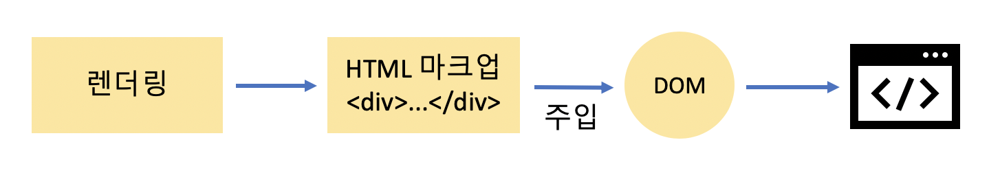
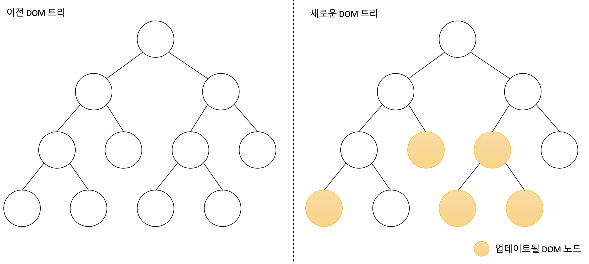
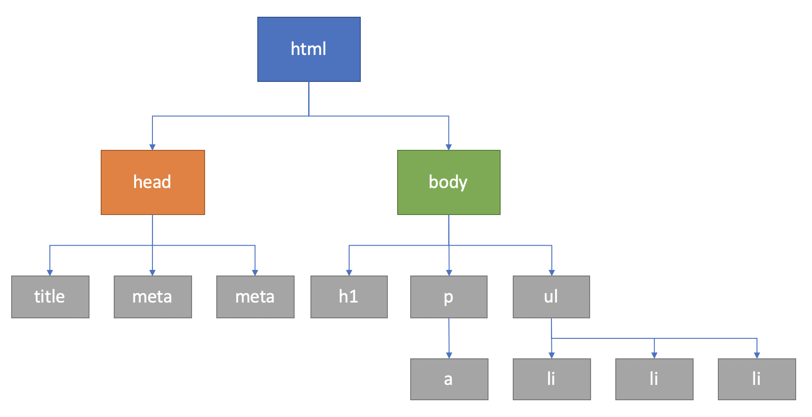

## 들어가며..

최근 회사 팀 이동, 사무실 이전, 내부 세미나 준비에 너무너무 바쁘다. :tired_face: 포스팅도 많이 미루고 있는데 그 동안 공부한 것이 많기 때문에 포스팅 할 주제는 많다.

그 중 하나가 **React.js**다.

React에 대한 내용 정리를 계속 미루고 미루다가 이번에 관련 세미나를 준비하면서, 이 참에 정리해서 포스팅하자는 생각으로 시작하게 되었다.

이번 포스팅은 **React의 전반적인 특징**에 대해서 정리하고자 한다.

## 왜 React인가?

### :banana: 여러 Javascript Framework들

초기에 Javascript는 웹 브라우저에서 간단한 연산 또는 시각적인 효과를 주는 단순한 스크립트 언어에 불과했다.

하지만 지금은 **웹**에서 가장 핵심적인 역할을 하고 있고, 더 나아가 영역을 확장하여 **서버 사이드**는 물론 **모바일**, **데스크톱** 애플리케이션에서도 엄청나게 활약한다.

아래는 Javascript 프레임워크 별 사례이다.

| Framework | Use cases                                                                                         |
| --------- | ------------------------------------------------------------------------------------------------- |
| Electron  | 슬랙(Slack), 아톰(Atom), VS Code 등                                                               |
| React     | 페이스북(Facebook), 넷플릭스(Netflix), Airbnb 등                                                  |
| Ionic     | [https://showcase.ionicframework.com/apps/top](https://showcase.ionicframework.com/apps/top) 참고 |

위 프레임워크를 포함하여 여러 자바스크립트 프레임워크들은 주로 **MVC(Model-View-Controller)** 아키텍처, **MVVM(Model-View-View Model)** 아키텍처를 사용한다. (AngularJS의 경우는 **MVW(Model-View-Whatever)**이다.)

### :banana: View를 업데이트한다?

`MVC`, `MVVM`, `MVW` 등 이들의 공통점은 **View**와 **Model**이다.

- Model : 애플리케이션에서 사용하는 데이터를 관리하는 영역
- View : 사용자에게 보이는 부분

보통 데이터가 변경되면, 이를 View에 반영하여 업데이트한다.

> 예를 들어 다음 JSON 객체 값을 사용하는 View가 있다고 가정하자.

```json
{
	"title": "Hello",
	"Conetents": "Hello World",
	"author": "ChanGrea",
	"likes": 1
}
```

```html
<div id="post-1">
	<div class="title">Hello</div>
	<div class="contents">Hello World</div>
	<div class="author">ChanGrea</div>
	<div class="likes">1</div>
</div>
```

**likes** 값을 2로 업데이트한다면, 애플리케이션의 **post-1**의 **likes** 요소를 찾아서 내부를 수정할 것이다.

하지만 애플리케이션 규모가 커지면, 상당히 복잡해지고 제대로 관리하지 않으면 성능도 떨어질 수 있다. 그래서 **Facebook** 개발 팀은 이를 해결하려고 하나의 아이디어를 고안해 냈다.

### :banana: 데이터가 변할 때 기존 뷰를 날리고 새로 렌더링한다.

어떤 데이터가 변할 때마다 어떤 변화를 줄지 고민하는 것이 아니라 그냥 기존 뷰를 날려 버리고 처음부터 새로 렌더링하는 방식이다.

이렇게 하면 애플리케이션의 구조가 매우 간단하고, 작성해야 할 코드양도 많이 줄어든다. 또한 더 이상 얻ㅎ게 변화를 줄지 신경 쓸 필요가 없고, 그저 뷰가 어떻게 생길지 선언하기만 하면 된다.

하지만 웹 브라우저에서 이 방식대로 하면 **CPU 점유율 증가**, **메모리 사용량 증가**, **렌더링 시 끊김** 등의 문제가 있을 것이다.

페이스북 개발 팀이 이런 성능적인 면을 고려하면서 개발 한 것이 **리액트(React)**이다.

## React 특징

### :heavy_check_mark: 오직 V(View)만 신경 쓰는 라이브러리

다른 MVC, MVW 등 프레임워크와 달리, 리액트는 **View만 신경 쓰는 라이브러리**이다.

데이터셋이 주어지면 HTML 태그 형식을 문자열로 반환하는 템플릿과 달리 리액트는 **컴포넌트**라는 것을 사용하여 렌더링한다.

> :strawberry: 컴포넌트(Component)
>
> - React에서 특정 부분이 어떻게 생길지 정하는 선언체로, 재사용이 가능한 API로 수많은 기능들을 내장하고 있다.
> - 컴포넌트 하나에서 해당 컴포넌트의 생김새와 작동 방식을 정의
>
> :strawberry: 렌더링(Rendering)
>
> - 사용자 화면에 View를 보여주는 것

React가 데이터가 변할 때마다 새롭게 리렌더링하면서 성능을 아끼고, 최적의 사용자 경험을 제공하는 것을 알기 위해서는 **'초기 렌더링'**과 **'리렌더링'** 개념을 이해해야 한다.

#### :point_right: 초기 렌더링

```javascript
render() { ... }
```

어떤 UI 관련 프레임워크, 라이브러리를 사용하든지 간에 맨 처음 어떻게 보일지를 정하는 초기 렌더링이 필요하다. 리액트는 그 역할을 하는 것이 위의 `render`함수이다.

:strawberry: render()

- 뷰가 어떻게 생겼고 어떻게 동작하는지에 대한 정보를 지닌 **객체** 반환
- 컴포넌트와 그 내부에 있는 컴포넌트들을 재귀적으로 **렌더링**
- 이후 이 객체의 정보를 바탕으로 **HTML 마크업(Markup)**을 생성하여 **DOM 요소** 안에 주입



#### :point_right: 조화 과정

리액트에서 뷰를 업데이트할 때 "업데이트 과정을 거친다"라고 하기보다는 **"조화 과정(reconciliation)을 거친다"**라고 하는 것이 더 정확한 표현이다.

컴포넌트에서 데이터에 변화가 있을 때 뷰가 변형되는 것처럼 보이지만, 사실 새로운 요소로 갈아 끼우기 때문이다.



위 그림에서 두 가지 뷰를 최소한의 연산으로 비교한 후, 둘의 차이를 알아내 최소한의 연산으로 DOM 트리를 업데이트한다.

### :heavy_check_mark: Virtual DOM

> :strawberry: DOM?
>
> - Document Object Model
> - 객체로 문서 구조를 표현하는 방법으로 XML이나 HTML로 작성한다.

웹 브라우저는 DOM을 활용하여 객체에 자바스크립트와 CSS를 적용한다. DOM은 트리 형태라서 특정 노드를 찾거나 수정하거나 제거하거나 원하는 곳에 삽입할 수 있다.



#### :point_right: DOM은 느리다?

DOM에는 치명적인 한 가지 문제점이 있는데 바로 동적 UI에 최적화되어 있지 않다는 것이다. Javascript를 이용하여 이를 동적으로 적용할 수 있다.

하지만, 위 그림에서 보듯이 DOM tree 하위에 여러 \<div\>가 몇 백, 몇 천개로 붙고, DOM 변화가 발생하면 성능 이슈가 발생한다.

DOM 자체는 빠르다.

하지만 위와 같은 시나리오에서 DOM의 변화가 생기면 웹 브라우저에서 CSs 다시 연산하고, 레이아웃을 구성하고, 페이지를 리페인트하는 과정이 오래 걸리기 때문에 시간이 오래 걸린다.

React는 이를 **Virtual DOM 방식**을 사용하여 DOM 업데이트를 추상화함으로써 DOM 처리 횟수를 최소화하고 효율적으로 진행한다.

#### :point_right: Virtual DOM

Virtual DOM을 사용하면 실제 DOM에 접근하여 조작하는 대신, 이를 추상화한 자바스크립트 객체를 구성하여 사용한다.(마치 실제 DOM의 가벼운 사본과 비슷)

React에서 데이터가 변하여 웹 브라우저에 실제 DOM을 업데이트할 때는 다음 세 가지 절차를 거친다.

1. 데이터를 업데이트하면 전체 UI를 Virtual DOM에 리렌더링
2. 이전 Virtual DOM에 있던 내용과 현재 내용 비교
3. 바뀐 부분만 실제 DOM에 적용


#### :point_right: 오해

##### :exclamation: React를 사용하면 무조건 빠르다!?

가장 오해하기 쉬운 부분같다. 사실 나도 React를 쓰면서도 왜 써야되는지 이해를 못하고 있었다. 이걸 써야만 성능이 좋아지고, 더 구조적으로 개발을 할 수 있는것일까에 대해 생각했었다.

리액트 매뉴얼에는 다음과 같은 문장이 있다.

> 우리는 다음 문제를 해결하려고 리액트를 만들었습니다.
>
> **"지속적으로 데이터가 변화하는 대규모 어플리케이션 구축하기"**

이제서야 **JQuery를 쓰지 않고 리액트를 쓰는 이유**를 이해했다.

JQuery? 써도 생산성이나 성능 좋게 만드는데 문제 없다.(오히려 더 좋을 수 있다) 하지만 우리가 React를 써야 하는 이유는 위와 나와 있듯이, 규모가 커짐에 따라 데이터 변화에 따른 **View 업데이트의 간결성**, 또한 프레임워크나 라이브러리가 주는 **컴포넌트의 재사용성**, **모듈화** 등의 이점 때문인 것 같다.

### :heavy_check_mark: 프레임워크가 아닌 라이브러리이다.

마지막으로 React는 프레임워크가 아닌 View만 신경쓰는 **라이브러리**이다.

즉 Ajax, 데이터 모델링, 라우팅 등과 같은 기능을 내장하고 있는 다른 프레임워크와 달리, React는 필요한 기타 기능을 직접 구현해야 한다.

하지만, React는 다른 개발자들이 만든 라이브러리가 많기 때문에 이것들을 활용하면 되고, 다만 추가적으로 이런 것들을 학습해야 하는 단점도 존재하긴 한다.

그렇지만 다른 웹 프레임워크나 라이브러리와 혼용해서 사용할 수 있다는 것은 장점인 것 같다.
