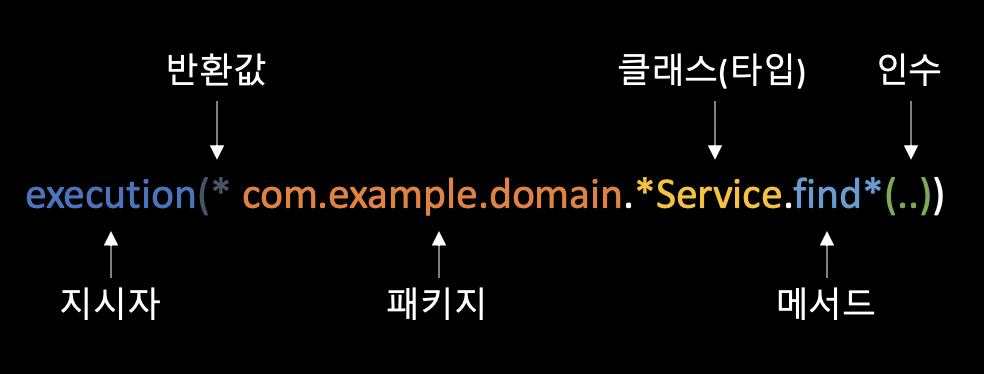

## Intro

이번 포스팅에서는 Spring Core 중 **AOP**에 대해서 정리할 것이다.

사실 [이전 포스팅(Spring Core DI 부분)](https://changrea.io/spring/spring-core/)에서도 적었지만, Spring Core에는 DI와 AOP가 전부는 아니다. 다만, 스프링을 말했을 때 특징으로 가장 많이 언급하는 것이기 때문에 이것들에 대해서는 꼭 정리하려고 하는 것이다.

## AOP

### 횡단 관심사(Cross-Cutting Concern)

비즈니스 로직과는 다소 거리가 있으나 여러 모듈에 걸쳐 공통적이고 반복적으로 필요로 하는 처리 내용을 **횡단 관심사(Cross-Cutting Concern)**이라고 한다. 아래 나열한 것들이 대표적인 횡단 관심사이다.

- 보안
- 로깅
- 트랜젝션 관리
- 모니터링
- 캐시 처리
- 예외 처리

이것들을 분리해서 한 곳으로 모으는 것을 **"횡단 관심사의 분리(Separation Of Cross-Cutting Concerns)"**라고 한다.

### AOP 개요

**AOP**는 관점 지향 프로그래밍(**Aspect Oriented Programming**)을 의미하는 약자, 여러 클래스에 흩어져 있는 횡단 관심사를 중심으로 설계와 구현을 하는 프로그래밍 기법이다.

### AOP 개념

#### 애스펙트(Aspect)

- AOP의 단위가 되는 **횡단 관심사**에 해당
  - '로그를 출력한다', '예외를 처리한다', '트랜잭션을 관리한다' 등등..

#### 조인 포인트(Join Point)

- 횡단 관심사가 실행될 지점이나 시점
- 스프링 프레임워크에서의 AOP에서는 메서드 단위로 조인포인트를 잡는다.

#### 어드바이스(Advice)

- 특정 조인 포인트에서 실행되는 코드
- Around, Before, After 등의 여러 유형이 있다.

#### 포인트컷(Pointcut)

- 수많은 조인 포인트 중에서 실제로 어드바이스를 적용할 곳을 선별하기 위한 표현식(expression)
- 조인포인트의 그룹
- XML 기반 설정 방식 or 애너테이션 기반 설정 방식

#### 위빙(Weaving)

- 애플리케이션 코드의 적절한 지점에 애스펙트를 적용하는 것
- 컴파일 시점, 클래스 로딩 시점, 실행 시점 등 (스프링 AOP는 기본적으로 실행 시점)

#### 타깃(Target)

- AOP 처리에 의해 처리 흐름에 변화가 생긴 객체
- Advised Object라고도 함

### 스프링 프레임워크에서 지원하는 어드바이스 유형

| 어드바이스      | 설명                                                         |
| --------------- | ------------------------------------------------------------ |
| Before          | 조인 포인트 전에 실행한다. 예외가 발생하는 경우만 제외하고 항상 실행된다. |
| After Returning | 조인 포인트가 정상적으로 종료한 후에 실행된다. 예외가 발생하면 실행되지 않는다. |
| After Throwing  | 조인 포인트에서 예외가 발생했을 때 실행된다. 예외가 발생하지 않고 정상적으로 종료하면 실행되지 않는다. |
| After           | 조인 포인트에서 처리가 완료된 후 실행된다. 예외 발생이나 정상 종료 여부와 상관없이 항상 실행된다. |
| Around          | 조인 포인트 전후에 실행된다.                                 |

## 스프링 AOP

- 스프링 AOP에는 실제 개발 현장에서 폭넓게 사용된  `AspectJ`라는 AOP 프레임워크가 포함
- AspectJ는 컴파일, 클래스 로드, 실행 시점에 위빙 시점 지원
  - 스프링 AOP는 실행 시점의 위빙을 기본으로 함
  - 컴파일 시점, 클래스 로드 시점에 대한 별도 설정이 필요 없다.

### pom.xml 설정

```xml
<dependency>
	<groupId>org.springframework</groupId>
  <artifactId>spring-context</artifactId>
</dependency>
<dependency>
	<groudId>org.springframework</groudId>
  <artifactId>spring-aop</artifactId>
</dependency>
<dependency>
	<groudId>org.aspectj</groudId>
  <artifactId>aspectjweaver</artifactId>
</dependency>
```

### 에스펙트 구현

```java
package com.example.aspect;

import org.aspectj.lang.JoinPoint;
import org.aspectj.lang.annotation.Before;
import org.aspectj.lang.annotation.Aspect;
import org.springframework.stereotype.Component;

@Aspect
@Component
public class MethodStartLoggingAspect {
  @Before("execution(* *..*ServiceImpl.*(..))")
  public void startLog(JoinPoint jp) {
    System.out.println("메서드 시작: " + jp.getSignature());
  }
}
```

- @Asepct - 애스펙트로 식별되도록 붙여준다.
- @Component - 컴포넌트 스캔 대상이 되어 DI 컨테이너에서 관리되도록 붙여준다.
- @Before - Before 어드바이스로 식별(괄호 안에 있는 것은 포인트컷 표현식이다.)

### 스프링 AOP 활성화

만든 에스팩트를 동작시키려면 AOP를 활성화해야 한다. '자바 기반 방식'과 'XML 파일 정의 방식'이 있다.

> 계속해서 자바 기반과 XML 기반이 같이 나오는데, 아무래도 XML은 작성해야 하는 것들이 많기 때문에 앞으로는 자바 기반(애너테이션) 방식을 위주로 정리(XML은 책 참고)

#### 자바 기반 설정 방식

```java
@Configuration
@ComponentScan("com.example")
@EnableAspectAutoProxy
public class AppConfig {
  // 생략
}
```

#### XML 파일 정의 방식

```xml
<?xml version="1.0" encoding="UTF-8"?>
<beans xmlns="http://www.springframework.org/schema/beans"
       xmlns:xsi="http://www.w3.org/2001/XMLSchema-instance"
       xmlns:context="http://www.springframework.org/schema/context"
       xmlns:app="http://www.springframework.org/schema/app"
       xsi:schemaLocation="http://www.springframework.org/schema/beans
                           http://www.springframework.org/schema/beans/spring-beans.xsd
                           http://www.springframework.org/schema/context
                           http://www.springframework.org/schema/context/spring-context.xsd
                           http://www.springframework.org/schema/app
                           http://www.springframework.org/schema/app/spring-app.xsd">
	
  <context:component-scan base-package="com.example" />
  <app:aspectj-autoproxy />
  
</beans>
```

## 자바 기반 설정 방식에서의 어드바이스 정의

### Before

- 조인 포인트 전에 실행
- @Before와 포인트컷 표현식 추가
- JoinPoint를 매개변수로 사용하여 실행 중인 메서드의 정보를 구할 수 있다.

### After Returning

- 조인 포인트가 정상적으로 종료된 후에 실행
- @AfterReturning의 returning 속성에 반환값을 받을 매개변수의 이름을 지정

```java
package com.example.aspect;

import org.aspectj.lang.JoinPoint;
import org.aspectj.lang.annotation.AfterReturning;
import org.aspectj.lang.annotation.Aspect;
import org.springframework.stereotype.Component;

@Aspect
@Component
public class MethodNormalEndLoggingAspect {
  @AfterReturning("execution(* *..*ServiceImpl.*(..))", returning = "user")
  public void endLog(JoinPoint jp, User user) {
    System.out.println("메서드 정상 종료: " + jp.getSignature() + "반환값=" + user);
  }
}
```

### After Throwing

- 조인 포인트에서 예외가 발생하여 비정상적으로 종료될 때 실행
- @AfterThrowing의 throwing 속성에 예외를 받을 매개변수의 이름 지정

```java
package com.example.aspect;

import org.aspectj.lang.JoinPoint;
import org.aspectj.lang.annotation.AfterThrowing;
import org.aspectj.lang.annotation.Aspect;
import org.springframework.stereotype.Component;

@Aspect
@Component
public class MethodExceptionEndLoggingAspect {
  @AfterThrowing("execution(* *..*ServiceImpl.*(..))", throwing = "e")
  public void endLog(JoinPoint jp, RuntimeException e) {
    System.out.println("메서드 비정상 종료: " + jp.getSignature());
    e.printStackTrace
  }
}
```

### After

- 메서드가 정상 종료 여부나 예외 발생 여부와 상관없이 **무조건 실행**(try-catch의 **finally**와 비슷)

```java
package com.example.aspect;

import org.aspectj.lang.JoinPoint;
import org.aspectj.lang.annotation.After;
import org.aspectj.lang.annotation.Aspect;
import org.springframework.stereotype.Component;

@Aspect
@Component
public class MethodEndLoggingAspect {
  @After("execution(* *..*ServiceImpl.*(..))")
  public void endLog(JoinPoint jp) {
    System.out.println("메서드 종료: " + jp.getSignature());
  }
}
```

### Around

- 가장 강력한 어드바이스
- 메서드의 **실행 전, 후**, **포인트컷이 적용된 대상 메서드 자체**도 실행 가능

```java
package com.example.aspect;

import org.aspectj.lang.JoinPoint;
import org.aspectj.lang.annotation.Around;
import org.aspectj.lang.annotation.Aspect;
import org.springframework.stereotype.Component;

@Aspect
@Component
public class MethodLoggingAspect {
  @Around("execution(* *..*ServiceImpl.*(..))")
  public Object log(JoinPoint jp) throws Throwable {
    System.out.println("메서드 시작: " + jp.getSignature());
    try {
      // 대상 메서드 실행
      Object result = jp.proceed();
      System.out.println("메서드 정상 종료: " + jp.getSignature() + " 반환값=" + result);
      return result;
    } catch (Exception e) {
      System.out.println("메서드 비정상 종료: " + jp.getSignature());
      e.printStackTrace();
      throw e;
    }
  }
}
```

- 위 코드에서는 @Before, @AfterReturning, @AfterThrowing의 역할을 하고 있다.
- finally 부분도 있다면, @After의 역할도 할 수 있을 것 같다.
- `Around` 하나로 모든 어드바이스를 구현 가능하다.

## 포인트컷 표현식

### 메서드명으로 조인 포인트 선택

#### execution 지시자의 표현 방식



#### Example

- **execution(* com.example.user.UserService.*(..))**
  - com.example.user.UserService 클래스에서 임의의 메서드를 대상으로 한다.
- **execution(* com.example.user.UserService.find*(..))**
  - com.example.user.UserService 클래스에서 이름이 find로 시작하는 메서드를 대상으로 한다.
- **execution(String com.example.user.UserService.*(..))**
  - com.example.user.UserService 클래스에서 반환값의 타입이 String인 메서드를 대상으로 한다.
- **execution(* com.example.user.UserService.*(String, ..))**
  - com.example.user.UserService 클래스에서 첫 번째 매개변수의 타입이 String인 메서드를 대상으로 한다.

#### 와일드카드

| 와일드카드 | 설명                                                         |
| ---------- | ------------------------------------------------------------ |
| *          | 기본적으로 임의의 문자열 의미, 패키지를 표현할 때는 임의의 패키지 **1개 계층** 의미, 메서드의 매개변수를 표현할 때는 **임의의 인수 1개** 의미 |
| ..         | 패키지를 표현할 때 임의의 패키지 **0개 이상** 계층 의미, 메서드의 매개변수를 표현할 때는 **임의 인수 0개 이상** 의미 |
| +          | 클래스명 뒤에 붙여 쓰며, 해당 클래스와 해당 클래스의 서브클래스, 혹은 구현 클래스 모두 의미 |

### 타입으로 조인 포인트 선택

- `within` 지시자 사용
- 클래스명의 패턴만 사용

#### Example

- within(com.example.service..*)
  - 임의의 클래스에 속한 임의의 메서드를 대상으로 한다. 단 임의의 클래스는 service 패키지나 이 패키지의 서브 패키지에 속한다.
- within(com.example.user.UserServiceImpl)
  - UserServiceImpl 클래스의 메서드를 대사응로 한다. 단 UserServiceImpl 클래스는 com.example.user 패키지에 속한다.
- within(com.example.password.PasswordEncoder+)
  - PasswordEncoder 인터페이스를 구현한 클래스의 메서드를 대상으로 한다.

### 그 밖의 기타 방법으로 조인 포인트 선택

#### Example

- bean(*Service)
  - DI 컨테이너에 관리되는 빈 가운데 이름이 'Service'로 끝나는 빈의 메서드를 대상으로 한다.
- @annotation(com.example.annotation.TraceLog)
  - @TraceLog 애너테이션(com.example.annotation.TraceLog)이 붙은 메서드를 대상으로 한다.
- @within(com.example.annotation.TraceLog)
  - @annotation과 동일

### 네임드 포인트컷 활용

- 포인트컷에 이름을 붙여두면 나중에 그 이름으로 포인트컷 재사용 가능
- `@Pointcut`애너테이션으로 정의

#### 네임드 포인트컷 정의

```java
@Component
@Aspect
public class NamedPointCuts {
  @Pointcut("within(com.example.web..*)")
  public void inWebLayer() {}
  
  @Pointcut("within(com.example.domain..*)")
  public void inDomainLayer() {}
  
  @Pointcut("execution(public * *(..))")
  public void anyPublicOperation() {}
}
```

#### 네임드 포인트컷 활용

```java
@Aspect
@Component
public class MethodLoggingAspect {
  @Around("inDomainLayer()")
  public Object log(ProceedingJoinPoint jp) throws Throwable {
    // 생략
  }
}
```

## 스프링 프로젝트에서 활용되는 AOP 기능

### 트랜잭션 관리

- `@Transactional` 애너테이션 (org.springframework.transaction.annotation.Transactional)
- 해당 메서드가 정상적으로 종료한 것이 확인되면 트랜잭션 **commit**
- 실패해서 예외(exception)이 발생한 것을 감지하면 트랜젝션 **rollback**

```java
@Transactional
public Reservation reserve(Reservation reservation) {
	// 예약 처리
}
```


### 인가

- 스프링 시큐리티에서 제공하는 인가 기능을 AOP 형태로 적용
- `@PreAuthorize` 애너테이션 (org.springframework.security.access.prepost.PreAuthorize)

```java
@PreAuthorize("hasRole('ADMIN')")
public User create(User user) {
  // 사용자 등록 처리(ADMIN 역할을 가진 사용자만 실행할 수 있다)
}
```


### 캐싱

- `@Cacheable` 애너테이션 (org.springframework.cache.annotation.Cacheable)
- 메서드의 매개변수 등을 Key로 사용하여 실행 결과를 캐시로 관리

```java
@Cacheable("user")
public User findOne(String email) {
  // 사용자 취득
}
```


### 비동기 처리

- `@Async` 애너테이션 (org.springframework.scheduling.annotation.Async)
- 반환값으로 `CompletableFuture` 타입 or `DeferredResult` 타입
- 스레드 관리는 스프링 프레임워크가 처리

```java
@Async
public CompletableFuture<Result> calc() {
  Result result = doSomething();		//오랜 시간이 소요되는 작업
  return CompletableFuture.completedFuture(result);
}
```


### 재처리

- **스프링 Retry**라는 프로젝트 활용
- `@Retryable` 애너테이션 (org.springframework.retry.annotation.Retryable)
- 원하는 조건을 만족할 때까지 재처리

```java
@Retryable(maxAttempts = 3)
public String callWebApi() {
  // 웹 API 호출
}
```

