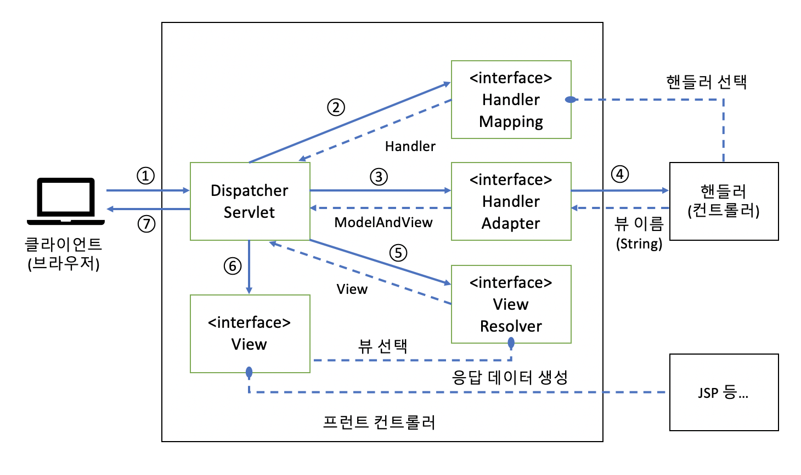

## Intro

스프링에서 제공하는 MVC, 스프링 MVC 부분에서 무엇인가를 설정하고, 개발하는 방법을 정리한다기보다는 개념정도 정리하려고 한다.

사실 개발 방법은 정리하는 것보다는 직접 해보는 것이 더 효율적이라는 생각이 들었기 때문이다.

## 스프링 MVC

### MVC Pattern?

모델(Model), 뷰(View), 컨트롤러(Controller)와 같은 세 가지 역할의 컴포넌트로 구성되어 클라이언트의 요청을 처리

| 컴포넌트명 | 설명                                                         |
| ---------- | ------------------------------------------------------------ |
| 모델       | 애플리케이션 **상태(데이터)**나 **비즈니스 로직**을 제공하는 컴포넌트 |
| 뷰         | 모델이 보유한 애플리케이션 상태(데이터)를 참조하고 클라이언트에 반환할 응답 데이터를 생성하는 컴포넌트 |
| 컨트롤러   | 요청을 받아 모델과 뷰의 호출을 제어하는 컴포넌트로 컨트롤러라는 이름처럼 요청과 응답의 처리 흐름을 제어한다. |

### 웹 애플리케이션 개발의 특징

1. **POJO(Plain Old Java Object) 구현**

   컨트롤러나 모델 등의 클래스는 POJO 형태로 구현된다. 특정 프레임워크에 종속적인 형태로 구현할 필요가 없기 때문에 단위 테스트를 하는 것이 상대적으로 수월해진다.

2. **애너테이션을 이용한 정의 정보 설정**

   비즈니스 로직과 그 로직을 수행하기 위한 각종 정의 정보를 자바 파일 안에서 함께 기술할 수 있기 때문에 효율적으로 웹 애플리케이션을 개발할 수 있다.

3. **유연한 메서드 시그니처 정의**

   컨트롤러 클래스의 메서드 매개변수에는 처리에 필요한 것만 골라서 정의 가능, 타입도 다양한 타입이 지원되며, 프레임워크가 인수에 전달하는 값을 자동으로 담아주거나 변환

4. **Servlet API 추상화**

   스프링 MVC는 서블릿 API(HttpServletRequest, HttpServletResponse, HttpSession 등의 API)를 추상화하는 기능 제공, 이는 컨트롤러 클래스에서 서블릿 API를 직접 사용하는 코드가 제거되기 때문에 테스트가 쉬워진다.

5. **뷰 구현 기술의 추상화**

   컨트롤러는 뷰 이름만 알면 되기 때문에 그 뷰가 어떤 구현 기술(JSP, 타임리프, 서블릿 API, 프리마커 등)로 만들어졌는지 구체적인 내용을 몰라도 된다.

6. **스프링의 DI 컨테이너와의 연계**

   스프링의 DI 컨테이너가 제공하는 DI나 AOP와 같은 구조를 그대로 활용 가능하다.

> :question: POJO (Plain Old Java Object)
>
> 자바 언어 사양 외에 어떠한 제한에도 묶이지 않은 자바 오브젝트, 쉽게 말하면, 어떤 Interface나 class를 상속하지 않는 순수한 자바 객체 자체다.

최근에 서버 쪽에서 사용자 정보를 받아서 저장하는 API를 개발했었는데, 아래와 같이 POJO를 정의하지 않았더니, 일일이 항목별로 파라미터로 받아서 처리해야 하는 불편함이 있었다. (중복 코드, 코드가 길어짐, 항목 헷갈림 ...)

```java
// 내가 생각하는 POJO의 예
class Member {
  String Id;
  String Name;
  String Phone;
  int age;
  
  // Getter, Setter
}
```


### MVC 프레임워크로서의 특징

1. **풍부한 확장 포인트 제공**

   컨트롤러나 뷰와 같이 각 역할별로 필요한 인터페이스 제공, 따라서 확장하고 싶다면 이러한 인터페이스를 자신만의 방법으로 구현하면 된다.

2. **엔터프라이즈 애플리케이션에 필요한 기능 제공**

   MVC 패턴뿐만 아니라, 메시지 관리, 세션 관리, 국제화, 파일 업로드 같은 다양한 기능을 제공한다.

3. **서드파티 라이브러리와의 연계 지원**

   - Jackson(JSON/XML 처리)
   - Google Gson(JSON 처리)
   - Google Protocol Buffers(Protocol Buffers로 불리는 직렬화 형식 처리)
   - Apache Tiles(레이아웃 엔진)
   - FreeMarker(템플릿 엔진)
   - Rome(RSS/Feed 처리)
   - JasperReports(보고서 출력)
   - ApachePOI(엑셀 처리)
   - Hibernate Validator(빈 유효성 검증)
   - Joda-Time(날짜/시간 처리)
   - Thymeleaf(템플릿 엔진)
   - HDV(보안 강화)

## 프런트 컨트롤러 아키텍쳐



- org.springframework.web.servlet.DispatcherServlet 클래스(서블릿)로 구현
- 프런트 컨트롤러의 처리 내용 대부분이 **인터페이스**를 통해 실행
  - 인터페이스를 통해 **프레임워크의 기능을 확장**할 수 있는 스프링MVC의 특징

### DispatcherServlet

- 프런트 컨트롤러와 연동되는 진입점 역할
- 기본적인 처리 흐름을 제어하는 사령탑 역할

| 인터페이스명                          | 역할                                                         |
| ------------------------------------- | ------------------------------------------------------------ |
| HandlerExceptionResolver              | 예외 처리를 하기 위한 인터페이스                             |
| LocaleResolver, LocaleContextResolver | 클라이언트의 Locale 정보를 확인하기 위한 인터페이스          |
| ThemeResolver                         | 클라이언트의 테마(UI 스타일)를 결정하기 위한 인터페이스      |
| FlashMapManager                       | FlashMap은 PRG(Post Redirect Get) 패턴의 Redirect와 Get 사이에서 모델을 공유하기 위한 Map 객체이다. |
| RequestToViewNameTranslator           | 핸들러가 뷰 이름과 뷰를 반환하지 않은 경우에 적용되는 뷰 이름을 해결하기 위한 인터페이스 |
| HandlerInterceptor                    | 핸들러 실행 전후에 하는 공통 처리를 구현하기 위한 인터페이스 |
| MultipartResolver                     | 멀티파트 요청을 처리하기 위한 인터페이스                     |

### Handler

- 프레임워크 관점에서는 '**핸들러**'라고 부르지만, 개발자가 작성하는 클래스의 관점에서는 '**컨트롤러**'라고 한다.

#### 구현 방법

1. @Controller (org.springframework.stereotype.Controller), @RequestMapping 이용
2. ~~org.springframework.web.servlet.mvc.Controller 인터페이스 구현, handleRequest 메서드 구현~~ (deprecated)

1번 방법에 대해서만 정리한다.

```java
@Controller
public class WelcomeController {
  
  @RequestMapping("/")
  public String home(Model model) {
    modle.addAttribute("now", new Date());
    return "home";
  }
}
```

### HandlerMapping

- 요청에 대응할 핸들러를 선택하는 역할
- 다양한 종류의 구현 클래스가 있지만, 최근에는 `RequestMappingHandlerMapping` 클래스를 사용
  - **@RequestMapping**이 붙은 메서드(핸들러)를 바탕으로 선택

### HandlerAdapter

- 핸들러 메서드를 호출하는 역할
- RequestMappingHandlerMapping 클래스에 의해 선택된 핸들러 메서드를 호출할 때는 `RequestMappingHandlerAdapter` 클래스를 사용
  - 핸들러 메서드에 매개변수 전달
  - 처리 결과를 리턴
  - 요청받은 데이터를 자바 객체로 변환
  - Bean Validation
- 기본적인 동작 방식을 변경 또는 지원되지 않는 타입을 지원하기 위해서 메서드 시그니처를 유연하게 정의할 수 있도록 두 가지 인터페이스를 제공

| 인터페이스명                    | 역할                                                         |
| ------------------------------- | ------------------------------------------------------------ |
| HandlerMethodArgumentResolver   | 핸들러 메서드 매개변수에 전달하는 값을 다루기 위한 인터페이스 |
| HnadlerMethodReturnValueHandler | 핸들러 메서드에서 반환된 값을 처리하기 위한 인터페이스       |

### ViewResolver

- 핸들러에서 반환한 뷰 이름을 보고, 이후에 사용할 View 인터페이스의 구현 클래스를 선택

| 클래스명                     | 설명                                                      |
| ---------------------------- | --------------------------------------------------------- |
| InternalResourceViewResolver | 뷰가 JSP일 때 사용, 기본적인 ViewResolver                 |
| BeanNameViewResolver         | DI 컨테이너에 등록된 빈의 형태로 뷰 객체를 가져올 때 사용 |

### View

- 클라이언트에 반환하는 응답 데이터를 생성하는 역할

| 클래스명             | 설명                                                   |
| -------------------- | ------------------------------------------------------ |
| InternalResourceView | 템플릿 엔진으로 JSP를 이용할 때 사용하는 클래스        |
| JstlView             | 템플릿 엔진으로 JSP + JSTL을 이용할 때 사용하는 클래스 |

