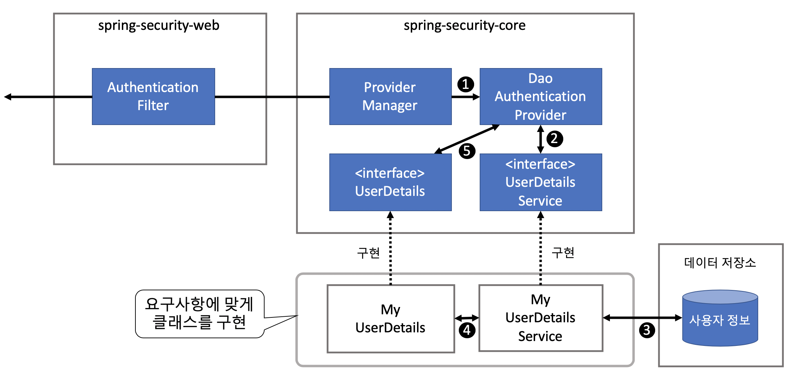
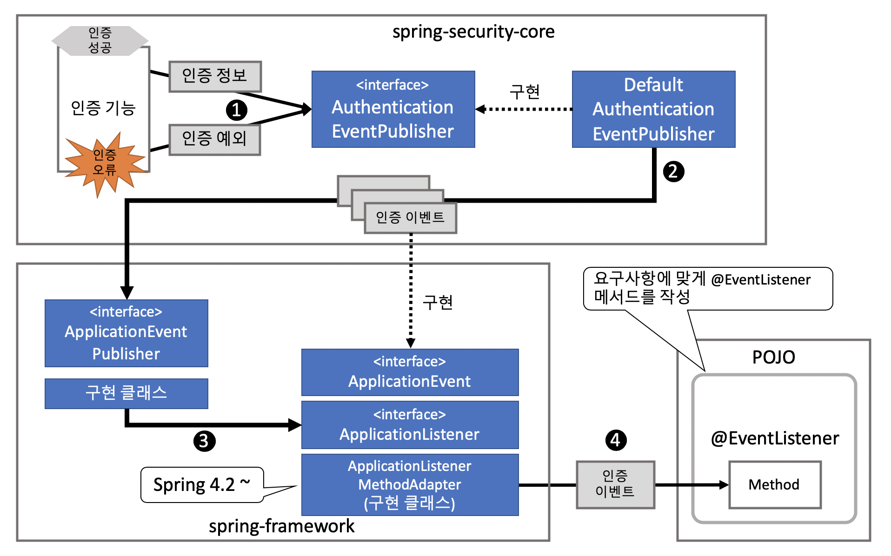
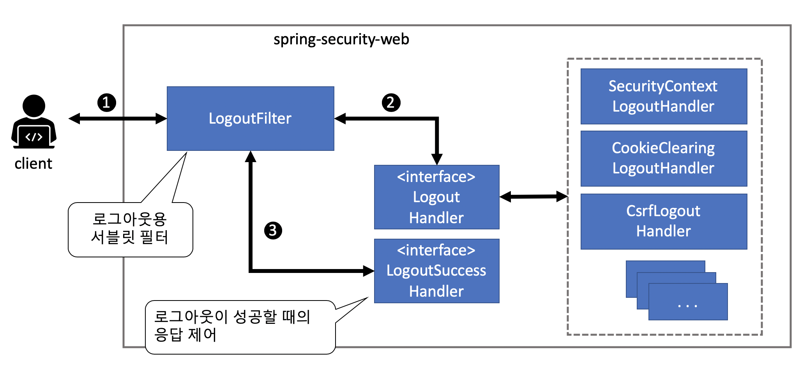

## 인증 처리

### 데이터베이스 인증



1. 스프링 시큐리티는 클라이언트로부터 인증 의뢰를 받아 DaoAuthenticationProvider에 인증 처리를 위임한다.
2. DaoAuthenticationProvider는 UserDetailsService에게 사용자 정보를 가져오게 한다.
3. UserDetailsService 구현 클래스는 데이터 저장소에서 사용자 정보를 가져온다.
4. UserDetailsService 구현 클래스는 데이터 저장소에서 가져온 사용자 정보를 사용해 UserDetails를 만든다.
5. DaoAuthenticationProvider는 UserDetailsService에서 반환된 UserDetails와 클라이언트가 제공한 인증 정보를 대조해서 이요자가 정당한 사용 권한을 가지고 잇는지 확인


#### UserDetails 작성

UserDetails는 인증 처리에 필요한 자격정보(사용자명과 패스워드)와  사용자의 상태 정보를 제공하기 위한 인터페이스로서 다음과 같은 메서드가 정으돼 있다.

<br />

> UserDetails 인터페이스

```java
public interface UserDetails extends Serializable {
  String getUsername();	// 사용자명 반환
  String getPassword();	// 등록된 패스워드 반환(패스워드 틀리면 BadCredentialsException 발생)
  boolean isEnabled();	// 유효한 패스워드인지 판단
  boolean isAccountNonLocked();	// 계정의 잠금 상태를 판단
  boolean isAccountNonExpired();	// 계정의 유효 기간 상태를 판단
  boolean isCredentialsNonExpired();	// 자격정보의 유효 기간 상태를 판단
  Collection<? extends GrantedAuthority> getAuthorities();	// 사용자가 가진 권한 리스트 반환 (인가 처리를 할 때 필요)
}
```

<br />

> UserDetails 인터페이스를 구현한 예

```java
public class AccountUserDetails implements UserDetails {
  
  private final Account account;
  private final Collection<GrantedAuthority> authorities;
  
  public AccountUserDetails(
  	Account account, Collection<GrantedAuthority> authorities) {
    this.account = acount;
    this.authorities = authorities;
  }
  
  public String getPassword() {
    return account.getPassword();
  }
  public String getUsername() {
    return account.getUsername();
  }
  public boolean isEnabled() {
    return account.isEnabled();
  }
  public Collection<GrantedAuthority> getAuthorities() {
    return authorities;
  }
  ...
  
  // 인증에 성공한 이후의 처리 과정에서 활용할 수 있도록 접근 메소드 제공
  public Account getAccount() {
    return account;
  }
}
```


스프링 시큐리티는 UserDetails의 구현 클래스로 User 클래스를 제공한다.

```java
public class AccountDetails extends User {
  
  private final Account account;
  
  public AccountUserDetails(Account account, boolean accountNonExpired,
                           boolean credentialsNonExpired, boolean accountNonLocked,
                           Collection<GrantedAuthority> authorities) {
    super(account.getUsername(), account.getPassword(), account.isEnabled(),
         true, true, true, authorities);
    this.account = account;
  }
  
  public Account getAccount() {
    return account;
  }
}
```


#### UserDetailsService 작성

- 자격정보와 사용자 상태 정보를 데이터 저장소에서 가져오기 위한 인터페이스

<br />

> UserDetailsService 인터페이스

```java
public interface UserDetailsService {
  UserDetails loadUserByUsername(String username) throws UsernameNotFoundException;
}
```

<br />

> UserDetailsService 인터페이스를 구현한 예

```java
@Service
public class AccountUserDetailsService implements UserDetailsService {
  @Autowired
  AccountRepository accountRepository;
  
  @Transactional(readOnly = true)
  public UserDetails loadUserByUsername(String username)
    			throws UsernameNotFoundException {
    Account account = Optional
      				.ofNullable(accountRepository.findOne(username))
      				.orElseThrow(() -> new UsernameNotFoundException("user not found."));
    return new AccountUserDetails(account, getAuthorities(account));
  }
  
  
  private Collection<GrantedAuthority> getAuthorities(Account account) {
    if(account.isAdmin()) {
      return AuthorityUtils.createAuthorityList("ROLE_USER", "ROLE_USER",
                                               "ROLE_ADMIN");
    } else {
      return AuthorityUtils.createAuthorityList("ROLE_USER");
    }
  }
}
```

:exclamation: 참고로 스프링 시큐리티에서 인가 처리를 할 때는 **'ROLE_'**로 시작하는 권한 정보를 롤로 취급한다.


#### 인증 처리 적용

- 앞서 만든 UserDetailsService를 사용해 사용자 인증 처리를 하려면AuthenticationManagerBuilder에 UserDetailsService를 적용해야 한다.

```java
@EnableWebSecurity
public class WebSecurityConfig extends WebSecurityConfigurerAdapter {
  
  @Autowired
  UserDetailsService userDetailsService;
  
  @Autowired
  void configureAuthenticationManager(AuthenticationManagerBuilder auth)
    throws Exception {
    auth.userDetailsService(userDetailsService)
      .passwordEncoder(passwordEncoder());
  }
  
  @Bean
  PasswordEncoder passwordEncoder() {
    return new BCryptPasswordEncoder();
  }
}
```


### 패스워드 해시화

패스워드를 데이터베이스에 저장할 때는 패스워드를 평문 그대로 저장하지 않고 해시화한 값으로 저장하는 것이 일반적이다.

| 클래스명                | 설명                                                         |
| ----------------------- | ------------------------------------------------------------ |
| BCryptPasswordEncoder   | **Bcrypt** 알고리즘으로 패스워드를 해시화하거나 일치 여부를 확인한다. |
| StandardPasswordEncoder | **SHA-256** 알고리즘으로 패스워드를 해시화하거나 일치 여부를 확인한다. |
| NoOpPasswordEncoder     | 해시화하지 않는 구현 클래스, 테스트용 클래스이므로 실제 애플리케이션에서는 사용하지 않는다. |


#### BCryptPasswordEncoder

- BCrypt 알고리즘으로 패스워드를 해시화하고 평문 패스워드와 일치 여부를 확인하는 구현 클래스
- 솔트(Salt)에는 16바이트 크기의 난수(java.security.SecureRandom)가 사용
- 기본적으로 1024(2의 10승)번 <u>스트레칭(stretching)</u> 수행
  - <u>스트레칭</u>? 해시값의 계산을 반복하는 것


### 인증 이벤트 처리

- 인증 처리 결과를 다른 컴포넌트로 전달
- 예를 들어
  - 인증의 성공이나 실패와 같은 인증 이력을 데이터베이스나 로그에 저장하고 싶은 경우
  - 패스워드가 연속으로 일정 횟수 이상 틀렸을 때 계정을 잠그고 싶은 경우


인증 이벤트는 다음과 같은 방식으로 통지된다.



1. 인증 결과(인증 정보나 인증 예외)를 AuthenticationEventPublisher에 전달해서 인증 이벤트의 통지를 의뢰한다.
2. AuthenticationEventPublisher의 기본 구현 클래스는 인증 결과에 대한 인증 이벤트를 인스턴스로 만든 다음, ApplicationEventPublisher에 전달해서 이벤트 통지를 의뢰한다.
3. ApplicationEventPublisher의 구현 클래스는 ApplicationListener 인터페이스의 구현 클래스에 이벤트를 통지한다.
4. ApplicationListener의 구현 클래스 중 하나인 ApplicationListenerMethodAdaptor는 @org.springframework.context.event.EventListener가 붙은 메서드를 호출하는 방법으로 이벤트를 통지한다.


#### 인증 성공 이벤트

인증이 성공할 때 스프링 시큐리티가 통지하는 이벤트는 다음과 같다.

중간에 오류가 발생하지 않는 한, 이 순서대로 모두 통지된다.

| 이벤트 클래스                             | 설명                                                         |
| ----------------------------------------- | ------------------------------------------------------------ |
| AuthenticationSuccessEvent                | **AuthenticationProvider에 의한 인증 처리가 성공**했음을 통지한다. 클라이언트가 올바른 인증 정보를 가지고 있다는 것을 알 수 있다. 단 다음 인증 처리에서 오류가 발생할 가능성이 있다. |
| SessionFixationProtectionEvent            | **세션 고정 공격에 대비한 처리(세션 ID의 변경)가 성공**했음을 통지한다. 이 이벤트 정보를 활용하면 변경 후의 세션 ID를 알 수 있다. |
| InteractiveAuthenticationSuccessEven**t** | **인증 처리가 모두 성공했음**을 통지한다. 이 이벤트 정보를 활용하면 화면 이동을 제외한 모든 인증 처리가 성공했다는 것을 알 수 있다. |


#### 인증 실패 이벤트

인증에 실패한 상황에 따라 다음 중 한 가지 이벤트가 통지된다.

| 이벤트 클래스                                | 설명                                                  |
| -------------------------------------------- | ----------------------------------------------------- |
| AuthenticationFailureBadCredentialsEvent     | BadCredentialsException이 발생했음을 통지한다.        |
| AuthenticationFailureDisabledEvent           | DisabledException이 발생했음을 통지한다.              |
| AuthenticaationFailureLockedEvent            | LockedException이 발생했음을 통지한다.                |
| AuthenticationFailureExpiredEvent            | AccountExpiredException이 발생했음을 통지한다.        |
| AuthenticationFailureCredentialsExpiredEvent | CredentialsExpiredException이 발생했음을 통지한다.    |
| AuthenticationFailureServiceExceptionEvent   | AuthenticationServiceException이 발생했음을 통지한다. |


#### 이벤트 리스너 작성

- DI 컨테이너에 등록된 빈에 @EventListener가 붙은 메서드를 만든 다음, 그 안에 하고 싶은 처리 내용을 구현하면 된다.

```java
@Component
public class AuthenticationEventListeners {
  
  private static final Logger log = LoggerFactory
    			.getLogger(AuthenticationEventListeners.class);
  
  @EventListener
  public void handleBadCredentials(
  						AuthenticationFailureBadCredentialsEvent event) {
    log.info("Bad credentials is detected. username : {}",
            event.getAuthentication().getName());
    // 생략
  }
}
```


### 로그아웃



1. 클라이언트는 로그아웃을 처리하는 경로로 요청을 보낸다.
2. LogoutFilter는 LogoutHandler의 메서드를 호출해서 로그아웃 처리를 한다.
3. LogoutFilter는 LogoutSuccessHandler의 메서드를 호출해서 화면을 이동한다.


#### LogoutHandler의 구현 클래스

| 클래스명                     | 설명                                       |
| ---------------------------- | ------------------------------------------ |
| SecurityContextLogoutHandler | 인증 정보를 제거하고 세션을 파기한다.      |
| CookieClearingLogoutHandler  | 지정한 쿠키를 삭제하기 위한 응답을 보낸다. |
| CsrfLogoutHnadler            | CSRF 방지용 토큰을 파기한다.               |

- 스프링 시큐리티가 제공하는 빈이 LogoutFilter에 자동으로 설정되기 때문에 직접 구현할 필요는 없다. :smile:


#### 로그아웃 처리 적용

- 빈 정의를 해줘야 한다.

```java
@Override
protected void configure(HttpSecurity http) throws Exception {
  // 생략
  http.logout()
    			.permitAll();
}
```


#### 기본 동작 방식의 커스터마이징

- 로그아웃 경로를 '/auth/logout'으로 변경

```java
@Override
protected void configure(HttpSecurity http) throws Exception {
  // 생략
  http.logout()
    			.logoutUrl("/auth/logout")
    			.permitAll();
}
```


### 로그아웃이 성공했을 때의 응답

- LogoutSuccessHandler 인터페이스와 구현 클래스 제공

| 클래스명                                | 설명                                                         |
| --------------------------------------- | ------------------------------------------------------------ |
| SimpleUrlLogoutSuccessHandler           | 지정한 URL(defaultTargetUrl)로 리다이렉트한다.(기본적으로 사용됨) |
| HttpStatusReturningLogoutSuccessHandler | 지정한 HTTP 상태로 응답한다.                                 |


#### 기본 동작 방식

- 로그인 폼을 표시하는 경로에 'logout'이라는 쿼리 파라미터가 붙은 URL로 리다이렉트
  - '/login' :arrow_right: '/login?logout'


#### 기본 동작 방식의 커스터마이징

- 로그아웃이 성공했을 때 이동항 경로를 'logoutSuccess'로 변경

```java
@Override
protected void configure(HttpSecurity http) throws Exception {
  // 생략
  http.logout()
    			.logoutSuccessUrl("/logoutSuccess")
    			.permitAll();	//생략
}
```

