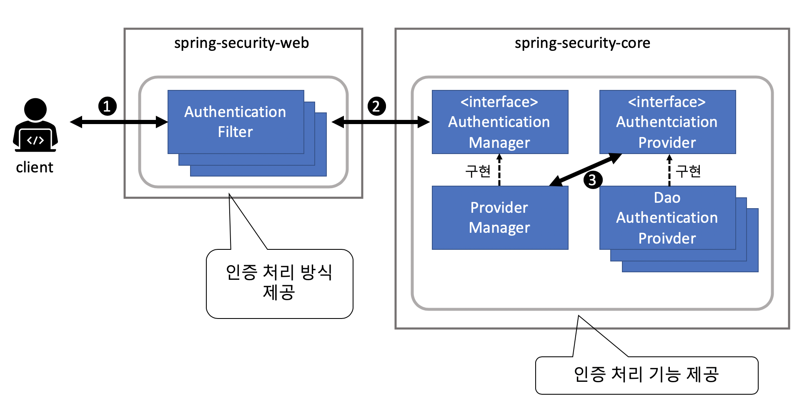
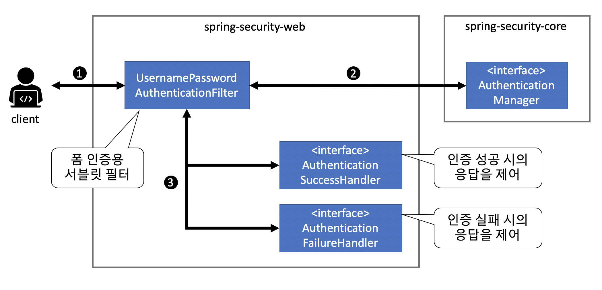

## Intro

[이전 포스팅](https://changrea.io/spring/spring-security-start/)에서 스프링 시큐리티의 개요와 특징, 설정, 아키텍처에 대한 내용에 대해 정리했엇다.

이번 포스팅에서는 연계 시리즈 2번째, **인증**에 대해서 정리하려고 한다.

- 스프링 시큐리티, 설정, 아키텍처
- **인증** / 인가
- CSRF 방지
- 세션 관리


## 인증 처리

### 인증(Authentication)?

애플리케이션을 이용하는 사용자의 정당성을 확인하기 위한 기능으로 아래와 같이 여러가지 방법이 있다.

- 사용자 정보를 데이터 저장소에 등록해 두고, 입력 정보와 비교하는 방법
- HTML 입력 폼을 사용하는 방식
- RFC에서 정해진 HTTP 표준 인증 방식(Basic 인증, Digest 인증 등)을 이용
- OpenID 인증이나 싱글 사인온 인증 같은 인증 방식 이용


### 인증 처리 메커니즘

개괄적인 인증 처리 프로세스는 아래와 같다.



1. 클라이언트는 인증이 필요한 리소스 경로에 접근할 때 **자격정보(사용자명과 패스워드)를 요청 파라미터**로 요청
2. 인증 필터(Authentication Filter)는 요청 파라미터에서 자격정보를 구한 다음, AuthenticationManager 클래스의 인증 메서드를 호출한다.
3. ProviderManager(AuthenticationManager의 기본 구현 클래스)는 실제 인증 처리를 AuthenticationProvider 인터페이스의 구현 클래스에 위임한다.


#### 인증 필터(Authentication Filter)

- 인증 처리 방식에 대한 **구현을 제공**하는 서블릿 필터
- 다양한 서블릿 필터 클래스 제공
  - 폼 인증용 서블릿 필터 클래스(UsernamePasswordAuthenticationFilter)
  - Basic 인증
  - Digest 인증
  - Remember Me 인증


#### AuthenticationManager

- **인증 처리를 수행**하기 위한 인터페이스
- **ProviderManager**는 스프링 시큐리티에서 제공하는 기본 구현체
- 실제 인증 처리를 **AuthenticationProvider**에게 위임하고 반환하는 인증 결과를 처리하는 구조


#### AuthenticationProvider

- **인증 처리 기능을 구현**하기 위한 인터페이스
- 위 그림에서는 사용자의 자격정보와 상태 정보를 확인하기 위한 **DaoAuthenticationProvider**를 사용하였다.


### 폼 인증

스프링 시큐리티는 다음과 같은 흐름으로 폼 인증을 수행한다.



1. 클라이언트는 폼 인증이 필요한 리소스 경로에 접근할 때 자격정보(사용자명과 패스워드)를 요청 파라미터로 전송한다.
2. UsernamePasswordAuthenticationFilter 클래스는 요청 파라미터에서 자격정보를 구한 다음, AuthenticationManager를 통해 해당 이용자가 인증된 사용자인지 확인한다.
3. 인증에 성공한 경우 AuthenticationSuccessHandler 메서드를 호출, 실패한 경우 AuthenticationFailureHandler 메서드를 호출해서 화면을 이동시킨다.


#### 폼 인증 적용

자바 기반 설정 방식으로 정리한다.

```java
@EnableWebSecurity
public class WebSecurityConfig extends WebSecurityConfigurerAdapter {
  @Override
  protected void configure(HttpSecurity http) throws Exception {
    // 생략
    http.formLogin();
  }
}
```


#### 기본 동작

설정만 잘 했다면, **'/login' 경로에 GET 메서드를 호출**하면 스프링 시큐리티가 제공하는 **기본 로그인 폼**이 표시된다.

로그인 폼에 정보를 입력하고 로그인 버튼을 누르면 **'/login' 경로에 대한 POST 메서드**가 실행되어 인증 처리가 진행된다.

> 하지만 기본적으로 제공하는 로그인 폼을 그대로 사용하는 경우는 거의 없을 것이다. 직접 만든 로그인 폼이 있다고 가정하고 적용하는 방법을 보자.


#### 로그인 폼의 작성

여기서는 "src/main/webapp/views/" 아래에 **loginForm.jsp**라는 로그인 폼 파일이 이미 있다고 가정하고 진행한다.


> 로그인 폼을 표시하기 위한 핸들러 메서드

```java
@Controller
public class AuthenticationController {
  
  @RequestMapping(path = "/login", method = RequestMethod.GET)
  public String viewLoginForm() {
    return "loginForm";
  }
}
```

- 로그인 폼의 뷰 이름('loginForm')을 반환

<br>

> 로그인 폼을 스프링 시큐리티에 적용하기 위한 빈 정의

```java
@Override
protected void configure(HttpSecurity http) throws Exception {
  // 생략
  http.formLogin()
    .loginPage("/login")
    .permitAll();
  
  // 위의 경우는 기본 동작에 대한 처리 방식이다.
  // 커스터마이징 하고 싶다면 이렇게 바꾸자.
  // '/authenticate' 경로로 uid(사용자명), pwd(패스워드) 파라미터르 요청
  http.formLogin()
    .loginProcessingUrl("/authenticate")
    .usernameParameter("uid")
    .passwordParameter("pwd")
    .permitAll();
  
  http.authorizeRequests()
    .anyRequest().authenticated();
}
```

- permitAll 메서드를 호출해서 모든 이용자가 로그인 폼에 접근할 수 있게 만든다.
  - 이렇게 하지 않으면, 인증 오류가 발생해서 **리다이렉트 루프(redirect loop)**가 발생


### 인증이 성공했을 때의 응답

> AuthenticationSuccessHandler의 구현 클래스

| 클래스명                                            | 설명                                                         |
| --------------------------------------------------- | ------------------------------------------------------------ |
| SavedRequestAware<br />AuthenticationSuccessHandler | 인증 전에 접근을 시도한 URL로 리다이렉트한다.(기본적으로 사용되는 구현 클래스) |
| SimpleUrl<br />AuthenticationSuccessHandler         | 생성자에 지정한 URL(defaultTargetUrl)로 리다이렉트나 포워드한다. |


#### 기본 동작

- 인증 전에 접근 시도한 요청을 HTTP 세션에 저장해 뒀다가 인증 성공 후에 복원해서 리다이렉트
- 경로에 접근권한이 있으면 페이지 표시, 없으면 인증 오류 발생
- 인증 처리 성공 후에 **루트 경로("/")**로 이동


#### 기본 동작 방식의 커스터마이징

- 인증 성공했을 때 이동할 기본 경로를 **'/menu'**로 변경

```java
@Override
protected void configure(HttpSecurity http) throws Exception {
  // 생략
  http.formLogin()
    .defaultSuccessUrl("/menu")
    .permitAll();
}
```


### 인증이 실패했을 때의 응답

> AuthenticationFailureHandler의 구현 클래스

| 클래스명                                           | 설명                                                         |
| -------------------------------------------------- | ------------------------------------------------------------ |
| SimpleUrl<br />AuthenticationFailureHandler        | 생성자에 지정한 URL(defaultFailureUrl)로 리다이렉트나 포워드한다.<br />(기본적으로 사용되는 구현 클래스) |
| ExceptionMapping<br />AuthenticationFailureHandler | **인증 예외나 이동 대상의 URL을 매핑**한다.<br />스프링 시큐리티는 오류의 원인마다 발생하는 예외 클래스가 바뀌기 때문에 이 구현 클래스를 사용하면 오류의 종류에 따라 이동 대상을 바꿀 수 있다. |
| Delegating<br />AuthenticationFailureHandler       | 인증 예외와 AuthenticationFailureHandler를 매핑할 수 있는 구현 클래스<br />ExceptionMappingAuthenticationFailureHandler와 비슷하지만 인증 예외마다 AuthenticationFailureHandler를 지정할 수 있기 때문에 더 유연한 동작을 지원할 수 있다. |


#### 기본 동작 방식

- 로그인 폼을 표시하는 경로에 **error**라는 쿼리 파라미터가 붙은 URL로 리다이렉트
  - '/login' :arrow_right: '/login?error'


#### 기본 동작 방식의 커스터마이징

- '/loginf=Failure'로 변경

```java
@Override
protected void configure(HttpSecurity http) throws Exception {
  // 생략
  http.formLogin()
    .failureUrl("/loginFailure")
    .permitAll();
}
```


## 이어서...

여기까지 인증 처리 메커니즘과 폼 인증 그리고 인증에 성공했을 때와 실패했을 때에 처리 방법에 대해서 정리했다. 이어지는 내용이 **데이터베이스 인증** 과 **인증 이벤트 처리** 그리고 **로그아웃**에 대한 내용인데 길어서 일단 여기까지 끊고 다음 포스팅에서 진행할 예정이다.