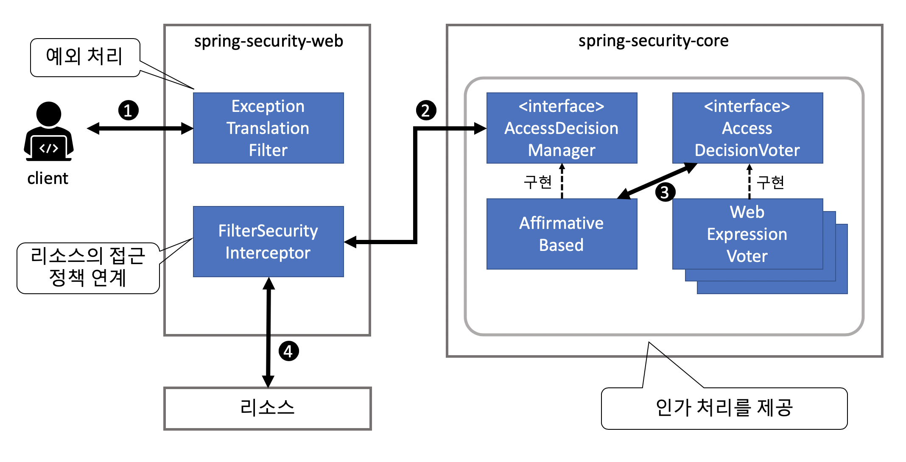

## Intro

지금까지 스프링 시큐리티의 개요와 구조 그리고 인증에 대해서 정리했었다. **인증**과 **인가**가 시큐리티의 대부분을 차지하기 때문에 양도 많다.

이번 포스팅에서는 연계 시리즈 2번째, **인가**에 대해서 정리하려고 한다.

- [스프링 시큐리티, 설정, 아키텍처](https://changrea.io/spring/spring-security-start/)
- [인증(Form)](https://changrea.io/spring/spring-security-authentication/), [인증(DB, Logout)](https://changrea.io/spring/spring-security-authentication-db/) / **인가**
- CSRF 방지
- 세션 관리


## 인가 처리

- 애플리케이션에서 **사용자가 접근할 수 있는 리소스를 제어**하기 위한 기능

- 각 리소스에 대한 접근 정책을 미리 정의, 접근 시 정책 확인해서 허용 여부 결정

- 웹리소스, 자바 메서드, 도메인 객체에 대한 접근 정책 정의 가능


### 인가 처리 구조



1. 클라이언트가 임의의 리소스에 접근한다.
2. **FilterSecurityInterceptor** 클래스는 **AccessDecisionManager** 인터페이스의 메서드를 호출하고 리소스에 대한 접근 가능 여부를 확인한다.
3. **AffirmativeBased** 클래스(*기본적으로 사용되는 AccessDecisionManager의 구현 클래스*)는 **AccessDecisionVoter** 인터페이스의 메서드를 호출하고 접근 가능 여부에 대한 투표 결과를 받는다.
4. **FilterSecurityInterceptor는** **AccessDecisionManager가** 허용할 때만 리소스의 접근을 허락한다.


### 접근 정책을 기술하는 방법

인가 처리를 적용하기 전에 **접근 정책을 기술하는 방법**에 대해서 먼저 정리한다.

인가 처리가 무엇인지 위에서 간단하게 정리했듯이, **<u>접근 정책</u>을 확인해서 리소스의 접근 허용 여부를 결정**한다고 했었다.

그렇다, 인가를 적용하기 위해서는 이 `접근 정책`을 사전에 정의해둬야 한다.

> Spring Security에서 접근 정책을 지정할 때 **<u>스프링 표현 언어(SpEL)</u>**을 사용할 수 있다.


#### 공통 표현식

| **표현식**                 | **설명**                                                     |
| -------------------------- | ------------------------------------------------------------ |
| hasRole(String  role)      | 해당 롤을 가지고 있는 경우 true                              |
| hasAnyRole(String…  roles) | 해당 롤 중에 하나를 가지고 있는 경우 true                    |
| isAnonymous()              | 익명 사용자인 경우  true                                     |
| isRememberMe()             | Remember Me 인증을 통해 로그인한 경우 true                   |
| isAuthenticated()          | 이미 인증된 사용자인 경우 true                               |
| isFullyAuthenticated()     | Remember Me가 아닌 일반적인 인증 방법으로 로그인한 경우 true |
| permitAll                  | 항상 true                                                    |
| denyAll                    | 항상  false                                                  |
| principal                  | 인증된 사용자의 **사용자  정보****(****UserDetails**  구현한 클래스의 객체) 반환 |
| authentication             | 인증된  사용자의 **인증  정보****(Authentication**  구현한 클래스의 객체) 반환 |


#### 웹 표현식

| **표현식**                      | **설명**                                                     |
| ------------------------------- | ------------------------------------------------------------ |
| hasIpAddress(String  ipAddress) | 인수에  지정한 IP 주소  체계에 클라이언트의 IP 주소가 일치하는 경우에 true  반환 |


### 웹 리소스에 대한 인가(자바 기반 설정 방식)

먼저 접근 정책을 적용할 웹 리소스(**HTTP 요청**)를 지정한다.

| **표현식**      | **설명**                                                     |
| --------------- | ------------------------------------------------------------ |
| antMatchers     | ant 형식으로 지정한 경로 패턴과 일치하는 리소스를 적용 대상  |
| regexMatchers   | 정규 표현식으로 지정한 경로 패턴과 일치하는 리소스를 적용 대상 |
| requestMatchers | 지정한 RequestMatcher  인터페이스 구현과 일치하는 리소스를 적용 대상 |
| anyRequest      | 기타 리소스를 적용 대상                                      |


### 접근 정책의 지정

- 접근 정책을 지정할 때는 **AuthorizedUrl** 클래스의 메서드를 사용


#### AuthorizedUrl 클래스의 메서드를 사용한 예

```java
@Override 
protected void configure(HttpSecurity http) throws Exception {   
  // 생략
  http.authorizeRequests()
    .antMatchers("/admin/accounts/**").hasRole("ACCOUNT_MANAGER")
    .antMatchers("/admin/configurations/**")
    	.access("hasIpAddress('127.0.0.1') and hasRole('CONFIGURATION_MANAGER')")
    .antMatchers("/admin/**").hasRole("ADMIN")
    .anyRequest().authenticated();
}
```


#### 경로 변수를 참조한 웹 리소스의 인가 제어 설정

```java
@Override
protected void configure(HttpSecurity http) throws Exception {
  // 생략
  http.authorizeRequests()
    .antMatchers("/users/{username}")
    	.access("isAuthenticated() and (hasRole('ADMIN') or (#username == principal.username))")
    .anyRequest().authenticated();
}

```

