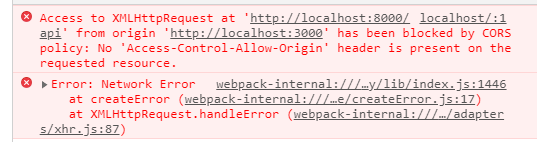

## AJAX

`AJAX`는 Javascript Library 중 하나이며, **<u>A</u>synchronous <u>J</u>avascript <u>A</u>nd <u>X</u>ml**의 약자이다.

브라우저가 가지고 있는 **XMLHttpRequest** 객체를 이용해서 전체 페이지를 새로고침하지 않고, 필요한 데이터만 **비동기적**으로 가져오는 방식이다.

이 경우 `Json` 이나 `XML` 형태로 데이터를 주고 받는다. 보통은 `JQuery`의 AJAX를 이용해서 **GET**, **POST** 등의 요청을 하는 식으로 많이 사용한다.


## CORS

`CORS`는 **<u>C</u>ross <u>O</u>rigin <u>R</u>esource <u>S</u>haring**의 약자로, **도메인** 또는 **포트**가 다른 서버의 자원을 요청하는 메커니즘이다.

웹페이지는 **Image**(``), **css**(`<link />`), **script**(`<script />`), Iframe, 동영상에 대해서는 자유롭게 가져올 수 있다.

하지만, 스크립트 태그 내에서 **특정한 도메인 간(Cross-Domain) 요청**, 특히 Ajax 요청은 다른 도메인에 데이터를 요청하는 것이 금지되었다.

### :thinking: Cross Domain이 뭔데?

예전에 정리했던 [REST API와 설계원칙(2) 중 'URI의 Authority 부분'](https://changrea.io/Web/rest-api-design-1/#authority) 을 참고하면, Authority는 **서버명**과 **도메인명**으로 구성된다.

여기서 **도메인**에 해당하는 부분은 **userinfo@host:port** 형식으로 구성된다. 보통 userinfo는 ssh 접속을 할 때 많이 사용되고, 우리가 보는 **웹 페이지의 도메인**은 **host(ip 주소)**와 **port(포트 번호)**일 것이다.

> 즉, Cross Domain은 <u>ip 주소 또는 포트 번호가 다른 것</u>을 의미한다.

### :question: 그럼 CORS가 왜 생겼고, 왜 이것을 따라야 할까?

언급했듯이, 기존에는 다른 도메인에 데이터를 요청하는 것 자체가 불가능했다. 하지만, Ajax가 점점 널리 쓰이게 되고, 요즘은 프론트엔드 개발을 "localhost:3000" 같이 다른 도메인에서 개발을 하듯이 타 도메인에 대해 데이터 요청이 필요하게 되었다.

Cross-Site HTTP Requests에 대한 요구가 늘어나자 **W3C**에서 `CORS` 라는 권고안을 내 준 것이다.

당연히 Cross-site HTTP Requests는 **"보안"**을 위해서 막아뒀었기 때문에 이를 허용해주는 정책인 CORS 권고안을 따라야 한다.


### :construction: CORS 메커니즘


<div style="text-align:right; font-style:italic; font-weight:100;">cors 위키백과 참고</div>

위키백과에서 cors를 검색하면 위와 같은 그림이 있다.

우리가 브라우저에서 Ajax 요청(XHR call)을 보내면 발생하는 프로세스를 그림으로 나타낸 것이다.

<span style="color: green;">녹색</span>으로 표시된 부분과 <span style="color: red;">적색</span>으로 표시된 부분을 나눠서 살펴보자.

<div style="border: 3px solid RGB(220, 233, 213); padding:5px;">
  1. 먼저 Cross-domain Ajax 요청이 들어오면 브라우저에서는 <code class="language-text">GET</code> 또는 <code class="language-text">HEAD</code> 요청인지를 본다.<br>
  &nbsp 1-1. GET과 HEAD 외 요청이라면, <code class="language-text">POST</code> 요청 여부를 검사한다.<br>
  &nbsp 1-2. POST 요청이라면 요청이 표준의 <code class="language-text">content-type</code>인지를 검사하고, 그 외에는 모두 OPTIONS 요청을 보낸다.<br>
  2. 단순히 데이터를 가져오기 위한 GET과 HEAD 요청이라면 사용자가 정의한 HTTP header(<code class="language-text">custom HTTP header</code>) 항목이 있는지 검사한다.<br>
  &nbsp 2-1. Custom HTTP header 항목이 있다면, OPTIONS요청을 보낸다.<br>
  3. Custom HTTP header가 없으면 그대로 요청을 보낸다.
</div>

<br>

최초 Ajax 요청 시, `GET, HEAD, POST `요청이 아니거나 또는 POST 요청이라도 `custom HTTP header`가 포함되어 있거나, 

`표준으로 정한 content-type이 아닌 요청`(**application/x-www-form-urlencoded, mutipart/form-data, text/plain 외의 모든 type**)이면 모두 **'Preflighted Request'** 라고 하는 OPTIONS 요청을 보내게 된다.

<div style="border: 3px solid RGB(223, 186, 177); padding:5px;">
  1. 위에 조건에 해당하는 경우 모두 OPTIONS 요청을 먼저 보낸다.<br>
  2. OPTIONS 요청에 대한 응답으로 'Access-Control-*' 형식의 헤더가 포함된 응답을 받게 된다.(Server 영역)<br>(여기서 요청을 보낸 Origin, Method, Custom Header, Credential 등이 없다면, ajax 요청은 CORS 정책에 의해 거부된다.)</div>


### 그럼 CORS Error를 방지하려면?



<br>

> 웹 개발을 해봤다면 한 번쯤은 위와 같은 에러를 봤을 것이다. 위 에러를 없애기 위해서 Chrome CORS 플러그인도 써보고 proxy하는 방법도 써보고 그래도 뭔가 안되자 ~~포기~~.. 결국에는 해결했던 기억이 난다.
>
> CORS에 대해 먼저 이렇게 정리하고 이해한 뒤에 했다면 좀 더 수월하지 않았을까 하는 아쉬움도 든다.

CORS Error를 방지하는 것은 위 정리된 내용을 참조하여 생각해보고 조금 검색만 해봐도 충분히 해결할 수 있다.

#### 1. Chrome CORS plugin 사용


Chrome을 사용하고 있다면, 웹 스토어에서 CORS 플러그인을 다운로드 받아 사용하는 방법이 있다.

하지만 이 방법의 경우에는 **Access-Control-Allow-Origin: \*** 과 **Access-Control-Allow-Method:** 만 추가될 뿐 다른 것을 커스터마이징 할 수 없다.

> :arrow_right: 인증/인가를 위해서는 좀 더 커스터마이징이 필요하다.

결국은 Server에서 설정을 해주는 방법이 가장 확실한 것 같다.

#### 2. Server에서 CORS 허용 설정

***node.js의 express***를 사용하는 경우에는 **cors** 라는 미들웨어를 사용한다. 아래는 [https://www.npmjs.com/package/cors](https://www.npmjs.com/package/cors) 에 있는 간단한 사용예제이다.

해당 사이트를 들어가보면, 이 외에도 다양한 옵션 지정이 가능하다.

```javascript
var express = require('express')
var cors = require('cors')
var app = express()
 
app.use(cors())
 
app.get('/products/:id', function (req, res, next) {
  res.json({msg: 'This is CORS-enabled for all origins!'})
})
 
app.listen(80, function () {
  console.log('CORS-enabled web server listening on port 80')
})
```

***Java의 Spring Framework***를 사용하는 경우에는 몇 가지 방법이 존재한다.

아래 방법 중 한 가지 골라서 사용하는 것이 좋을 듯 하다. (뭣도 모르고 여러가지 썼었다가 왜 안되지 하고 계속 삽질했었다.)

1. Filter에서 설정 (**CorsFilter**)

   ```java
   public class MyCorsFilter extends CorsFilter {
    
       public MyCorsFilter() {
           super(configurationSource());
       }
    
       private static UrlBasedCorsConfigurationSource configurationSource() {
           CorsConfiguration config = new CorsConfiguration();
           config.setAllowCredentials(true);
           config.addAllowedOrigin("http://localhost:3000");
           config.addAllowedHeader("*");
           config.addAllowedMethod("*");
           UrlBasedCorsConfigurationSource source = new UrlBasedCorsConfigurationSource();
           source.registerCorsConfiguration("/**", config);
           return source;
       }
   }
   ```

   

2. Interceptor에서 설정

   ```java
   @Component
   public class WebInterceptor implements HandlerInterceptor {
   
   	@Override
   	public boolean preHandle(HttpServletRequest request, HttpServletResponse response, Object exception) throws Exception {
   		response.setHeader(HttpHeaders.ACCESS_CONTROL_ALLOW_ORIGIN, "http://localhost:3000");
   		response.setHeader(HttpHeaders.ACCESS_CONTROL_ALLOW_CREDENTIALS, "true");
   		response.setHeader(HttpHeaders.ACCESS_CONTROL_ALLOW_HEADERS, "Content-Type");
   	}
   }
   ```

   

3. 사용하는 메소드에 **@CrossOrigin** 어노테이션 지정

   - 개별적으로 설정하는 방법

     ```java
     @CrossOrigin(maxAge = 3600)
     @RestController
     @RequestMapping("/example")
     public class ExampleController {
      
         @CrossOrigin("http://localhost:3000")
         @RequestMapping("/{id}")
         public Example retrieve(@PathVariable Long id) {
             // ...
         }
     }
     ```

     

4. webmvc에서 제공하는 cors 설정 이용 (**WebMvcConfigure**)

   - Global하게 설정하는 방법

     ```java
     @Configuration
     @EnableWebMvc
     public class WebMvcConfiguration implements WebMvcConfigurer {
     
         @Override
         public void addCorsMappings(CorsRegistry registry) {
             registry.addMapping("/**")
                     .allowedOrigins("http://localhost:3000")
                     .allowedMethods("GET", "POST", "PUT", "DELETE");
         }
     }
     ```

     


## CORS Request의 종류 그리고 인증..

CORS 관점에서 보는 요청의 종류는 4가지이다.

- Simple Request
- 'Preflighted' Request
- 'Credentialed' Request

- 'Non-Credential' Request

### :heavy_check_mark: Simple Request

보통은 CORS에 해당하면 **Preflight** 라고 해서 OPTIONS method를 통해 이 요청이 전송하기에 안전한지를 체크하는 요청을 보낸다. (Preflighted Request)

그런데 이런 체크하는 행위를 할 필요 없는 요청을 보낼 때가 있다. <u>아래의 조건</u>에 해당하는 케이스다.

- GET, HEAD, POST 중 하나의 요청
- Custom Header가 없는 경우 (아래의 header만 가능)
  - Accept, Accept-Language, Content-Language, Content-Type, DPR, Downlink, Save-Data, Viewport-Width, Width
- Content-Type는 아래의 값들만 허용
  - application/x-www-form-urlencoded, multipart/form-data, text/plain


### :heavy_check_mark: Preflighted Request

Simple Request와 달리 OPTIONS method를 통해 Cross-site 요청에 대해 전송이 안전한지를 체크한다. 

위에서 언급한 Simple Request의 조건에 해당하지 않는다면 아래와 같이 OPTIONS 요청을 보낸다.

```markdown
// OPTIONS Request
OPTIONS /resources/post-here/ HTTP/1.1
Host: bar.other
User-Agent: Mozilla/5.0 (Macintosh; Intel Mac OS X 10.14; rv:71.0) Gecko/20100101 Firefox/71.0
Accept: text/html,application/xhtml+xml,application/xml;q=0.9,*/*;q=0.8
Accept-Language: en-us,en;q=0.5
Accept-Encoding: gzip,deflate
Connection: keep-alive
Origin: http://foo.example
Access-Control-Request-Method: POST
Access-Control-Request-Headers: X-PINGOTHER, Content-Type

// OPTIONS Response
HTTP/1.1 204 No Content
Date: Mon, 01 Dec 2008 01:15:39 GMT
Server: Apache/2
Access-Control-Allow-Origin: https://foo.example
Access-Control-Allow-Methods: POST, GET, OPTIONS
Access-Control-Allow-Headers: X-PINGOTHER, Content-Type
Access-Control-Max-Age: 86400
Vary: Accept-Encoding, Origin
Keep-Alive: timeout=2, max=100
Connection: Keep-Alive
```

<u>Request 부분</u>을 보면 `Origin`, `Access-Control-Request-Method`, `Access-Control-Request-Headers` 항목이 있다.

예제에서는 **foo.example** 에서 /resources/post-hear/ 로 **X-PINGOTHER** 라는 커스텀 헤더를 포함하여 **POST** 요청을 보냈다.

그 전에 브라우저에서는 OPTIONS 요청을 통해 해당 요청이 안전한지를 체크한다. 이후 OPTIONS 요청에 대해 **'Access-Control'** prefix가 붙은 여러가지 항목이 포함된 응답을 받는다.

<u>Resonse 부분</u>을 보면 `Access-Control-Allow-Origin`, `Access-Control-Allow-Methods`, `Access-Control-Allow-Headers` 항목이 있다.

요청에 대해서 해당하는 origin, method, header는 허용하겠다는 의미의 응답이다.


### :heavy_check_mark: Credentialed 와 Non-Credentialed Request

기본적으로 CORS에서 브라우저는 자격 증명 즉 Cookie나 인증에 필요한 정보, 세션 정보(JSESSIONID) 등을 보내지 않는다.

하지만, `Authentication`, `Authorization`을 구현하기 위해서는 자격 증명이 필요하다. 보통은 Cookie나 JSESSIONID를 서버에 전송하고 서버에서 그것들을 체크하여 인증/인가를 수행한다.

#### :o: Cookie를 보내기 위한 플래그

```javascript
const invocation = new XMLHttpRequest();
const url = 'http://bar.other/resources/credentialed-content/';
    
function callOtherDomain() {
  if (invocation) {
    invocation.open('GET', url, true);
    invocation.withCredentials = true;
    invocation.onreadystatechange = handler;
    invocation.send(); 
  }
}
```

7행을 보면 **withCredentials** 항목을 true로 지정함으로써, Cookie를 서버에 함께 보낸다. (jQuery나 fetch 등 라이브러리 별로 지정하는 방법이 조금씩 다르다.)

#### :o: 서버에서도 Credential을 허용해야 한다.

브라우저에서 Cookie와 함께 요청을 보냈다고 하더라도, 서버에서 이를 허용하지 않으면 응답은 무시된다.

```markdown
Access-Control-Allow-Credentials: true
```

> :exclamation: Credentialed Request의 경우 Access-Control-Allow-Origin 항목을 도메인 하나하나 지정해줘야 한다는 점에 주의하자.


## 마무리

CORS에 대한 내용은 **모든 개발자**가 알고 있어야 한다고 말한다. 명확하게는 웹 개발자, 서버 개발자, 프론트엔드 개발자들이다.

그동안 이런 내용을 알기 전까지는 크롬 플러그인 같은 편법(?)으로 하다가 잘 안되고 헤매고 서버 개발자에게 말해도 모르쇠 태도에 지쳤었는데, 이제는 이런 내용을 알았기 때문에 서버 개발자에게 자신있게 요청할 수 있지 않을까..?

