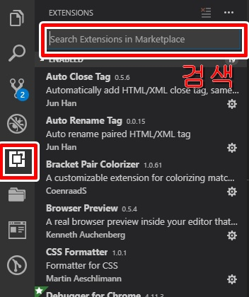
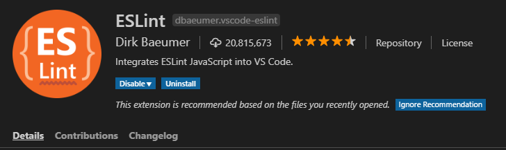
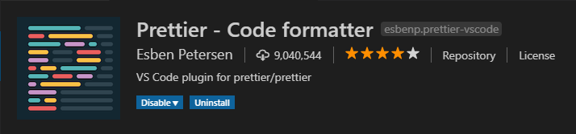
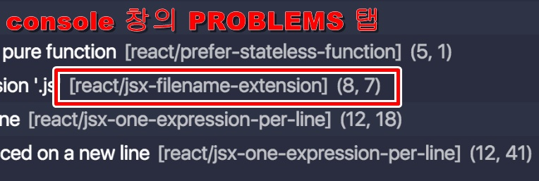
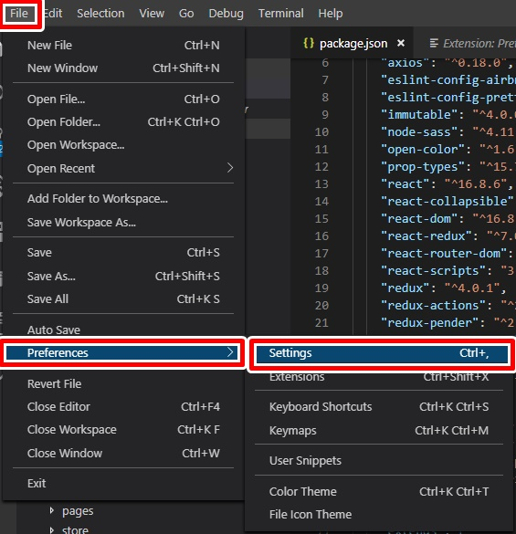
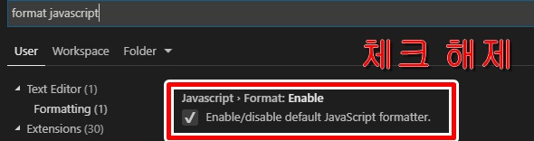
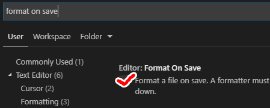
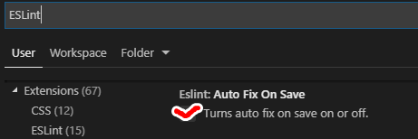

## 0. 들어가기 전

:full_moon:추석 연휴가 끝나고 쓰는 포스팅!

정신없이 코드를 작성하고 나서 :computer: 나중에 보면 굉장히 읽기 어려운 코드가 되어 있다.

심지어 요즘은 IDE가 좋아져서 많이 괜찮아졌지만, 실수로 빠뜨린 세미콜론, 잘못 입력한 키워드 등 말썽인 부분이 많다.(특히, `프론트엔드 개발`은 더더욱..)

그래서 이번 포스팅에서는 개발할 때 신경써야 할 이런 부분들을 최소화하고 자동화할 수 있는 방법에 대해서 다뤄보고자 한다.
(~~물론 이전 블로그에서 다룬 내용이긴 하다~~:full_moon_with_face:)

참고로 이것은 **VSCode에서 ESLint와 Prettier를 적용**하는 내용이다.

## 1\. VSCode Extension 설치



먼저 VSCode를 설치했다는 가정 하에 아래 2가지 Extension을 설치한다.

1. ESLint
2. Prettier

> VSCode 좌측에 보면 박스 모양을 클릭하면 위 그림과 같이 검색 창이 뜬다.

### :heavy_check_mark: ESLint



_ESLint는 자바스크립트의 문법을 체크해주는 도구이다._

### :heavy_check_mark: Prettier



_Prettier는 Code Formatting 도구이며, 코드를 규칙에 따라 정렬해주고, 빠진 세미콜론을 자동으로 채워주는 등의
기능을 한다._

## 2\. 설정 커스터마이징

두 가지 Extension을 설치했다면 ESLint와 Prettier의 세부적인 rule을 설정하는 방법을 보자

각자의 프로젝트의 `package.json` 파일에서 아래와 같이 작성한다.

> 아래는 하나의 예시이다.

#### `package.json`

```json
...
"eslintConfig": {
    "extends": [
        "airbnb",
        "prettier"
    ],
    "parser": "babel-eslint",
    "rules": {
        "react/jsx-filename-extension": 0,
        "import/no-named-as-default": 0,
        "import/no-named-as-default-member": 0,
        "import/no-unresolved": 0,
        "import/prefer-default-export": 0,
        "no-underscore-dangle": 0,
        "no-console": 0,
        "react/forbid-prop-types": 0
    },
    "env": {
        "browser": true
    }
},
```

**extends** : `airbnb`의 규칙과 `prettier` 적용

> 여기서 ESLint의 규칙에는 `airbnb`, `prettier` 등 여러가지가 있는데, 나는 `airbnb`를 선택했다.

**parser** : ES6의 `arrow function`을 사용하기 위해 추가

**env** : `document.~`" 사용하기 위해 추가

**rules** : 세부 규칙을 커스터마이징 하기 위해 정의

이 부분에서 세부적인 규칙을 정의한다.
실제로 ESLint를 적용해서 개발을 하다보면 수많은 에러가 발생할 것이다.
하지만 그것을 완벽하게 지키면 좋겠지만(?) 팀에서 정의한 규칙이 있을수도 있고, 때로는 오히려 ESLint가 발목을 잡을 경우가 있다.

아래와 같이 `Console 창의 Problems 탭`에는 ESLint 관련 내용들이 쭈욱 뜰 것이다. 보고나서 굳이 체크 안해도 되는 내용은 예외처리를 해주면 된다.

> 끄고 싶은 에러는 0, 그리고 경고처리만 하고 싶은 에러는 1로 처리



> 위의 경고 메세지를 없애고 싶다면 아래와 같이 추가한다.

```json
"react/jsx-filename-extension": 0,
```

## 3\. VSCode 설정 & Prettier 포매팅 설정

> 그래.. 지금까지 ESLint와 Prettier를 적용하는 것까지는 알겠는데, 그렇다면 그 수많은 코드를 일일이 다 신경쓰면서 개발해야 하는건가..?

라고 생각이 들 것이다.

다행히도 VSCode에서는 이런 것을 `CMD + S`만으로 자동화 할 수 있는 방법이 있다.:v:

### :heavy_check_mark: 기본 Javascript 포매팅 기능 비활성화

#### `File - Preferences - Settings`



#### `"Format JavaScript" 검색 - Javascript > Format: Enable 체크해제`



### :heavy_check_mark: Prettier 설정

프로젝트 루트 디렉터리에 **`.prettierrc 파일`** 생성 및 편집 (현재 설정 파일은 아래와 같습니다.)

> 다른 옵션들은 [Options](https://prettier.io/docs/en/options.html) 페이지에서 확인 가능

```javascript
{
  "singleQuote": true,
  "semi": true,
  "useTabs": false,
  "tabWidth": 2,
  "trailingComma": "all",
  "printWidth": 80
}
```

#### :exclamation: (수정사항 - 2020.07.16)

최근에 React.js 프로젝트용 보일러플레이트를 만들다가 ESLint랑 Prettier 적용 중 둘의 충돌 때문에 좀 애먹었다. 대안을 찾던 중 [prettier-eslint](https://www.npmjs.com/package/prettier-eslint) 라는 도구를 사용했더니 깔끔하게 해결되었다.

```bash
yarn add prettier-eslint --dev
```

> (참고) 또한 [Velopert](https://velog.io/@velopert/eslint-and-prettier-in-react)님은 prettier-eslint 말고 [eslint-config-prettier](https://github.com/prettier/eslint-config-prettier) 라는 도구를 더 선호한다고 소개한다. 자바스크립트 관련된 문법체크는 eslint가 하고, 코드 스타일 관리는 prettier가 하도록 완벽하게 나눠준다고 하니 사용해보자.

### :heavy_check_mark: 코드 저장 시, 자동 포맷팅 설정

#### `File - Preferences - Settings`


#### `"format on save" 검색 - Editor: Format On Save 체크`



#### `"ESLint" 검색 - Eslint: Auto Fix On Save 체크`


